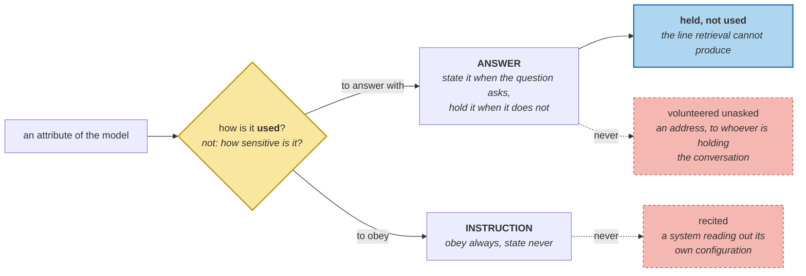

# Personalization Without Creepiness

> **In one line.** The model-driven context costs exactly what the tuned retrieval path costs — 51 tokens either way — and the only thing it adds is the ability to say what it withheld.

## Where this sits

<!-- graph:begin -->
**Stage:** `assemble` · **Level:** advanced · **~50 min**

**You need first:** [Behaviour as Memory](../implicit-signals/index.md)

**Concepts assumed:** [User Model](../../../concepts/user-model.md) · [Element Cost](../../../concepts/element-cost.md) · [Retrieval Scoping](../../../concepts/retrieval-scoping.md)

**This unlocks:** [Cold Start and Shared Accounts](../cold-start-and-shared-accounts/index.md)
<!-- graph:end -->

## The problem

Six attributes, and the obvious use is to inject all six:

```
where do I work and what should I not eat?   asked 2, volunteers 4
what should I not eat?                       asked 1, volunteers 5
where do I work?                             asked 1, volunteers 4
what am I like to talk to?                   asked 0, volunteers 6
```

Every one of those volunteered sets contains `residence` — her home address, offered in reply to a question about lunch.

The obvious fix is *"only what was asked"*, and the counterexample is in the same model. `response_style` is *"prefers shorter answers"*. Nobody will ever ask about it, and applying it is the entire reason for having remembered it.

## Why this isn't RAG

A retrieval system withholds by ranking. A document that scores low is not in the context, and if you ask *why wasn't this shown*, the answer is a number — it lost. Nothing decided to keep it back, so nothing can report having done so.

A memory layer holds a **model of a person**, and the difference between *did not rank* and *chose not to say* is the whole of what makes personalisation acceptable. One of those can be explained to the user. The other cannot, because there was no decision to explain.

## Mechanism

**Attributes divide by how they are used, not by how sensitive they are:**

| mode | rule | on this corpus |
|---|---|---|
| `ANSWER` | state it when the question asks | employer, diet, residence, beverage, commute |
| `INSTRUCTION` | obey it always, state it never | response_style |

An instruction that gets stated is a system reciting its own configuration. A fact that gets volunteered is a system telling someone's address to whoever is holding the conversation. Both are failures and neither is about sensitivity — `residence` and `response_style` are equally private and belong in opposite columns.



**Reach the slots through I6's own decomposition.** `formulate` then `slots_for` — the same path retrieval uses, so the model and the retriever agree about what a question is asking, rather than drifting apart on two implementations.

### Restraint is also cheaper

| question | asked | silent | held | tokens | all six |
|---|--:|--:|--:|--:|--:|
| where do I work and what should I not eat? | 2 | 1 | 3 | **44** | 75 |
| what should I not eat? | 1 | 1 | 4 | **30** | 75 |
| where do I work? | 1 | 1 | 4 | **21** | 75 |
| what am I like to talk to? | 0 | 1 | 5 | **7** | 75 |

The privacy argument and the budget argument point the same way, which is rare enough to be worth noticing. Volunteering the whole model costs between 31 and 68 extra tokens to say things nobody asked about.

### And against retrieval, it is a tie

```
model-driven context, with the compact header   51 tokens, 6 memories
retrieval path, lowest passing budget           51
```

**Exactly the same**, because both arrive at the same six memories — retrieval by ranking and a budget, the model by asking which attributes the question reaches. No saving, no regression.

So the model does not buy a cheaper context. What it buys is this:

```
used: diet (eats fish; does not eat meat; is pescatarian; has a gluten intolerance)
used: employer (works at Calico Systems; is a staff engineer)
applied silently: response_style
held, not used: beverage
held, not used: commute
held, not used: residence
```

Retrieval cannot produce that last line. It withheld the address too — the address simply scored low — but *"we know your address and did not mention it"* is a sentence only a system that decided can say. **Same context, same cost, different guarantee.**

## Design decisions

**Why is `withheld` returned rather than dropped?** Because a correction affordance needs what was *not* used as much as what was. A disclosure listing only the two attributes that were applied invites the reasonable assumption that those are the only two held, and the first time a user discovers otherwise, every previous disclosure retroactively becomes a lie by omission.

**Why not classify by sensitivity?** Because it cuts the wrong way. The address is sensitive and is an `ANSWER` — when she asks *"what's my address?"*, withholding it is broken, not private. The response style is equally personal and must never be stated. Mode is about the use; sensitivity is a separate axis that A6 handles with a different mechanism.

**Why not let the model replace retrieval?** Because it ties on this question and this corpus, and it only works where a question maps cleanly onto slots. *"What did I say about the Spark job?"* reaches no slot at all — the model has nothing to offer, and the retriever does. They are complementary: the model is exact where it applies and silent where it does not.

**`disclosure` is not a log.** A log answers *what happened*; this answers *what did you use about me, and what else do you have*. The second question is the one an affordance exists to make answerable, and `memory-observability` builds the first.

## Lab

**You'll implement:** `apply` and `disclosure`.

**Run:**
```
uv run python curriculum/advanced/applying-the-model/lab/lab.py
```

**Expected output:** the four questions split **2/1/3**, **1/1/4**, **1/1/4** and **0/1/5**, with token costs **44 / 30 / 21 / 7** against **75** for the whole model; then the model context at **51** tokens beside the retrieval path's **51**; then the six-line disclosure.

**Stretch:** move `residence` into `INSTRUCTIONS`. It stops being volunteered — and also stops being answerable, so *"what's my address?"* returns nothing while the assistant silently uses it to reason about her commute. **A mode is a claim about how an attribute is used, and getting it wrong fails in whichever direction you were not watching.**

## What this adds to the capstone

`memlab.user.apply` — `Mode`, `INSTRUCTIONS`, `Applied`, `asked_slots`, `apply`, `disclosure`. Uses `retrieve.query.formulate` and `slots_for` so the model reads a question exactly as the retriever does.

## Failure modes

| Symptom | Cause | How to detect | Mitigation |
|---|---|---|---|
| Address offered unprompted | Whole model injected | Count attributes not reached by the question | Split by mode |
| Preference remembered and ignored | Instructions filtered out as unasked | Ask a question reaching no slot | Always apply instructions |
| Assistant recites its own settings | Instruction treated as an answer | Look for the preference in the output | Obey, never state |
| Disclosure that misleads | Only used attributes shown | Ask what else is held | Report withheld too |
| Model and retriever disagree | Two implementations of "what is asked" | Compare their slot sets | One decomposition |

## Check yourself

??? question "The model context and the retrieval context cost exactly the same. What was the point?"
    That the six memories were chosen rather than ranked into place. Retrieval withheld the address by scoring it low, which cannot be reported as a decision and would reverse if the wording changed. The model withheld it because the question did not reach `residence`, which is stable and explainable. The cost is a tie; the guarantee is not.

??? question "Why is `response_style` in the opposite column from `residence` when both are private?"
    Because mode is about use, not sensitivity. A standing preference has to shape every reply and appear in none of them; a fact has to appear when asked and nowhere else. Sorting by sensitivity puts them together and then serves them identically, which fails in both directions at once.

??? question "Restraint saves up to 68 tokens. Is that the argument for it?"
    It is the argument that costs nothing to accept. The real one is that a system which volunteers an address in response to a question about lunch has broken something a token count cannot express — but a privacy control that also happens to be free is a control that survives its first performance review, and this one does.

## Connections

<!-- graph:begin -->
**Stage:** `assemble` · **Level:** advanced · **~50 min**

**You need first:** [Behaviour as Memory](../implicit-signals/index.md)

**Concepts assumed:** [User Model](../../../concepts/user-model.md) · [Element Cost](../../../concepts/element-cost.md) · [Retrieval Scoping](../../../concepts/retrieval-scoping.md)

**This unlocks:** [Cold Start and Shared Accounts](../cold-start-and-shared-accounts/index.md)
<!-- graph:end -->
