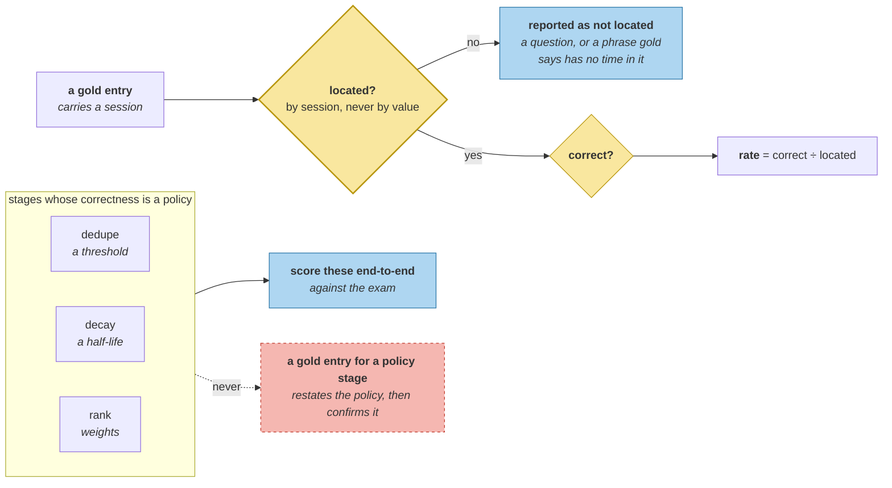

# Component Metrics

> **In one line.** The first version of this metric scored the system at 0.733, 0.600 and 0.500, and every one of those numbers was the metric.

## Where this sits

<!-- graph:begin -->
**Stage:** `govern` · **Level:** advanced · **~50 min**

**You need first:** [Why Memory Eval Is Hard](../why-memory-eval-is-hard/index.md)

**Concepts assumed:** [The Absent Corpus](../../../concepts/absent-corpus.md) · [Moving Ground Truth](../../../concepts/moving-ground-truth.md) · [Slot](../../../concepts/slot.md)

**This unlocks:** [Build Your Own Harness](../end-to-end-eval/index.md)
<!-- graph:end -->

## The problem

One boolean over seven stages cannot attribute a failure. So score the stages — and the scorer is code, written against an answer key someone else phrased, and it is wrong in the direction that looks like a system problem.

Four bugs, in the order I hit them:

| version | reported | actually |
|---|---|---|
| substring-match gold's supersession values | extract **0.733** | gold says *"wants short answers"*; the store holds *"Priya prefers shorter answers"* — the metric scored the answer key's prose style |
| match the phrase, ignore the session | anchor **0.500** | *"last week"* is in two memories; gold gives a session for every entry so the lookup can be unambiguous |
| match supersession values as text | arbitrate **0.600** | same paraphrase problem, one stage down |
| require *every* claim in the slot retired | arbitrate **0.600** | session 4 holds *"does not drink coffee"* (retired) and *"drinks tea"* (correctly live) |

Each looked like a finding. **None of them was.**

## Why this isn't RAG

A retrieval metric is a comparison between two sets of document ids. There is nothing to phrase, nothing to locate, and no way for the scorer to disagree with the key about what a judgement *refers to*.

Here every gold entry is a natural-language description of something the system was supposed to decide, and the metric's first job is to find the record it refers to. **Locating is a step, it can fail, and a metric that folds failures-to-locate into failures-to-be-correct reports the system as broken.**

## Mechanism

**Separate `located` from `correct`.**

```
stage         correct  located  entries    rate
extract             4        4        4   1.000
resolve             1        1        1   1.000
arbitrate           4        4        5   1.000
anchor              4        4        6   1.000
dedupe              0        0        0      --
decay               0        0        0      --
rank                0        0        0      --
```

`rate` is correct ÷ located. Three entries could not be located and are reported as such rather than as failures:

- *"last month"* (session 3) is inside a **question** — *"remind me what I said about the Spark job last month"* — and questions produce no memories.
- *"Very proud of her"* has no time phrase at all; gold says so in its own note.
- `commute` names the session holding the *replacement*, because the system represents that change as a past-tense statement rather than a supersession — which is defensible, and scoring it wrong measures the answer key's model of the change.

**Locate by session, never by value.** Every gold entry carries one, and that is why: the values are paraphrases written for a human reader, and the sessions are unambiguous.

### Three stages cannot be scored at all

```
dedupe  which pairs are duplicates is a threshold, not a fact
decay   'should have faded' is not a fact about a turn
rank    relevance judgements are what memory eval lacks by construction
```

**This is not a gap in the answer key.** These three stages have no correct behaviour that is a fact about the conversation — their correctness is a *policy*, and a gold entry for them would restate whatever policy was implemented and then confirm it. `dedupe`'s threshold, `decay`'s half-life and `rank`'s weights were all chosen by measuring their effect on the exam, which is the only honest thing available: **score the policy stages end-to-end and the factual stages against the key.**



## Design decisions

**Why is extraction recall-only?** Precision needs gold to enumerate everything that should *not* be extracted, which is unbounded. `over-extraction` measured the problem in Beginner and named no threshold, because there is not one — the boundary is a judgement, which puts it with `dedupe` and `decay`.

**Why report `entries` as well as `located`?** Because 4-of-4 at 1.000 and 4-of-6 at 1.000 are different situations, and only the second tells you a third of that seam's entries are never exercised. A metric reporting a rate alone hides how much of the key it declined to look at.

**Why keep the unscorable stages in the report?** So that *"we measure the pipeline"* cannot be said without qualification. Three of seven stages have no component metric and never will; printing them with `--` is cheaper than a paragraph nobody reads.

## Lab

**You'll implement:** `extraction`, `arbitration`, and `anchoring`.

**Run:**
```
uv run python curriculum/advanced/component-metrics/lab/lab.py
```

**Expected output:** all four scorable stages at **1.000**, with `arbitrate` locating **4 of 5** entries and `anchor` **4 of 6**, and the three unscorable stages showing `--` with their reasons.

**Stretch:** fold `unmatched` back into the denominator. `arbitrate` becomes 0.800 and `anchor` 0.667, both of which look like real regressions, and no test fails because the numbers are still internally consistent. **The most dangerous metric is the one that is wrong and stable.**

## What this adds to the capstone

`memlab.eval.components` — `Metric`, `extraction`, `resolution`, `arbitration`, `anchoring`, `unscorable`, `report`. Locates records by session and slot, never by gold's prose.

## Failure modes

| Symptom | Cause | How to detect | Mitigation |
|---|---|---|---|
| A stage scores low and nothing is wrong | Metric matched the key's paraphrase | Print what the metric located | Locate by session |
| Correct behaviour scored as failure | Sibling claims required to be retired | Read every claim in the slot | Check one, not all |
| A third of the key never exercised | `unmatched` folded into the denominator | Report entries and located separately | Two counters |
| "We measure the pipeline" | Unscorable stages omitted | Count stages in the report | Print them with `--` |
| Metrics agree with the system | Written after the behaviour | Check what the first run reported | Expect to debug the metric |

## Check yourself

??? question "The metric reported 0.500 for a parser that was right. How would you have caught that?"
    By printing what it located. Every one of these bugs was invisible in the score and obvious in the intermediate result — *"last week"* matched a step inside the weekly-report procedure, and one line of output showing which memory it picked ends the investigation. A metric that emits only a number cannot be debugged, and it will be believed.

??? question "Why can `dedupe`, `decay` and `rank` never have gold entries?"
    Because their correct behaviour is not a fact about the conversation. Nothing in the transcript establishes which pairs are duplicates, when a memory should fade, or how relevant a belief is to a question — those are thresholds and weights, and a gold entry would record the implementation and then confirm it. They are scored end-to-end instead, which is what every threshold in this course was actually tuned against.

??? question "All four scorable stages report 1.000. Is that suspicious?"
    Slightly, and the honest reading is narrower than it looks. The key contains twenty-five assertions, four stages are checkable, and three entries could not be located at all — so 1.000 means *the parts of the key this metric can reach are satisfied*. It is a regression guard, not a grade, and its value is that the next change to any of those four stages has something to fail against.

## Connections

<!-- graph:begin -->
**Stage:** `govern` · **Level:** advanced · **~50 min**

**You need first:** [Why Memory Eval Is Hard](../why-memory-eval-is-hard/index.md)

**Concepts assumed:** [The Absent Corpus](../../../concepts/absent-corpus.md) · [Moving Ground Truth](../../../concepts/moving-ground-truth.md) · [Slot](../../../concepts/slot.md)

**This unlocks:** [Build Your Own Harness](../end-to-end-eval/index.md)
<!-- graph:end -->
