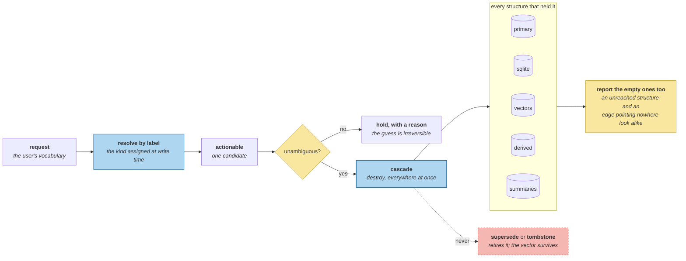

# Deletion That Actually Deletes

> **In one line.** Search the store for the word she used and you find nothing, so the request looks already satisfied — and the address is still in three places.

## Where this sits

<!-- graph:begin -->
**Stage:** `govern` · **Level:** advanced · **~55 min**

**You need first:** [Redaction and Minimization](../redaction-and-minimization/index.md)

**Concepts assumed:** [Personal Data](../../../concepts/personal-data.md) · [Label, Not Permission](../../../concepts/label-not-permission.md) · [Derivation Graph](../../../concepts/derivation-graph.md)

**This unlocks:** [Proving You Forgot](../rtbf-and-auditability/index.md)
<!-- graph:end -->

## The problem

Beginner's seventh failure, unfinished since Level 1:

```
s5   We moved. New place is 47 Halloway Road, Bristol.
s13  And actually — forget my old address, I don't want that stored anywhere.
```

**The old address was never stored.** She gave the new one. A literal reading deletes nothing; a helpful reading deletes the address she currently lives at. The store cannot tell which she meant, and `gold.yml` expected provenance to resolve that. It does not — it *reports* it: the only address on file came from session 5, in a sentence calling it the new place. Enough to ask a question, not enough to act.

And before any of that, resolution fails for a duller reason:

```
records containing "address":  0
```

She says *"address"*; the store says *"Priya lives at 47 Halloway Road, Bristol"*. **The user's word for a thing is not the store's word for it**, so the obvious implementation returns zero records and the request looks satisfied.

## Why this isn't RAG

Deleting a document from an index is a solved, total operation: drop the row, drop its postings, and the derived structures rebuild from a corpus that is still the truth. Nothing was inferred *from* the document that outlives it.

A memory layer has no corpus behind it. The record was the truth, other records were derived from it, its vector lives in a cache keyed by content, and a copy sits in whatever secondary store was added for query speed. **There is nothing to rebuild from**, so deletion has to reach every structure by name — and the list of structures is not written down anywhere except in the code that created them.

## Mechanism

**Resolution runs on labels, not on wording.** `privacy.classify` assigned `Kind.ADDRESS` at write time, and this is the stage that needs it — years later, from a request phrased in the user's vocabulary rather than the store's. That is what `pii-on-the-write-path` meant by *label, not permission*: the label's most important consumer is a request that had not been made yet.

```
resolving by label: 1 candidate, actionable=True
   one record labelled 'address', from s5:2025-08-02T11:15:00Z
   — but the request says 'old' and this is the address she gave as her new one
```

**Actionable and unambiguous are not the same thing.** One candidate makes the deletion mechanically possible; the reason string is what stops it being automatic. A system that deletes here is guessing, and the guess is irreversible.

**The cascade is total, and it reports the zeroes:**

```
cascade: primary=1  sqlite=1  vectors=1  derived=0  summaries=0   total=3
gone from: primary  sqlite  vectors
```

Three structures held it and none of them knew about the others. `derived` and `summaries` are zero on this corpus and are reported anyway — `temporal-knowledge-graphs` measured that a cascade reporting only what it removed is indistinguishable from one whose edges point nowhere, and this is the operation where that distinction is legally load-bearing.



**Deletion is not supersession.** Everything else in this course retires rather than destroys, and that decision is what makes `rollback` possible. This is the one operation that must actually destroy, which is why it needed its own vocabulary — `Operation` has had `add | update | merge | noop` since I3 and no member for this.

**Tombstoning is not deletion either.** `VectorIndex.index` tombstones a retired belief and keeps its vector *on purpose*, because an audit needs it. A deletion request is where that requirement inverts: the thing that must be provable is that the vector is gone, so `forget` destroys it and `holds` reports whether it did. Asking `vector_for` instead would **compute the vector you were about to delete**.

## Design decisions

**Why not delete on one candidate?** Because *"old address"* names something that is not in the store, and the only record it could plausibly mean is the one she still uses. Both readings are defensible and they have opposite consequences, so the system's job is to surface that, not resolve it. Deleting the wrong record permanently, with an audit trail saying the user asked, is the failure this whole module exists to prevent.

**Why is the candidate search generous?** Because the asymmetry runs the other way from every other classifier in this course. A wide candidate set gets reported and reviewed; a narrow one gets acted on. Missing a record that should have been deleted is a compliance failure that recurs on every audit; deleting an extra one is unrecoverable.

**Why report `derived=0`?** Because the derivation graph has one edge on this corpus and a real store has thousands, and a cascade that prints only non-zero counts looks identical whether it walked the graph or never found it. The zeroes are the evidence that the walk happened.

## Lab

**You'll implement:** `resolve`, `cascade`, and `purge`.

**Run:**
```
uv run python curriculum/advanced/deletion-that-actually-deletes/lab/lab.py
```

**Expected output:** **0** records containing the word *address*, **1** candidate found by label with the ambiguity reported, and the cascade — **primary 1, sqlite 1, vectors 1, derived 0, summaries 0, total 3** — with the address gone from all three.

**Stretch:** run the cascade using `vector_for` instead of `holds` to test whether the index has a vector. It reports success, and the index now contains a freshly computed embedding of the memory you just deleted. **A presence check that creates what it looks for is the worst possible thing to build a deletion audit on.**

## What this adds to the capstone

`memlab.privacy.delete` — `Request`, `Resolution`, `Cascade`, `resolve`, `cascade`, `purge`. `VectorIndex` gains `forget` and `holds`. This closes the second half of Beginner's failure 7; the first half was `two-clocks`.

## Failure modes

| Symptom | Cause | How to detect | Mitigation |
|---|---|---|---|
| Request appears already satisfied | Matched the user's wording, not the label | Count records containing the user's word | Resolve on labels |
| Wrong record deleted, irreversibly | One candidate treated as unambiguous | Read the resolution's reason | Surface, do not resolve |
| Data survives in a secondary store | Cascade knows only the primary | Grep every structure after deleting | Enumerate structures by name |
| Vector recreated during deletion | Presence checked with a computing accessor | Check the index size afterwards | A non-computing `holds` |
| Cascade looks correct and never ran | Only non-zero counts printed | Look for the zeroes | Report every structure |

## Check yourself

??? question "Searching for "address" returns zero records. What went wrong?"
    Nothing, at the time. The extractor stored *"Priya lives at 47 Halloway Road, Bristol"*, which is a good memory and contains no word the user is likely to use when asking for it back. The mismatch only becomes a problem at deletion, which is years after the write and the reason `pii-on-the-write-path` insisted the classification be kept as a durable label rather than a decision made and discarded.

??? question "There is exactly one candidate. Why not delete it?"
    Because the request says *old* and this address is the one she gave as new. The old address was never stored, so a literal reading deletes nothing and a helpful reading deletes where she lives. One candidate makes the operation mechanically possible; it does not make the intent clear, and the two are separately reported for exactly that reason.

??? question "Why does deletion need its own operation when supersession already exists?"
    Because supersession is designed never to destroy — that is what makes the audit trail, the as-of query and `rollback` possible. Deletion has the opposite requirement: the record must stop existing, and that must be provable. The two cannot share a mechanism, and the tombstone in the vector index is the same tension in miniature: it keeps the vector for audit, and deletion is where that inverts.

## Connections

<!-- graph:begin -->
**Stage:** `govern` · **Level:** advanced · **~55 min**

**You need first:** [Redaction and Minimization](../redaction-and-minimization/index.md)

**Concepts assumed:** [Personal Data](../../../concepts/personal-data.md) · [Label, Not Permission](../../../concepts/label-not-permission.md) · [Derivation Graph](../../../concepts/derivation-graph.md)

**This unlocks:** [Proving You Forgot](../rtbf-and-auditability/index.md)
<!-- graph:end -->
