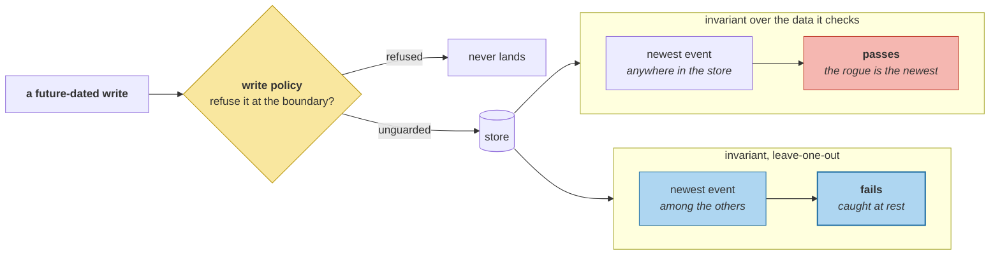

# Invariants and Drift Detection

> **In one line.** The first version of the clock invariant let a future-dated write redefine the clock and pass its own check.

## Where this sits

<!-- graph:begin -->
**Stage:** `govern` · **Level:** advanced · **~45 min**

**You need first:** [Memory Observability](../memory-observability/index.md)

**Concepts assumed:** [Leak Assertion](../../../concepts/leak-assertion.md) · [Bi-Temporal Modeling](../../../concepts/bi-temporal-modeling.md) · [Derivation Graph](../../../concepts/derivation-graph.md)

**This unlocks:** [Migrating Live Memory](../schema-migration-on-live-memory/index.md)
<!-- graph:end -->

## The problem

This course states invariants in eight modules and checks each in its own lesson's tests. That is right for teaching and useless in production, where the question is *"is the store healthy now?"* and the answer must be one call.

```
invariant                                     kind         count  holds
no cross-tenant memory is visible             structural       0  True
no belief is retired before it was recorded   structural       0  True
every derived_from reference resolves         structural       0  True
every superseded_by reference resolves        structural       0  True
ids are unique                                structural       0  True
no memory is dated past the store's clock     policy           0  True
no slot holds more than four live beliefs     policy           0  True

structural: 5   policy: 2
```

**The two kinds must not be reported together unlabelled.** A structural violation can only come from a bug in this system. A policy violation can come from a legitimately unusual user — and a dashboard that shows them identically makes a real bug look like a heavy-user alert.

## Why this isn't RAG

An index has few invariants worth asserting because it is derived: if it disagrees with the corpus, rebuild it. Consistency is restorable by recomputation, so drift is an operational nuisance rather than a correctness problem.

A memory store **is** the truth. There is nothing to rebuild from, so a violated invariant is not a stale derivation — it is data that is now wrong and will stay wrong. That difference is why these have to run continuously rather than at deploy time.

## Mechanism

**They catch a real historical bug.** Run the same seven against earlier profiles:

```
@I8: 1 failing  [('no belief is retired before it was recorded', 1)]
@A1: 0 failing
@A3: 0 failing
```

That is the Berlin claim `validity-intervals` found — retired nine months before it was recorded — detected by an invariant rather than by reading code, and shown fixed at the module that fixed it.

### The invariant that could not fail

The clock check was written the obvious way: compare each memory against the newest event in the store. Then a future-dated write arrives and:

```
unguarded future-dated write: 0 failing
```

**It passes**, because the rogue *is* the newest event and therefore is not past it. An invariant computed from the data it is checking cannot detect an outlier that moves the reference.

Leave-one-out fixes it — each memory is compared against the newest of the *others*:

```
unguarded future-dated write: 1 failing  [("no memory is dated past the store's clock", 1)]
```

The same record the A3 write policy refuses, now caught at rest by the check that is supposed to catch it. **A boundary control and an invariant are not redundant**: one refuses, the other notices what got in another way.



## Design decisions

**Why label kind rather than severity?** Because severity is a deployment decision and kind is a fact. *Structural* means "only a bug produces this"; *policy* means "unusual data produces this". How loudly each pages someone depends on who is on call, and encoding that here would bake one team's rota into the library.

**Why is "no slot holds more than four live beliefs" a policy invariant?** Because four is what this corpus happens to have — the diet slot, with all four beliefs simultaneously true. There is nothing wrong with five. It is a drift *detector*, and calling it structural would make a legitimate user look like a defect.

**Why run these against old profiles at all?** Because an invariant nobody has seen fail is an invariant nobody knows works. Running the set against `@I8` produces a real failure with a known cause, which is the cheapest possible test of the checker itself — and it is exactly the technique `memory-attacks` used to prove `leak_check` fires.

## Lab

**You'll implement:** `check`, `failing`, and `by_kind`.

**Run:**
```
uv run python curriculum/advanced/invariants-and-drift-detection/lab/lab.py
```

**Expected output:** seven invariants all holding at `@A3`, **5 structural** and **2 policy**, the `@I8` run failing exactly one, and the future-dated write caught — with the whole-store version of the same check reporting **0**.

**Stretch:** compute the clock reference over the whole store instead of leave-one-out, and add two future-dated records instead of one. Both pass, and they now agree with each other. **A pair of outliers that validate each other is the failure mode of every self-referential check.**

## What this adds to the capstone

`memlab.production.invariants` — `Kind`, `Violation`, `check`, `failing`, `by_kind`. Collects assertions from eight modules into one pass; adds no new rules.

## Failure modes

| Symptom | Cause | How to detect | Mitigation |
|---|---|---|---|
| Outlier passes its own check | Reference computed over all data | Add one extreme record | Leave-one-out |
| Real bug looks like a busy user | Kinds reported together | Ask which are structural | Label the kind |
| Invariants never fire | Never tested against a broken store | Run against an old profile | Prove they fail |
| Drift detector reads as a defect | Threshold from one corpus | Ask what makes the number right | Call it policy |
| Assertions scattered across modules | Each checked in its own tests | Ask for one health call | Collect them |

## Check yourself

??? question "Why did the clock invariant pass on exactly the record it was written for?"
    Because it defined the clock as the newest event in the store, and the rogue was the newest event. Nothing about the check was wrong except that its reference came from the data under test — so the outlier moved the standard it was measured against. Leave-one-out is the smallest fix, and the general lesson is that any invariant using an aggregate of the data cannot catch a record that shifts that aggregate.

??? question "Structural and policy invariants both report a count. Why separate them?"
    Because they mean different things about what to do next. A structural violation says code is broken and the data is now wrong permanently; a policy violation says a user did something unusual and may need a look. Reporting them in one undifferentiated list means every alert requires an investigation to determine which kind it was.

??? question "Six of the seven already had tests. What does collecting them buy?"
    A question you can ask of a running store. The lesson tests answer *"did this module work when it was written?"*; the collected check answers *"is this store healthy right now?"*, which is the only form the question takes in production — and it is what makes running them against `@I8` possible, which is how you find out the checker works.

## Connections

<!-- graph:begin -->
**Stage:** `govern` · **Level:** advanced · **~45 min**

**You need first:** [Memory Observability](../memory-observability/index.md)

**Concepts assumed:** [Leak Assertion](../../../concepts/leak-assertion.md) · [Bi-Temporal Modeling](../../../concepts/bi-temporal-modeling.md) · [Derivation Graph](../../../concepts/derivation-graph.md)

**This unlocks:** [Migrating Live Memory](../schema-migration-on-live-memory/index.md)
<!-- graph:end -->
