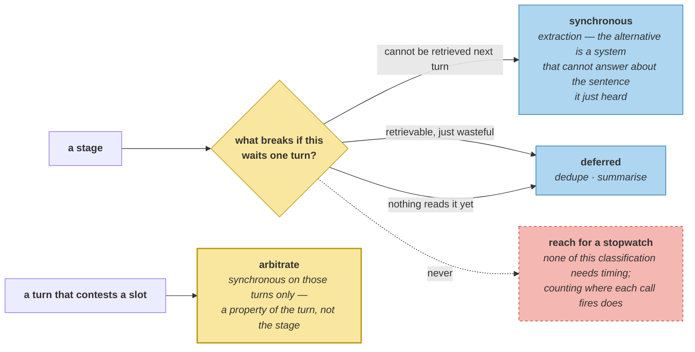

# The Latency Budget

> **In one line.** Half the per-turn model cost is on the critical path — and the other half is a model call in a stage everyone calls deferrable.

## Where this sits

<!-- graph:begin -->
**Stage:** `govern` · **Level:** advanced · **~45 min**

**You need first:** [The Write Path Dominates](../cost-model/index.md)

**Concepts assumed:** [Cost Profile](../../../concepts/cost-profile.md) · [Sleep-Time Compute](../../../concepts/sleep-time-compute.md) · [Consistency Window](../../../concepts/consistency-window.md)

**This unlocks:** [Caching, Batching, Routing](../caching-batching-routing/index.md)
<!-- graph:end -->

## The problem

`cost-model` counted 2.0 model calls per turn on the write path. They do not all have the same deadline.

```
extract    synchronous   a memory not extracted cannot be retrieved on the next turn
resolve    synchronous   entity links are needed to file the memory correctly
dedupe     deferred      a duplicate is retrievable; it is just wasteful
arbitrate  synchronous   only on a contested slot -- the A2 gate; otherwise deferred
decay      deferred      salience drifts slowly; a turn's delay is invisible
summarise  deferred      nothing reads a summary that does not exist yet
reflect    deferred      and unwired anyway -- A2.3 measured it as a regression

synchronous stages: 3 of 7
per turn: synchronous 1.0  deferred 1.0  total 2.0
blocking share: 50%
```

**The split is even, and the deferred half is not free.** `cost-model` counted 48 completions over 24 turns. Half are extraction and half are `conflict.classify` — and measuring *where* they fire settles which bucket each belongs in:

```
classify calls during the per-turn loop : 0
classify calls during consolidation     : 24
```

Conflict detection is a model call, it is one per turn on average, and **all of it is deferred**. Consolidation is not the cheap half; it is the half you already moved.

## Why this isn't RAG

A retrieval system's latency budget is spent at read time and the user is watching every millisecond of it: embed, search, rerank, generate. Indexing latency is nearly free to trade away, because nobody is waiting for it.

Here the read path is arithmetic over a cached index and the *write* path is where the model calls are — and the user is waiting for that too, because the next turn will be answered from what this turn stores. **The deadline is not "before the answer", it is "before the next question"**, which is a different and more forgiving budget, and the whole reason deferral is available at all.

## Mechanism

**Ask what breaks if this waits one turn.** Every classification here follows from that question and none of it needs timing:

- A memory not extracted **cannot be retrieved** next turn. Synchronous.
- A duplicate **is** retrievable, just wasteful. Deferred.
- A summary that does not exist yet is not read by anything. Deferred.
- A contested slot answered stale is the eleven-turn window `sleep-time-compute` measured. Synchronous *on those turns only* — which is the gate, priced.

**`arbitrate` is the only conditional entry**, and that is the interesting one. It is not synchronous or deferred by nature; it is synchronous **when the turn contests something**, which is a property of the turn rather than the stage. Every other row is a property of the stage.



**50% blocking, and the half that remains cannot move.** Extraction is 1.0 of the 2.0 calls, and deferring it is not an optimisation — it is a system that cannot answer a question about the sentence it just heard. The other 1.0 is already off the turn, which is what A2's gate was for.

The first version of this lesson reported **81%**, because it passed `cost-model`'s *total* to `budget()` as though every completion were extraction. The stage names made that plausible — consolidation sounds like the expensive one — and the only thing that caught it was counting where each call fires.

## Design decisions

**Why count calls rather than measure milliseconds?** Same reason as `cost-model`: seconds belong to the provider and the machine, and this corpus runs against a deterministic fake. A model call is the unit that transfers between deployments, and the split between blocking and deferred is a structural property that a stopwatch would only confirm.

**Why is `resolve` synchronous when entity links seem cosmetic?** Because filing is not cosmetic. A memory stored without its entity link is invisible to `cold-start-and-shared-accounts`' third-party exclusion and to `provenance-and-trust`' third-party detection, so the next turn's model is built wrong. It is cheap and it is on the path.

**Why list `reflect` at all when it is unwired?** Because a latency budget that omits the stages you decided not to run is a budget that will silently gain them back. A2.3 measured reflection as a regression and left it in the codebase; the budget records that it would be deferred if it ever returned.

## Lab

**You'll implement:** `split` and `budget`.

**Run:**
```
uv run python curriculum/advanced/latency-budget/lab/lab.py
```

**Expected output:** the seven stages with their classifications, **3 of 7** synchronous, per turn **1.0** synchronous against **1.0** deferred, and a **50%** blocking share.

**Stretch:** pass `cost-model`'s total of 48 as `extract_calls`, as the first version of this lesson did. You get **81%** blocking, a plausible story about consolidation being cheap, and no test failure — the number is internally consistent and describes a system that does not exist. **A per-turn figure is only meaningful once you have counted where each call fires.**

## What this adds to the capstone

`memlab.cost.latency` — `When`, `Stage`, `split`, `Budget`, `budget`. Takes its numbers from `cost-model`'s call counts and `sleep-time-compute`'s gate rather than measuring anything new.

## Failure modes

| Symptom | Cause | How to detect | Mitigation |
|---|---|---|---|
| Optimising the wrong stage | Cost confused with blocking cost | Split by deadline before optimising | Ask what breaks if it waits |
| Assistant cannot recall the last turn | Extraction deferred | Ask about something just said | Extraction is synchronous |
| Budget silently grows | Unwired stages omitted from it | List every stage, wired or not | Record the decision |
| Gate cost invisible | Conditional stage counted as always-on | Count the turns it fires on | Price it per turn |
| Latency tuned by stopwatch | Measured in a deployment's units | Ask what transfers | Count calls |

## Check yourself

??? question "Consolidation makes as many model calls as extraction. Why is it still the deferrable half?"
    Because of *when* they fire, not how many there are. Zero `conflict.classify` calls happen during the per-turn loop and all 24 happen during consolidation, so the cost is real and already off the critical path. Volume and deadline are independent, and the stage names suggest the opposite of both.

??? question "What is different about `arbitrate`'s classification?"
    It is the only entry that depends on the *turn* rather than the stage. Extraction is always synchronous and summarisation always deferrable; arbitration is synchronous exactly when the turn claims a slot something live already claims. That is the A2 gate, and this lesson is where its cost is written down as a per-turn number.

??? question "Half the cost is unavoidable. What is the budget for, then?"
    Knowing which half. There is no room left to move work off the turn — the deferrable half is already deferred — so every remaining gain has to come from making extraction itself cheaper. That is a routing decision about engineering time, and getting it wrong by one input turned it into a plan to optimise a stage that is already off the critical path.

## Connections

<!-- graph:begin -->
**Stage:** `govern` · **Level:** advanced · **~45 min**

**You need first:** [The Write Path Dominates](../cost-model/index.md)

**Concepts assumed:** [Cost Profile](../../../concepts/cost-profile.md) · [Sleep-Time Compute](../../../concepts/sleep-time-compute.md) · [Consistency Window](../../../concepts/consistency-window.md)

**This unlocks:** [Caching, Batching, Routing](../caching-batching-routing/index.md)
<!-- graph:end -->
