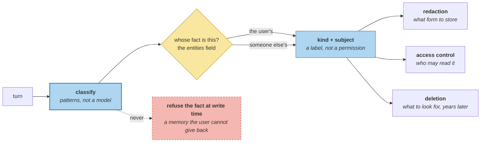

# PII on the Write Path

> **In one line.** Block every kind of personal data at the gate and the exam fails, because one of the four facts it needs is a medical diagnosis.

## Where this sits

<!-- graph:begin -->
**Stage:** `govern` · **Level:** advanced · **~45 min**

**You need first:** [Retrieving Procedures](../retrieving-procedures/index.md)

**Concepts assumed:** [The Memory Record](../../../concepts/memory-record.md) · [Write Authorisation](../../../concepts/write-authorisation.md) · [Entity Resolution](../../../concepts/entity-resolution.md)

**This unlocks:** [Redaction and Minimization](../redaction-and-minimization/index.md)
<!-- graph:end -->

## The problem

There has been a write-path gate since I1. It decides **memory-worthiness** — dropping scratch-tier activity, keeping the rest — and no stage has ever asked whether a candidate is personal data.

`gold.yml` marks four items. All four are stored, and the scan finds seven memories carrying them:

```
third_party_health   Priya's partner Sam is a nurse at St. Aubyn's
third_party_health   Samira got a promotion to charge nurse
third_party_health   Samira is a charge nurse
address              Priya lives at 47 Halloway Road, Bristol
phone                Priya's phone number is 07700 900412
health               Priya was diagnosed with a gluten intolerance last week
health               Priya has a gluten intolerance
```

Then apply the obvious policy:

| policy | blocked | store | exam |
|---|--:|--:|---|
| block nothing | 0 | 37 | **True** |
| block all four kinds | 7 | 30 | **False** |
| block contact details only | 2 | 35 | True |
| block third-party health only | 3 | 34 | True |

**Blocking all personal data breaks the system**, because `gluten intolerance` is health data *and* one of the four facts the exam requires. A policy that protects it by never storing it has protected the user from an answer they asked for.

## Why this isn't RAG

PII in a retrieval system is somebody else's problem, upstream. The corpus was assembled, reviewed and redacted before indexing; the index inherits whatever decision was made, and the read path never has to reason about it.

A memory layer manufactures the corpus **one turn at a time, from the person the data is about, who is telling you on purpose.** *"I've got a gluten intolerance"* is medical data volunteered so that you will use it. There is no upstream to defer to, and "do not store personal data" would empty the store of exactly what makes it useful.

## Mechanism

**Classify, do not decide.** A label says *this is health data about the user*; it does not say *refuse it*. Redaction chooses what form to store, access control chooses who may read it, and deletion needs to know what to look for — three later stages, one label, no permission attached at write time.

**Third-party data is detected by the entity link.** *"Sam is a nurse"* is health-adjacent data about someone who never agreed to any of this, and the only thing distinguishing it from a fact about the user is `entities` — the field I2 populated for a retrieval reason. **Three of the seven findings are about someone else**, and they are the ones with no consent story at all.



**Patterns, not a classifier.** A false negative is a missed label; a false positive is a fact the system refuses to remember. Both are visible in a diff, and neither justifies a nondeterministic decision on the write path — the same argument `implicit-signals` and `learning-from-outcomes` made, in the module where the cost of an invented positive is a memory the user gave you and cannot get back into the system.

### What the table actually says

The two narrow policies both preserve the exam, and they preserve it for different reasons. Blocking contact details loses the address and phone — nothing the exam asks for. Blocking third-party health loses Samira entirely, which is arguably the most defensible policy on the page and the one nobody proposes, because it costs the user nothing and protects a person who is not in the room.

**Sensitivity does not order these.** The health facts are the most sensitive and the most load-bearing. The third-party facts are the least defensible to hold and the least missed.

## Design decisions

**Why is the label not a permission?** Because the same fact is required in one context and unacceptable in another. The gluten intolerance must reach a question about food and must not reach the travel agent — that is two decisions, made by two different stages, from one label. Collapsing them at the gate makes the strictest one win everywhere.

**Why not ask the user at write time?** Because they already told you. A prompt asking *"may I remember that you have a gluten intolerance?"* immediately after they volunteered it is not consent, it is friction, and the answer is in the transcript. The consent question that does need asking is about *deletion*, and session 13 asks it unprompted.

**Why does `health` match on `diagnosed` as well as the condition?** Because the episodic memory — *"Priya was diagnosed with a gluten intolerance last week"* — is separately stored and separately retrievable, and a policy that labels the semantic fact and misses the episode has labelled half the data. The scan finds **two** health memories, not one.

## Lab

**You'll implement:** `classify`, `scan`, and `blocked_by`.

**Run:**
```
uv run python curriculum/advanced/pii-on-the-write-path/lab/lab.py
```

**Expected output:** **7 of 37** memories carrying personal data, three of them about someone else, and the four-policy table — blocking all four kinds drops **7** memories and the exam goes **False**.

**Stretch:** remove `entities` from the third-party check, so *"Sam is a nurse"* is classified as health data about the user. Two of the three become `health`, the block-all policy still fails the exam for the same reason, and the store now records a medical fact about the wrong person. **The field that separates two people is the same one that separates two consent stories.**

## What this adds to the capstone

`memlab.privacy.classify` — `Kind`, `Finding`, `PATTERNS`, `classify`, `scan`, `blocked_by`. No pipeline stage: this lesson deliberately adds a label and no enforcement, and `redaction-and-minimization` is the first stage that acts on it.

## Failure modes

| Symptom | Cause | How to detect | Mitigation |
|---|---|---|---|
| Store empties of useful facts | PII blocked at the gate | Run the exam under the policy | Label, then decide per stage |
| Half the data labelled | Only the semantic form matched | Count memories per kind | Match the episode too |
| Third-party data treated as the user's | Entity link ignored | Check `entities` on health matches | Detect by link, not phrasing |
| A fact the user gave, refused | Classifier false positive at write time | Diff what a policy would block | Patterns over models |
| Strictest policy wins everywhere | Label collapsed into permission | Ask which stage enforces it | Separate label from decision |

## Check yourself

??? question "Blocking all personal data is the safest policy. What does it cost here?"
    The exam. `gluten intolerance` is health data and one of the four facts the answer requires, so the strictest policy produces a system that cannot tell the user what they told it, in order to protect them from it. Safety that removes the function is not a trade-off that was made; it is one that was avoided by not measuring.

??? question "Which of the four kinds is easiest to justify blocking, and why is it not the sensitive one?"
    Third-party health. Blocking it costs the user nothing measurable — the exam is unaffected, the model already excluded Samira's facts — and it protects someone who never agreed to be in the store. The health data about the user is more sensitive and less blockable, because they volunteered it so that it would be used.

??? question "Why detect third-party data by `entities` rather than by wording?"
    Because *"Sam is a nurse"* and *"I am a nurse"* are the same shape and different consent stories, and only the entity link records which one this is. It is the same field that stops a shared account merging two identities — one mechanism, two governance problems, and both of them invisible if resolution never ran.

## Connections

<!-- graph:begin -->
**Stage:** `govern` · **Level:** advanced · **~45 min**

**You need first:** [Retrieving Procedures](../retrieving-procedures/index.md)

**Concepts assumed:** [The Memory Record](../../../concepts/memory-record.md) · [Write Authorisation](../../../concepts/write-authorisation.md) · [Entity Resolution](../../../concepts/entity-resolution.md)

**This unlocks:** [Redaction and Minimization](../redaction-and-minimization/index.md)
<!-- graph:end -->
