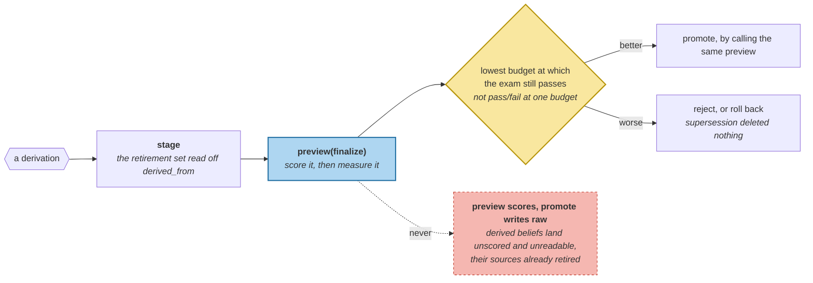

# Promotion as a Release

> **In one line.** The preview said the change costs five tokens; without one missing step it actually breaks the exam at every budget — and the whole point of a release is that you find that out before shipping.

## Where this sits

<!-- graph:begin -->
**Stage:** `evolve` · **Level:** advanced · **~50 min**

**You need first:** [Reflection and Insight](../reflection-and-insight/index.md)

**Concepts assumed:** [Reflection](../../../concepts/reflection.md) · [Snapshot Isolation](../../../concepts/snapshot-isolation.md) · [Supersession](../../../concepts/supersession.md)

**This unlocks:** [Memory Topologies](../memory-topologies/index.md)
<!-- graph:end -->

## The problem

`reflection-and-insight` produced three beliefs that were correct, fully traceable, and made the system worse. The beliefs were never the problem. The problem was that there was no step between **deriving** them and **having** them.

A background job that writes straight into the live store answers three questions at once and reports on none of them:

- what would change?
- is the system better?
- can this be undone?

## Why this isn't RAG

Re-indexing is idempotent and reversible by construction: the corpus is untouched, so a bad index is fixed by building another one. There is nothing to roll back because nothing was destroyed.

Consolidation destroys. It retires beliefs, moves confidences, merges records — in the store that *is* the source of truth. There is no corpus to rebuild from, so "undo" has to be a thing you designed, not a thing you fall back on. **Rollback is the part to build first**, because everything else is only safe once it exists.

## Mechanism

**Stage reads the retirement set off the provenance.** A derivation returns memories carrying `derived_from`; everything named there is what the change subsumes. Deriving the retirement set rather than specifying it separately is what stops the two drifting apart.

```
staged: derive+3   adds 3   retires 8   base 37
```

**Evaluate on the measurement that matters.** Not pass/fail at one budget — the lowest budget at which the exam still passes. A change that keeps the exam correct while eating five tokens of headroom is a regression that a single-budget check reports as green.

```
before 51    after 56    delta +5    better=False
```

The store is untouched by all of this: still 37 memories.

### The step that was missing

`preview` originally returned the merged list, and the evaluation ran the pipeline's scoring pass over it before measuring. `promote` wrote the merged list directly. Two lines apart, and they were different programs:

| | lowest passing budget |
|---|---|
| preview **without** the finalize step | **never passes** |
| preview **with** it | 56 |
| what `promote` actually wrote | 56 |

Derived beliefs were scored in the preview and unscored on disk, so on disk they were `tier=working`, invisible to `retrievable_only` — while their eight sources had just been retired. **The store lost the diet facts entirely**, and the release that was supposed to catch exactly this reported a tidy `+5`.

The fix is structural rather than careful: `finalize` is a parameter of `preview`, and `promote` calls `preview`. There is no longer a way to measure one thing and apply another.



**Rollback works because supersession never deleted anything.** Drop what the release added, clear `invalid_at` on what it retired, and the store is identical — ids, validity, supersession pointers and tiers:

```
promoted    lowest budget 56
rolled back lowest budget 51    store identical: True
```

A store that had deleted the subsumed memories could not do this at all. That is `supersession-not-deletion`'s argument from two levels ago, finally cashed.

**Promotion refuses a moved base.** A release computed against one store must not be applied to another, because the retirement set was chosen by looking at what was live *then* — `background-job-mechanics`' snapshot rule in its strictest form.

## Design decisions

**Why measure the lowest passing budget rather than pass/fail?** Because every interesting regression here is a loss of headroom. The exam still answers correctly after promotion; it just needs 56 tokens instead of 51. A binary check at 80 is green through the entire failure.

**Why does `stage` not apply and then undo?** Because promoting and rolling back leaves traces — retirement timestamps, superseded-by pointers — and the round trip is only clean here because rollback was designed. Computing a preview costs a pass over the store and touches nothing, which is a better default than trusting your own undo.

**And the release for reflection is rejected.** That is A2's conclusion and it is a real outcome, not a failure of the module: three correct beliefs, staged, measured at +5 tokens, and not shipped — with the mechanism and the number both retained so the decision can be revisited when the store is large enough for it to flip.

## Lab

**You'll implement:** `stage`, `preview`, and `rollback`.

**Run:**
```
uv run python curriculum/advanced/promotion-as-release/lab/lab.py
```

**Expected output:** the staged change — **3 added, 8 retired, base 37** — the verdict **51 → 56**, the preview measured with and without the finalize step (**56** against never passing), and the round trip returning the store identical.

**Stretch:** roll back a release that was promoted, then promote it again and roll back a second time. The store returns to the same fingerprint each time. Then delete a subsumed memory instead of retiring it and try. **Undo is a property of the write model, not of the undo function.**

## What this adds to the capstone

`memlab.sleep.release` — `Staged`, `Verdict`, `stage`, `preview`, `evaluate`, `promote`, `rollback`. **Module A2 ends here.** Consolidation now has a schedule that knows which turns cannot wait, a write-back that cannot lose a concurrent turn, a reflection stage that is measured rather than assumed, and a release process that can decline to ship it.

## Failure modes

| Symptom | Cause | How to detect | Mitigation |
|---|---|---|---|
| Promotion behaves unlike its preview | Preview omits a step the write performs | Measure the preview and the result | One function, both paths |
| Regression passes review | Checked pass/fail at one budget | Measure the lowest passing budget | Measure headroom |
| Cannot undo a bad consolidation | Subsumed memories deleted | Try a round trip; diff the store | Retire, never delete |
| Release applied to a changed store | Retirement set chosen against an old base | Compare base ids before applying | Refuse and re-stage |
| Derived beliefs silently unreachable | Written after the scoring pass | Count them in the eligible pool | Finalize inside the preview |

## Check yourself

??? question "The preview and the promotion were two lines apart. Why were they different programs?"
    Because one ran the scoring pass and the other did not, and nothing in the types said they had to agree. Derived memories are created at `tier=working`, and `retrievable_only` drops those whenever long-term memories exist — so the preview measured scored beliefs while the store held invisible ones with their sources already retired. The fix is not to remember; it is to make `promote` call `preview`.

??? question "Rollback restored the store exactly. What made that possible?"
    That nothing had been destroyed. Retirement sets `invalid_at` and `superseded_by` on records that stay in the log, so undo is clearing two fields and dropping three added memories. Had consolidation deleted the eight subsumed beliefs, the information needed to restore them would not exist anywhere — and no amount of care in the rollback function recovers it.

??? question "A2 ends by declining to ship its own feature. What was the module for?"
    The decision. Reflection was plausible enough to be worth building and wrong enough to be worth measuring, and without staging you find that out in production or not at all. The module's output is a mechanism that turns "this seems like a good idea" into "+5 tokens, rejected, here is the number to re-check at scale."

## Connections

<!-- graph:begin -->
**Stage:** `evolve` · **Level:** advanced · **~50 min**

**You need first:** [Reflection and Insight](../reflection-and-insight/index.md)

**Concepts assumed:** [Reflection](../../../concepts/reflection.md) · [Snapshot Isolation](../../../concepts/snapshot-isolation.md) · [Supersession](../../../concepts/supersession.md)

**This unlocks:** [Memory Topologies](../memory-topologies/index.md)
<!-- graph:end -->
