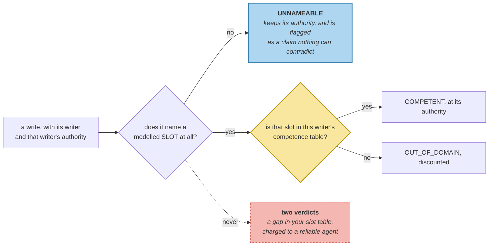

# Provenance and Trust

> **In one line.** The one agent write that gets checked is checked by accident — and lowering trust for the other two would punish a reliable agent for a gap in your own vocabulary.

## Where this sits

<!-- graph:begin -->
**Stage:** `govern` · **Level:** advanced · **~50 min**

**You need first:** [Memory Topologies](../memory-topologies/index.md)

**Concepts assumed:** [Provenance](../../../concepts/provenance.md) · [Slot](../../../concepts/slot.md) · [Memory Topology](../../../concepts/memory-topology.md)

**This unlocks:** [Cross-Agent Write Conflicts](../cross-agent-write-conflicts/index.md)
<!-- graph:end -->

## The problem

Authority works. The travel agent's relocation rumour arrives at 0.3, flows into confidence, loses arbitration to the address the user gave, and `test_hearsay_is_not_believed` has passed since I4.

Audit what that defence actually covers:

```
calendar-agent   auth 0.9   slot=None       live=True
calendar-agent   auth 0.9   slot=None       live=True
travel-agent     auth 0.3   slot=residence  live=False
```

**The one write that gets checked is the one that happened to claim a slot the user also claims.** The other two were never compared with anything — conflict detection generates candidates by slot, they name no slot, so no candidate exists and arbitration never runs. Their authority is a number on a row nothing looks at.

*"Nothing disagreed with this"* and *"nothing looked at this"* produce identical output.

## Why this isn't RAG

Retrieval has source quality too — domain authority, recency, a curated allowlist — and it is genuinely a property of the *source*. A reputable publication is reputable across its output, and the reader is choosing which documents to read.

A memory layer stores assertions from writers with narrow competence into one belief set. A calendar agent is excellent about calendars and, about a user's diet, no better informed than a stranger. **Trust has to attach to the claim, not the claimant** — and that is only possible if the system can say what is being claimed.

## Mechanism

**Competence is a table of (writer → slots).** Short and explicit, because a table you can read is a table someone keeps current, and a wrong entry fails visibly in arbitration rather than silently.

**Three verdicts, and the third is the one that matters:**

| verdict | meaning | trust |
|---|---|---|
| `COMPETENT` | within the writer's domain | its authority |
| `OUT_OF_DOMAIN` | names a slot this writer does not own | discounted to 0.3 |
| `UNNAMEABLE` | names **no** slot at all | **its authority, and flagged** |

The obvious design has two states, and it is wrong. A claim naming no modelled slot is not outside the writer's domain — it is outside the *vocabulary*, and discounting it encodes *"our slot table is incomplete"* as *"this writer is unreliable"*. Those are statements about different parties.



Which matters here, because the calendar agent's **entire output** is unnameable. This course models seven attributes and none of them is scheduling:

```
writer            auth        slot         verdict  trust  checkable
calendar-agent     0.9        None      unnameable    0.9      False
calendar-agent     0.9        None      unnameable    0.9      False
travel-agent       0.3   residence   out of domain    0.3       True
```

A two-state policy discounts the reliable agent to 0.3 and leaves the rumour where it was.

### And it is not an agent problem

Assess the whole store:

```
competent      27
unnameable      9
out of domain   1
```

**Nine of thirty-seven memories claim nothing the system can name**, and seven of those are the user's own — *"Priya mostly does pipeline work"*, *"Priya is debugging a Spark job"*. The vocabulary gap is store-wide. The agent case is just where it stops being a retrieval inconvenience and becomes a question about what you are willing to believe.

**So the deliverable is the flag, not the discount.** `unchecked()` lists the agent writes nothing can contradict. Two of three, on a corpus with three.

## Design decisions

**Why is `travel-agent`'s competence empty?** Because it relays. Its one contribution is *"Priya's colleague mentioned"* — a claim about a claim, and there is no attribute a relay is authoritative for. Empty is the honest entry, and it is the entry that makes `OUT_OF_DOMAIN` fire on the one write worth catching.

**The `calendar-agent: {commute}` entry never fires on this corpus.** Its writes are unnameable, so competence is never consulted. It is kept because it is *correct* — a calendar agent reporting a change of commute is within its domain — and removing it would make the table a description of this fixture rather than a policy. But it earns nothing here and the lab prints that.

**Why not add a `schedule` slot and close the gap?** Because `SLOTS` is load-bearing for conflict detection, ranking, scheduling and reflection — four callers across two levels, with figures measured against each. Adding a slot is a change to all four and needs its own measurement, not a footnote in a trust lesson. The gap is the finding; closing it is a separate piece of work.

**Why does an out-of-domain claim keep 0.3 rather than being refused?** The same argument I1 made for storing hearsay at all: refusing it makes a later confirmation look like the first anyone had heard. An out-of-domain observation is weak evidence, not an absence of evidence.

## Lab

**You'll implement:** `assess` and `unchecked`.

**Run:**
```
uv run python curriculum/advanced/provenance-and-trust/lab/lab.py
```

**Expected output:** the three agent writes with their verdicts — two **unnameable** at trust **0.9**, one **out of domain** at **0.3** — then **2 of 3** unchecked, and the store-wide split **27 / 9 / 1**.

**Stretch:** collapse the three verdicts to two, treating unnameable as out-of-domain. The calendar agent's trust falls to 0.3 on both its writes, the travel agent's stays at 0.3, and no test that checks the *rumour* notices. **A policy that punishes the reliable writer and leaves the unreliable one untouched still looks like a working trust model.**

## What this adds to the capstone

`memlab.agents.trust` — `Verdict`, `Assessment`, `COMPETENCE`, `competence`, `assess`, `unchecked`. Reads `SLOTS` and `slot_of` from `evolve.conflict` rather than restating them, so the vocabulary has one definition and this lesson's gap is the same gap arbitration has.

**`assess` ships unwired.** The write policy already live in `ingest` admits the calendar agent's unnameable writes at full authority and says nothing, which is exactly what this lesson argues it should do — the flag belongs where two claims are being weighed against each other, not where one is being let in. `cross-agent-write-conflicts` is where trust replaces raw authority in arbitration, and it is the next lesson. Until then this module computes a verdict nothing consumes, and saying so is cheaper than a reader discovering it.

## Failure modes

| Symptom | Cause | How to detect | Mitigation |
|---|---|---|---|
| Hearsay defence looks complete | Only slot-claiming writes are arbitrated | Count agent writes with no slot | Flag the unnameable |
| Reliable agent distrusted | Vocabulary gap read as unreliability | Check which verdict its writes get | Three states, not two |
| Trust per writer, not per claim | Authority is a constant on the row | Ask what the writer is competent about | A competence table |
| Silent acceptance of anything | "Nothing disagreed" reported as agreement | Compare unchecked count to write count | Report, do not infer |
| Competence table drifts | Entries that never fire | Print which entries were consulted | Keep it short and printed |

## Check yourself

??? question "Two of three agent writes are never arbitrated. Is that a hole in arbitration?"
    No — arbitration is doing exactly what I4 specified, comparing beliefs that claim the same attribute. The hole is that two of the writes claim an attribute the system has no name for, so no pair is ever formed. Fixing it in arbitration would mean comparing everything with everything, which I3 measured as the thing slots exist to avoid.

??? question "Why keep full authority for a claim you cannot assess?"
    Because the failure is in the vocabulary, not the writer. A calendar agent reporting a recurring 1:1 is doing its job well; the store simply has no slot for scheduling. Discounting it would record a fact about the store's coverage as a fact about the agent's reliability, and the next person to read that number would draw the wrong conclusion about which to fix.

??? question "Nine of thirty-seven memories are unnameable, seven of them the user's own. So is the slot table wrong?"
    Incomplete, which is different, and the lesson does not fix it on purpose. `SLOTS` has four callers across two levels with measured figures against each, so adding entries is a change to conflict detection, ranking, scheduling and reflection at once. What this lesson delivers is knowing the size of the gap and which writes fall in it.

## Connections

<!-- graph:begin -->
**Stage:** `govern` · **Level:** advanced · **~50 min**

**You need first:** [Memory Topologies](../memory-topologies/index.md)

**Concepts assumed:** [Provenance](../../../concepts/provenance.md) · [Slot](../../../concepts/slot.md) · [Memory Topology](../../../concepts/memory-topology.md)

**This unlocks:** [Cross-Agent Write Conflicts](../cross-agent-write-conflicts/index.md)
<!-- graph:end -->
