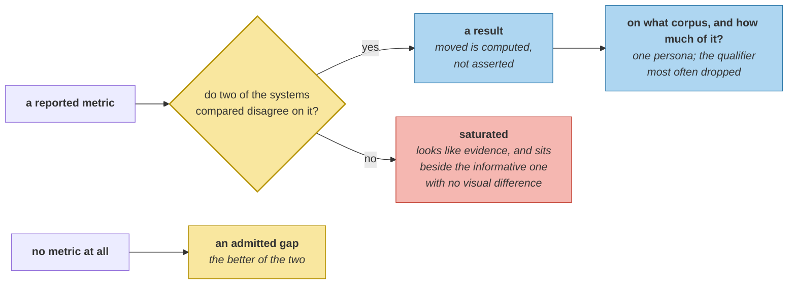

# Reading Benchmark Claims Critically

> **In one line.** The most defensible claim this course can make is *"1.000 on four metrics across six profiles"*, and one of the four is informative.

## Where this sits

<!-- graph:begin -->
**Stage:** `govern` · **Level:** advanced · **~45 min**

**You need first:** [LLM as Judge, and Its Failure Modes](../llm-as-judge-for-memory/index.md)

**Concepts assumed:** [Eval Suite](../../../concepts/eval-suite.md) · [Flat Metric](../../../concepts/flat-metric.md) · [Component Metric](../../../concepts/component-metric.md)

**This unlocks:** [The Write Path Dominates](../cost-model/index.md)
<!-- graph:end -->

## The problem

Start with your own number, because it is the one you cannot dismiss:

```
headline : memlab v0.3 scores 1.000 on 4 metrics across 6 profiles
moved    : ['anchor']   (1 of 4 informative)
flat     : ['extract', 'resolve', 'arbitrate']
absent   : ['dedupe', 'decay', 'rank']
corpus   : one corpus, one persona, 24 turns
```

Every word of the headline is true. Three of the four metrics were **already 1.000 before Level 3 began**, three of the seven pipeline stages have **no metric at all**, and the whole thing rests on one conversation.

None of that is dishonesty. It is what the number means, and a claim carrying it is more useful than one that does not.

## Why this isn't RAG

Retrieval benchmarks are comparable because the corpus and judgements are shared. MS MARCO scores from two papers describe the same task, so a difference is a difference in the systems.

Memory benchmarks share almost nothing. Each defines its own conversations, its own question types, its own notion of a correct answer, and — the part that does the damage — **its own division of labour between the memory system and the model reading its output.** Two numbers from two papers can differ because one of them let a larger model do the remembering.

<!-- landscape:begin -->
This is why the same system is cited at wildly different scores on LoCoMo, LongMemEval and BEAM depending on who ran it and how retrieval was configured. See the [landscape notes](../../../landscape/benchmarks/locomo.md) for dated specifics; the point here is structural and survives any of those being renamed or retired.
<!-- landscape:end -->

## Mechanism

**Four questions, and they apply to your own numbers first:**

```
- which metrics differ between the systems compared?
- which were already saturated before the change?
- which stages have no metric at all?
- on what corpus, and how much of it?
```

**`moved` is computed, not asserted.** A metric qualifies only if two of the compared systems disagree on it — which is the line between a result and a number, and it is a line a claim can be checked against mechanically.

**A saturated metric is worse than a missing one.** A missing metric is an admitted gap. A metric reporting 1.000 for both systems looks like evidence and is not, and it is reported alongside the informative one with no visual difference. `extract`, `resolve` and `arbitrate` are correct, and citing them as evidence for anything in Level 3 would be false while every individual number stayed true.

**The corpus qualifier is the one most often dropped.** *"One corpus, one persona, 24 turns"* is the strongest caveat on the list — every finding in this course is a finding about Priya — and it is the sentence a headline never has room for.



## Design decisions

**Why is `honest` a property of the claim rather than a judgement about the claimant?** Because it is checkable: does the claim carry `moved`/`flat`, `absent` and `corpus`? That turns *"read benchmark claims critically"* from advice into a predicate, and it applies identically to a vendor's numbers and to yours.

**Why does this lesson name no scores from published benchmarks?** Because they would be stale within a release cycle and the reasoning would not. The reading is structural — what moved, what was saturated, what has no metric, on what data — and dated specifics live in `landscape/`, behind a marked block, with an expiry.

**Why start with your own claim?** Because every reader believes they would apply this to somebody else's. Applying it here produces *"1 of 4 informative"* about a system the reader has spent seventy lessons building, which is more convincing than any external example and immune to the objection that the example was chosen.

## Lab

**You'll implement:** `about` and `questions`.

**Run:**
```
uv run python curriculum/advanced/reading-benchmark-claims/lab/lab.py
```

**Expected output:** the headline, `moved` containing only **anchor** at **1 of 4** informative, the three flat metrics, the three absent stages, the corpus qualifier, and `honest: True`.

**Stretch:** drop the flat metrics from the report and recompute. The claim becomes *"1.000 on one metric"* — weaker-sounding, more informative, and the version nobody publishes. **The incentive runs towards the number that says less.**

## What this adds to the capstone

`memlab.eval.claims` — `Claim`, `about`, `questions`. **Module A7 ends here**: what can be scored, per-stage metrics that had to be debugged before they were believed, a suite across profiles, the regression discipline counted, the rule about judgement, and a check you can run on a claim.

## Failure modes

| Symptom | Cause | How to detect | Mitigation |
|---|---|---|---|
| Saturated metric cited as evidence | Reported without its history | Check whether it moved at that change | Report `flat` alongside |
| Incomparable numbers compared | Benchmarks differ in division of labour | Ask what the model was allowed to do | Compare within one harness |
| Gap invisible | Unmetricked stages omitted | Count stages against metrics | Report `absent` |
| Result over-generalised | One corpus, one persona | Ask how many conversations | Carry the corpus qualifier |
| Critique applied only outward | Own numbers exempt | Run the four questions on yours | Start there |

## Check yourself

??? question "Three metrics report 1.000 and are called uninformative. Are they worthless?"
    As regression guards they are valuable and that is what they are. As evidence for a change they are empty, because they reported the same value before it. The failure mode is not measuring them; it is citing them — and since a saturated metric and an informative one look identical in a table, the distinction has to be computed and printed rather than remembered.

??? question "Why can two papers report very different numbers for the same memory system?"
    Because memory benchmarks share almost nothing: their conversations, question types, and notions of a correct answer all differ, and so does the division of labour between the memory layer and the model reading its output. A number can improve because a larger reader compensated for worse retrieval, which is a fact about the harness rather than the system.

??? question "What is the strongest caveat on this course's own claim?"
    The corpus. Every finding here — the 51-token budget, the eleven-turn window, the three accidental defences — is a finding about one persona across twenty-four turns. The methods generalise and the numbers do not, and that is the sentence a headline has no room for, which is exactly why the claim has to carry it as a field.

## Connections

<!-- graph:begin -->
**Stage:** `govern` · **Level:** advanced · **~45 min**

**You need first:** [LLM as Judge, and Its Failure Modes](../llm-as-judge-for-memory/index.md)

**Concepts assumed:** [Eval Suite](../../../concepts/eval-suite.md) · [Flat Metric](../../../concepts/flat-metric.md) · [Component Metric](../../../concepts/component-metric.md)

**This unlocks:** [The Write Path Dominates](../cost-model/index.md)
<!-- graph:end -->
