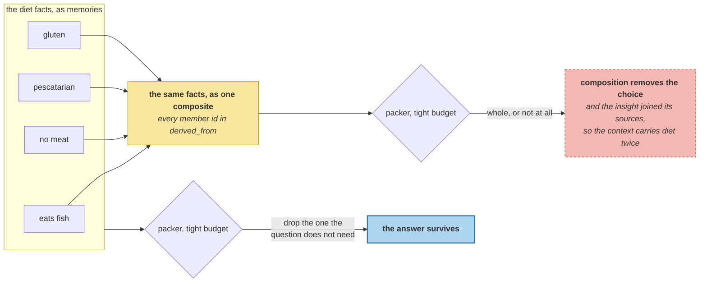

# Reflection and Insight

> **In one line.** Three well-supported, fully traceable derived beliefs — and every way of putting them in the store makes the answer worse.

## Where this sits

<!-- graph:begin -->
**Stage:** `evolve` · **Level:** advanced · **~55 min**

**You need first:** [Background Job Mechanics](../background-job-mechanics/index.md)

**Concepts assumed:** [Slot](../../../concepts/slot.md) · [Salience](../../../concepts/salience.md) · [Element Cost](../../../concepts/element-cost.md)

**This unlocks:** [Promotion as a Release](../promotion-as-release/index.md)
<!-- graph:end -->

## The problem

The obvious generator is similarity: find beliefs that look related and synthesise. I3 already measured that this signal cannot separate a refinement from a corroboration from a contradiction — 0.669, 0.505, 0.439, with no threshold between them — which is why `evolve/promote.py` promotes nothing.

Point it at reflection and it fails harder. **20 candidate pairs**, ranked:

```
0.557  Priya drinks tea            + Priya drinks three coffees a day
0.478  Priya drinks tea            + Priya works at Calico Systems
0.449  Priya is a staff engineer   + Priya prefers shorter answers
0.433  Priya mostly does pipeline work + Priya is pescatarian
```

The **top-scoring insight candidate is a contradiction** — the coffee reversal I4 already arbitrated. Second pairs a drink with an employer, third a job title with a formatting preference. **14 of 20 pair facts from unrelated slots**, and the first genuine dietary relation sits sixth.

## Why this isn't RAG

Summarising a corpus is a read-time convenience: generate a summary, show it, throw it away. If it is wrong the user sees a bad summary of documents they can go and check.

A derived belief is **written back**. It joins the store as a first-class memory, gets ranked, gets retrieved, and gets stated as though the user had said it — with no document behind it to check against. Reflection is the one stage that manufactures beliefs, so it is the one stage where an unsupported claim enters looking exactly like a supported one.

## Mechanism

**Generate from structure.** Live beliefs sharing a `SLOT` — the same table that serves conflict detection, ranking and now scheduling. Four groups have two or more:

| slot | live | |
|---|--:|---|
| diet | 4 | fish, no meat, pescatarian, gluten |
| beverage | 2 | tea, three coffees |
| employer | 2 | Calico Systems, staff engineer |
| occupation_other | 2 | **Samira** is a charge nurse; Sam still works nights |

**Compose, do not write.** The insight is a template over its members, and every member id goes in `derived_from` so A1's `cascade` can retire it the moment a source goes. A composed belief can be checked against its sources; a generated sentence has no way back to the evidence.

**The suppression that matters is the fourth row.** Slots are keyed on *what is claimed*, not on *who it is claimed about*, so `occupation_other` groups two facts about Priya's partner. Composing them writes a belief that Priya works night shifts as a charge nurse. **Any third-party entity disqualifies the group** — and it is the only rule here that catches anything, because retired members are not a reason to refuse: they simply are not members, so the slot's history is untouched and `temporal-questions` still answers it.

Three groups survive. All three are correct.

### And they are invisible

```
derived beliefs, as created:   tier=working
eligible pool:                 18 of 40
insights in the pool:          0 of 3
```

`retrievable_only` keeps `LONG_TERM` whenever any exists, and nothing has scored the new beliefs — reflection ran *after* the decay pass. **A belief a background job derives cannot be read until something scores it**, which is the same ordering trap as anchoring before reconciliation, in a different stage.

### Score them, and it gets worse

Run the scoring pass and the composites are the highest-salience beliefs in the store — the diet composite at **0.899**, the highest of anything. They take ranks **1 and 2**:

```
1. 2.690  employer: Priya works at Calico Systems; Priya is a staff engineer
2. 2.939  diet: Priya eats fish; Priya does not eat meat; Priya is pescatarian; ...
3. 2.899  Priya does not eat meat
4. 2.562  Priya works at Calico Systems
5. 2.415  Priya is a staff engineer
```

Ranks 3–5 are the composites' own members. The insight **joined** its sources instead of replacing them, so the context now carries the diet twice.

| policy | lowest passing budget | store |
|---|--:|--:|
| no reflection | **51** | 37 |
| insights added alongside | 55 | 40 |
| insights retire their sources | **56** | 40 |

(`slot-value` reported 52 because it swept discrete budgets and never tried 51. Sweeping every value gives 51, and the finer metric is what this lesson needs — a change that costs five tokens of headroom is invisible to a check at one budget.)

**Both policies are worse, and retiring the sources is the worse of the two.** The reason is the one I8 spent a module on: the packer selects *memories*. It can take three of the four diet facts and drop the one the question does not need. It cannot take three quarters of a composite. **Composition destroys the packer's ability to drop things** — the property that made 51 reachable at all.



## Design decisions

**So reflection ships unwired**, like `promote()` before it, and for the same reason: the measurement says the signal does not carry the decision. Keeping it as code with a passing test makes the deferral visible and re-testable; deleting it makes the next person rediscover it.

**When would it pay?** When retrieval is the bottleneck rather than the budget — a store large enough that four diet facts never rank together, where one composite that always ranks is better than four atoms that individually do not. That is a property of scale, and this corpus is 37 memories. `scaling-the-store` is where the condition gets measured rather than asserted.

**Why not compose only what the question needs, at read time?** That is a good idea and it is not reflection — nothing is written back, nothing is derived, and there is no `derived_from` to maintain. It belongs in `assemble`, and it would not have this lesson's failure mode because a read-time composite is never in competition with its own sources.

**Why keep `beverage`?** Tea and three coffees a day are both live and both true; the contradiction was `does not drink coffee`, which I4 retired. The composite is correct. It is also useless, which is the point — correctness was never the thing in doubt.

## Lab

**You'll implement:** `groups`, `_refuse`, and `compose`.

**Run:**
```
uv run python curriculum/advanced/reflection-and-insight/lab/lab.py
```

**Expected output:** the similarity generator's **20** candidates with a contradiction on top, then **7** slots examined and **3** derived with `occupation_other` refused as third-party, then **0 of 3** eligible before scoring, and the budget table — **51 / 55 / 56**.

**Stretch:** drop the third-party rule and read what gets written. `occupation_other: Samira is a charge nurse; Sam still works nights` enters the store as a belief about Priya, scored, ranked, and indistinguishable from something she said. **The rule that catches nothing on most corpora is the one you cannot omit.**

## What this adds to the capstone

`memlab.sleep.reflect` — `Refusal`, `Group`, `groups`, `compose`, `reflect`. **Deliberately not wired into any pipeline**; `@I*` and `@A1` are unmoved because nothing calls it.

## Failure modes

| Symptom | Cause | How to detect | Mitigation |
|---|---|---|---|
| Insights synthesise contradictions | Candidates generated by similarity | Rank the candidates; read the top one | Group by slot |
| A belief about someone else, about the user | Slot keys what is claimed, not who | Check `entities` on every member | Refuse third-party groups |
| Derived beliefs never retrieved | Created after the scoring pass | Count them in the eligible pool | Score before reading |
| Budget regresses after reflection | Composite joins its sources | Measure the lowest passing budget | Measure before wiring |
| An insight cannot be traced | Generated rather than composed | Follow `derived_from` to sources | Compose from members |

## Check yourself

??? question "The three derived beliefs are correct and fully traceable. Why not ship them?"
    Because correctness was never in question. They make the lowest passing budget worse under both policies — 51 to 55 joined, 51 to 56 replacing — and a belief that degrades the answer is not improved by being true. The measurement to run before wiring a stage is not "is the output right" but "is the system better".

??? question "Why does retiring the sources make it worse than leaving them?"
    Because a composite is one memory and the packer selects memories. Four atomic diet facts let it keep three and drop the one the question does not need; a single composite is all-or-nothing and costs more than the subset would. Retiring the atoms removes the option that made 51 reachable.

??? question "The third-party rule fires on exactly one group. Is it worth having?"
    It is the only rule that fires at all, and what it prevents is the worst failure in this module: a belief that Priya works night shifts as a charge nurse, written in her own store, ranked, and retrievable with nothing to distinguish it from something she said. A rule's value is the cost of the case it catches, not how often it fires.

## Connections

<!-- graph:begin -->
**Stage:** `evolve` · **Level:** advanced · **~55 min**

**You need first:** [Background Job Mechanics](../background-job-mechanics/index.md)

**Concepts assumed:** [Slot](../../../concepts/slot.md) · [Salience](../../../concepts/salience.md) · [Element Cost](../../../concepts/element-cost.md)

**This unlocks:** [Promotion as a Release](../promotion-as-release/index.md)
<!-- graph:end -->
