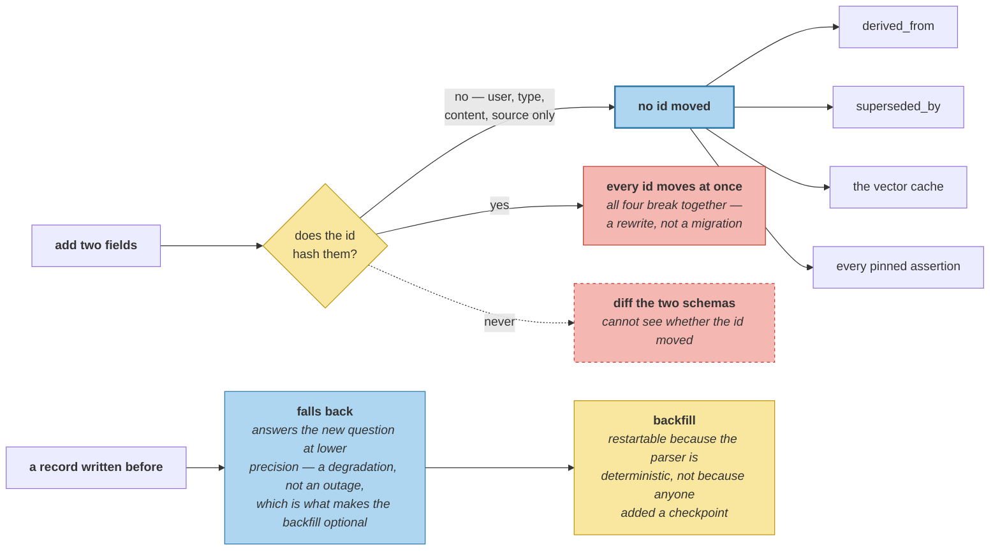

# Migrating Live Memory

> **In one line.** This course migrated the record shape mid-course and nothing broke — for four reasons, only one of which could still have been arranged afterwards.

## Where this sits

<!-- graph:begin -->
**Stage:** `store` · **Level:** advanced · **~45 min**

**You need first:** [Invariants and Drift Detection](../invariants-and-drift-detection/index.md)

**Concepts assumed:** [The Memory Record](../../../concepts/memory-record.md) · [Bi-Temporal Modeling](../../../concepts/bi-temporal-modeling.md) · [Relative Time Resolution](../../../concepts/relative-time.md)

**This unlocks:** [Hardening Pass](../capstone-finale/index.md)
<!-- graph:end -->

## The problem

A1 added `valid_from` and `valid_to` to a record with 37 memories already written against the old shape. That is a schema migration on live memory, and it is worth knowing whether it worked by design or by luck.

```
rule                                holds  consequence
new fields are nullable              True  old records stay readable without a default
the id did not change                True  derived_from, superseded_by and the vector cache stay valid
content did not change               True  pinned assertions and fixtures still match
the old value still answers          True  queries degrade in precision, not in availability
```

## Why this isn't RAG

Changing an index schema means re-indexing. It costs time and money, the corpus is untouched, and when it finishes the new index is correct by construction — the old one is disposable, so there is no compatibility question at all.

A memory store's records **are** the data. There is nothing to re-derive from, so every old record has to remain readable and every reference to it has to keep resolving. The migration is not a rebuild; it is a change made underneath something that must not stop working.

## Mechanism

**The id is the rule that cannot be arranged afterwards.** `Memory.id` hashes user, type, content and source — **not** the new fields — so adding two columns changed no id. Had the hash covered every field, every id would have moved at once, breaking `derived_from`, `superseded_by`, the vector cache and every pinned assertion in the course simultaneously, and the migration would have been a full rewrite.

That decision was made in Beginner for deduplication, and this is the third time it has paid for something else — `rtbf-and-auditability` was the second.

**Old records answer the new query, at lower precision.** `event_start` falls back to `happened_at`, so a record written before A1 answers an as-of question using *"when this was asserted"* instead of *"when it was true"*. That is a degradation rather than an outage, and it is what makes the backfill optional.

**The backfill is a reprocessing pass, and it is idempotent by construction:**

```
backfill: considered 37  updated 4  unchanged 33
re-run  : updated 0  (restartable)
```

Four of thirty-seven records gain a real event time — exactly the four phrases `relative-time-resolution` could resolve. The parser derives `valid_from` from content, so a second pass computes the same value and changes nothing: **restartable because it is deterministic, not because anyone added a checkpoint.**

**`compatibility` compares a record before and after, not two schemas.** A schema diff cannot see whether the id moved, and the id moving is the failure that matters.



## Design decisions

**Why keep `happened_at` rather than renaming it to `valid_from`?** Because a dozen Level 1 and 2 figures are measured against it and it means something specific — *when this was asserted*. Renaming would have been a content-neutral change that broke every quoted number, which is the most expensive kind: no behaviour changes and everything fails.

**Why is the backfill optional?** Because the fallback is honest. A store that never runs it answers as-of queries at assertion precision, which is wrong by up to 249 days on this corpus and available. Forcing the backfill would make the migration a two-phase deployment for a precision improvement, and `validity-intervals` measured that the query works either way.

**Why `strip` rather than a real old-format fixture?** Because a checked-in pre-migration store would be a second corpus to maintain, and every number in this course is measured against one. Reconstructing the old shape from the new one is exact for this change — the fields were added, not altered — and the lab says so rather than implying it generalises.

## Lab

**You'll implement:** `compatibility`, `backfill`, and `strip`.

**Run:**
```
uv run python curriculum/advanced/schema-migration-on-live-memory/lab/lab.py
```

**Expected output:** four compatibility rules all holding, a backfill considering **37** records and updating **4**, a re-run updating **0**, and every id unchanged by the migration.

**Stretch:** add `valid_from` to `_derive_id`'s hash key and re-run the backfill. Four records change id, and `derived_from`, `superseded_by` and the vector cache all now point at records that no longer exist — from a migration that added two nullable columns. **The id's contents are a compatibility decision, made once, years before the migration that depends on it.**

## What this adds to the capstone

`memlab.production.migrate` — `Compatibility`, `compatibility`, `Backfill`, `backfill`, `strip`. Describes a migration this course already performed, and checks the four properties that made it safe.

## Failure modes

| Symptom | Cause | How to detect | Mitigation |
|---|---|---|---|
| Every reference breaks at once | New field included in the id hash | Compare ids before and after | Hash identity, not state |
| Old records unreadable | New field required, not nullable | Load a pre-migration record | Nullable plus fallback |
| Backfill cannot be resumed | Reprocessing is not deterministic | Run it twice; diff | Derive from content |
| Numbers fail with no behaviour change | A field was renamed | Grep for the old name in tests | Add, do not rename |
| Migration blocks the deployment | Backfill treated as required | Ask what breaks without it | Degrade in precision |

## Check yourself

??? question "Adding two nullable columns changed nothing. Which of the four rules was the load-bearing one?"
    The id. Nullability and the fallback are choices available at migration time, but what the id hashes was fixed in Beginner — and had it covered every field, all 37 ids would have moved on a change that altered no content, breaking `derived_from`, `superseded_by`, the vector cache and every pinned assertion at once. That is the one you cannot arrange when the migration arrives.

??? question "Why is a backfill that updates 4 of 37 records worth running?"
    Because those four are the only records where the old and new fields disagree — the relative-time phrases whose event time is not the instant they were said. The other 33 already answer correctly through the fallback. A backfill's value is not its coverage; it is whether the records it changes were wrong.

??? question "The backfill is restartable. What makes it so?"
    That reprocessing derives `valid_from` from the record's own content, so a second pass computes the same value and updates nothing. No checkpoint, no cursor, no resume logic — the same property `background-job-mechanics` needed from consolidation, and the reason both can simply be run again after a crash.

## Connections

<!-- graph:begin -->
**Stage:** `store` · **Level:** advanced · **~45 min**

**You need first:** [Invariants and Drift Detection](../invariants-and-drift-detection/index.md)

**Concepts assumed:** [The Memory Record](../../../concepts/memory-record.md) · [Bi-Temporal Modeling](../../../concepts/bi-temporal-modeling.md) · [Relative Time Resolution](../../../concepts/relative-time.md)

**This unlocks:** [Hardening Pass](../capstone-finale/index.md)
<!-- graph:end -->
