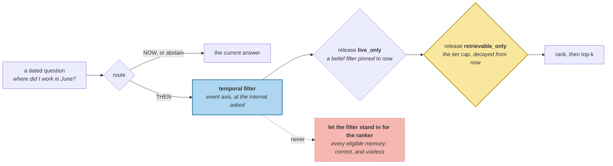

# Three Temporal Questions

> **In one line.** *"Where did I work in June 2025?"* returns the right memory only after you find the third place the read path had assumed *now* — releasing the first two gets you 1 of 4.

## Where this sits

<!-- graph:begin -->
**Stage:** `retrieve` · **Level:** advanced · **~50 min**

**You need first:** [Validity Intervals](../validity-intervals/index.md)

**Concepts assumed:** [As-Of Query](../../../concepts/as-of-query.md) · [Validity Interval](../../../concepts/validity-interval.md) · [Retrieval Scoping](../../../concepts/retrieval-scoping.md)

**This unlocks:** [Resolving 'Last Week'](../relative-time-resolution/index.md)
<!-- graph:end -->

## The problem

`validity-intervals` built a query that answers the past correctly. Ask it through the read path anyway:

```
where did I work in June 2025?     the memory that was true then: not in the top 5
what did I drink in 2025?                                          not in the top 5
where did Priya live in 2025?                                      not in the top 5
how did I like answers in 2025?                                    not in the top 5
```

**0 of 4.** Not ranked low — absent. And nothing is misbehaving: similarity has no opinion about time, so the date is spent as vocabulary and the retired memory never enters the pool.

Three questions hide behind one interface:

| | asks | axis |
|---|---|---|
| **NOW** | *"where do I work?"* | event, open interval |
| **THEN** | *"where did I work in June 2025?"* | event, pinned |
| **CHANGED** | *"when did I change jobs?"* | both, as a changelog |

Level 2 answers the first, and answers the other two with it.

## Why this isn't RAG

A retrieval system genuinely does have one question — *"what in this corpus matches?"* — and a date in the query is a perfectly good matching term, because documents about June 2025 tend to say "June 2025".

A memory is a claim about the world with its own validity, and the date it is *about* is almost never in its text. *"Priya is a data engineer at Northwind Labs"* contains no year. Nothing you do to the matching function surfaces it for a question about 2025, because the information the question needs was never in the string — it is in the interval alongside it.

## Mechanism

**Route first, then filter, then rank.** Classification is deliberately small and deliberately abstains rather than guesses: routing *"when did I change jobs"* to NOW returns a confident current answer to a question about history.

**A named time is an interval, not an instant.** *"In 2025"* parsed to a timestamp becomes 2025-01-01 — the least likely day the asker meant. At point precision the route finds 1 of 4; at interval precision, 4 of 4. **The question carries the precision it was asked at, and the parser has to keep it.**

### Three places the read path had assumed now

Filtering on the event axis is not enough, because the stages after it each pin their own clock to the present:

| released | at rank 1 |
|---|--:|
| Level 2 read path, unchanged | 0 of 4 |
| + temporal filter, nothing released | 0 of 4 |
| + `live_only` — the belief filter | **1** of 4 |
| + `retrievable_only` — the I5 tier cap | **4 of 4** |

`live_only` is a belief-time filter with its clock set to now, and it is right for every question Level 2 asks. `retrievable_only` is subtler: the tier cap is a decayed-relevance proxy, decay is measured from now, and **a memory demoted for being stale is exactly the memory a question about the past wants.** The property that made it droppable is the property that makes it the answer.



Neither release alone gets you there. Both together, and the same call answers both questions:

```
where did I work in June 2025?  ->  Priya is a data engineer at Northwind Labs
where do I work?                ->  Priya works at Calico Systems
```

### The filter does not replace the ranker

Used alone, the temporal filter is worse than what it replaced. *"Where do I work?"* leaves **30 memories** eligible — correct, and useless as a reply. *"When did I change jobs?"* produces **88 change events** across the store, 12 of them on the employer alone.

Eligibility and relevance are different axes, exactly as salience and relevance were in I5. The composition is filter-then-rank, and the reason it has to be that order is that ranking cannot recover what a filter already dropped.

## Design decisions

**Why regexes rather than a model call?** Because the classifier must abstain predictably. A model that routes 95% correctly still routes *"when did I change jobs"* to NOW sometimes, and that failure is silent — a fluent, current, wrong answer. Twelve patterns that fail visibly beat a classifier that fails plausibly, and the write path is where model calls earn their cost.

**Why not just always release both filters?** Because then every question pays the price the temporal ones pay. `live_only` is what makes *"where do I work?"* answer Calico instead of Northwind, and the tier cap is a third of I5's forgetting. They are released **because the route asked for it**, which is why the route has to exist before the release is safe.

**CHANGED returns pairs, not memories.** A changelog is `(memory, axis)` — *became true*, *stopped being true*, *believed*, *retired* — because there are two axes with two ends each. Flattening it to a list of memories is how a history gets rendered as a set of current facts, which is the failure this whole module exists to prevent.

## Lab

**You'll implement:** `classify`, `parse_when`, and `temporal_search`.

**Run:**
```
uv run python curriculum/advanced/temporal-questions/lab/lab.py
```

**Expected output:** the routing table, then the staged release — **0**, **0**, **1**, **4 of 4** at rank 1 — then the filter used alone leaving **30** memories eligible for *"where do I work?"* and **88** change events for *"when did I change jobs?"*.

**Stretch:** parse *"in 2025"* to an instant instead of an interval and re-run. You get 1 of 4, and the one that survives is an accident of which day the fact happened to start. **A precision you discard at parse time cannot be recovered downstream.**

## What this adds to the capstone

`memlab.temporal.questions` — `Question`, `Routed`, `classify`, `parse_when`, `answer`, `eligible`, `temporal_search`. `temporal.validity` gains `overlapping`; `retrieve.scoped.eligible` and `search` gain `live_only` and `retrievable_only`, both defaulting to today's behaviour, so no `@I*` figure moves.

## Failure modes

| Symptom | Cause | How to detect | Mitigation |
|---|---|---|---|
| Dated question returns current facts | Date matched as vocabulary | Ask the same question with and without the date | Route before ranking |
| Filter added, nothing changes | A later stage re-pins the clock to now | Count the pool at each stage | Release every now-assumption on the route |
| Year question answers about January | Interval collapsed to an instant | Ask about a fact that started mid-year | Keep the precision asked |
| Correct but unusable answer | Eligibility used as relevance | Count what the filter leaves | Filter, then rank |
| History rendered as current facts | Changelog flattened to memories | Check the return shape | Keep the axis on each event |

## Check yourself

??? question "Releasing `live_only` moves 0 of 4 to 1 of 4. Why so little?"
    Because the tier cap is still filtering. `retrievable_only` keeps only LONG_TERM memories whenever any exist, and the retired employer fact sits in WORKING — demoted by I5's decay for being stale. Two independent filters both meant "now", and releasing one leaves the other in charge.

??? question "Why is releasing both filters unconditionally the wrong fix?"
    Because they are load-bearing for the other two routes. `live_only` is the reason *"where do I work?"* answers Calico rather than Northwind, and the tier cap is a third of the forgetting I5 built. The release is safe only because the route asked for it — which is why classification has to come first, not because classification is interesting.

??? question "The temporal filter leaves 30 memories eligible. Is that a bug?"
    No — it is the correct answer to a different question. Eligibility says which memories the question *could* be about; relevance says which ones to say. Treating the first as the second is the same mistake I5 made by adding salience to a relevance score, and it fails the same way: correct, and unusable.

## Connections

<!-- graph:begin -->
**Stage:** `retrieve` · **Level:** advanced · **~50 min**

**You need first:** [Validity Intervals](../validity-intervals/index.md)

**Concepts assumed:** [As-Of Query](../../../concepts/as-of-query.md) · [Validity Interval](../../../concepts/validity-interval.md) · [Retrieval Scoping](../../../concepts/retrieval-scoping.md)

**This unlocks:** [Resolving 'Last Week'](../relative-time-resolution/index.md)
<!-- graph:end -->
