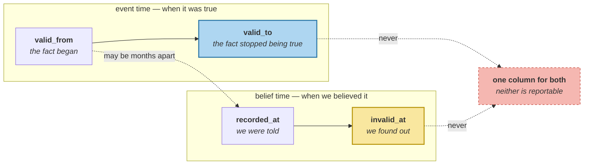

# Two Clocks

> **In one line.** Beginner told you to record two clocks and you did — and 37 of 37 memories prove that only one of them was ever running.

## Where this sits

<!-- graph:begin -->
**Stage:** `store` · **Level:** advanced · **~45 min**

**You need first:** [Does This Earn Its Tokens?](../../intermediate/slot-value/index.md)

**Concepts assumed:** [Event Time vs Ingestion Time](../../../concepts/event-time.md) · [The Memory Record](../../../concepts/memory-record.md) · [Supersession](../../../concepts/supersession.md)

**This unlocks:** [Validity Intervals](../validity-intervals/index.md)
<!-- graph:end -->

## The problem

`the-memory-record` argued that one timestamp is a bug, and the record has carried `happened_at` and `recorded_at` ever since. Audit them:

```
total memories                        37
with an event time                    37
  ...whose event time is just the
     instant it was written           37   (100%)
  ...derived from the language         0
with an event end                      0
```

**Every event time in the store is a copy of the write clock.** The field is populated, the schema is right, and nothing measures anything. It is the most comfortable kind of bug: it looks like the feature.

The three memories a calendar agent wrote look at first like exceptions — their timestamps are not in the user-turn set. They are not exceptions. The agent stamps its own clock exactly as the extractor stamps its own; counting only user turns is how you get 34/37 and conclude you are mostly fine.

And it goes wrong in the direction that matters:

| stored | happened_at | actually | off by |
|---|---|---|--:|
| used to cycle to work **before the move** | 2026-04-08 | 2025-08-02 | **249 days** |
| left Northwind Labs **last month** | 2026-01-19 | 2025-12-01 | 49 days |
| diagnosed with a gluten intolerance **last week** | 2026-05-15 | 2026-05-08 | 7 days |

A fact about 2025 dated 2026, in a system whose arbitration rule is *recency wins*.

## Why this isn't RAG

A retrieval corpus has one clock, and it is usually enough. A document was published; you index it; if you want the newest version you sort by that field. The corpus does not disagree with itself about *when*, because nobody is narrating.

A memory layer is fed by conversation, where the tense is in the grammar. *"I used to cycle"* is a fact about a period that has ended, arriving now. *"Since March"* opens an interval with no close. *"Last week"* is an offset from an instant the sentence does not contain. Every one of these needs the second clock read off the sentence rather than off the wall — and RAG never had to, because documents do not say "last week" about themselves and expect you to work it out.

## Mechanism

**Four instants, not two.** The distinction is a rectangle, not a line:

```
event time    valid_from ....... valid_to      when it was TRUE
belief time   recorded_at ...... invalid_at    when we BELIEVED it
```



Each axis can move without the other:

| case | event | belief |
|---|---|---|
| she moves house and tells you a month later | `valid_from` = the move | `recorded_at` = the telling |
| she moved and never mentioned it | `valid_to` set later, retroactively | `invalid_at` unset until then |
| you retire a belief that was correct | unchanged — it stayed true | `invalid_at` set, wrongly |

The third row is why `valid_to` cannot be `invalid_at` under another name. **A fact can stop being true without anyone noticing, and a belief can be retired while the fact it described still holds.** Collapse them and neither is reportable — which is exactly the audit a regulator asks for.

**`happened_at` stays.** It means *"when this was asserted"* and a dozen Level 1 and 2 figures are measured against it; renaming it would silently move numbers in lessons twenty modules back. `valid_from` falls back to it, so a record written before this module still answers an as-of query — just at whatever precision the assertion happened to carry.

**Zero event ends is the other half of the finding.** Nothing in the store records that anything *stopped*. The cycling ended, the Northwind job ended, the coffee abstinence ended — and each is represented as a newer memory that outranks an older one, which works only as long as the question is *"what is true now?"*. That assumption is what the next lesson breaks.

## Design decisions

**Why not fix the extractor first?** Because you cannot tell whether the parse is right until you can ask a question that distinguishes them, and no such query exists yet — see the next two lessons. Fixing the input to a query you cannot run is how you get a parser that is confidently wrong for two modules. `relative-time-resolution` lands fourth on purpose.

**Why not infer `valid_to` from supersession?** It is tempting: the Northwind memory was retired on 2025-12-08, so set `valid_to` there. But that date is when the *system found out*, not when she left — the corpus says she left in December and told you in January. Deriving one clock from the other reintroduces exactly the conflation this lesson exists to remove, and it would look correct on this corpus.

**Is the audit worth shipping?** Yes, as a share. `share_copied` at 100% says the parser is not running; at 60% it says the parser runs and most sentences genuinely have no time in them, which is true and fine. The number is only meaningful next to the corpus it was measured on.

## Lab

**You'll implement:** `audit` and `event_end`.

**Run:**
```
uv run python curriculum/advanced/two-clocks/lab/lab.py
```

**Expected output:** the clock audit — **37 of 37 copied, 0 derived from language, 0 event ends** — then the three relative phrases with their errors of **249**, **49** and **7** days.

**Stretch:** run the audit counting only user turns, the way a first attempt would. You get **34 of 37** and a comfortable story about three exceptions. **A denominator you chose without checking is how a 100% failure reports as 92%.**

## What this adds to the capstone

`memlab.temporal.clocks` — `event_start`, `event_end`, `belief_start`, `belief_end`, `ClockAudit`, `audit`, `turn_timestamps`. The record gains `valid_from` and `valid_to`; `happened_at` and `invalid_at` keep their meanings, so every `@I*` snapshot is unmoved.

## Failure modes

| Symptom | Cause | How to detect | Mitigation |
|---|---|---|---|
| Past facts treated as current | Event time copied from the write clock | Audit event time against the write instants | Read the clock off the sentence |
| A 100% failure reports as 92% | Denominator excludes agent writes | Count every writer, not just users | One set of write instants |
| Cannot show when a fact stopped | `valid_to` conflated with `invalid_at` | Ask when a belief was wrong vs when it ended | Four instants, two axes |
| Recency arbitration picks the older fact | The newer memory carries an older event | Compare event and write order | Arbitrate on event time |
| Parser tuned against no query | Input fixed before the question exists | Ask what would prove the parse wrong | Build the query first |

## Check yourself

??? question "The schema has had two timestamp fields since Beginner. What exactly is broken?"
    Population, not schema. Both fields are set on all 37 records, and on all 37 they hold the same instant — the moment the record was written. A field that is always a copy of another field carries no information, however correct its name is.

??? question "Why can't `valid_to` just be `invalid_at`?"
    They answer different questions and can disagree in both directions. A fact stops being true when nobody is watching (`valid_to` in the past, `invalid_at` still unset), and a belief gets retired in error while the fact stands (`invalid_at` set, the thing still true). Under one field, neither situation can be described — and "when did you stop believing this, and were you right to?" is the question an audit actually asks.

??? question "Counting only user turns gives 34/37. Why is that the wrong denominator?"
    Because it silently redefines the population as "memories from humans" while the claim is about the store. The three agent-written memories are doing the identical thing — stamping the writer's own clock — so excluding them turns a total failure into three interesting exceptions. The number was not wrong; the set it was measured over was.

## Connections

<!-- graph:begin -->
**Stage:** `store` · **Level:** advanced · **~45 min**

**You need first:** [Does This Earn Its Tokens?](../../intermediate/slot-value/index.md)

**Concepts assumed:** [Event Time vs Ingestion Time](../../../concepts/event-time.md) · [The Memory Record](../../../concepts/memory-record.md) · [Supersession](../../../concepts/supersession.md)

**This unlocks:** [Validity Intervals](../validity-intervals/index.md)
<!-- graph:end -->
