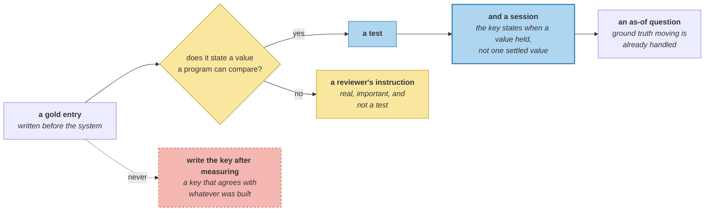

# Why Memory Eval Is Hard

> **In one line.** A wrong answer implicates seven stages, and the entire evaluation this course has run for three levels is one boolean.

## Where this sits

<!-- graph:begin -->
**Stage:** `govern` · **Level:** advanced · **~45 min**

**You need first:** [Memory Attacks](../memory-attacks/index.md)

**Concepts assumed:** [The Memory Record](../../../concepts/memory-record.md) · [Supersession](../../../concepts/supersession.md) · [As-Of Query](../../../concepts/as-of-query.md)

**This unlocks:** [Component Metrics](../component-metrics/index.md)
<!-- graph:end -->

## The problem

Three structural problems, and this course has been living with all of them without naming them.

**There is no labelled corpus.** A retrieval benchmark ships queries and relevance judgements over documents someone else wrote. Here the corpus is a conversation, the "documents" are memories the system *created*, and the labels are claims about what should have been extracted — a judgement about the system's own output. `gold.yml` is that judgement, written by hand.

**Ground truth moves.** *"Where does Priya work?"* has two correct answers depending on when you ask, and both are in the transcript. A benchmark with one answer key per question asserts that memory does not change, which is the one thing it certainly does.

**The write path is unlabelled.**

```
stages a wrong answer implicates: 7
['extract', 'resolve', 'dedupe', 'arbitrate', 'decay', 'rank', 'assemble']
```

The exam scores an *answer*. Seven stages sit between the turn and the answer, and a wrong answer implicates all of them. This course spent three levels working out which — by building module snapshots and bisecting, not by measuring any stage.

## Why this isn't RAG

Retrieval evaluation has a solved shape because the corpus predates the system. Someone judges document 47 relevant to query 12, the judgement stays true, and every system is scored against the same fixed pair. Precision and recall mean something because *the set of correct answers is a property of the data*.

None of that survives here. The set of correct answers is a property of **when you ask**, the corpus is produced by the system under test, and the labels have to describe what the system should have *decided* — not what a document says.

## Mechanism

**Start by counting what can be scored at all.**

```
seam               items  checkable
entities               1       True
supersessions          6       True
relative_time          7       True
pii                    4       True
procedures             1       True
shared_memory          3       True
final_question         1       True
deletion_request       1      False
persona                1      False

checkable: 7 of 9 seams, 23 of 25 assertions
```

**`checkable` is the load-bearing column.** A seam is checkable when its gold entry states a value a program can compare against the store. The two that are not are instructive:

- `deletion_request.must_also_remove` is **five English sentences about structures** — *"any session-5 rolling summary that mentions Bristol"*. Real, important, and a reviewer's instruction rather than a test.
- `persona` describes the corpus and asserts nothing.

**23 of 25 assertions are machine-checkable**, which is a better position than most memory systems are in and is entirely because the answer key was written before the system. Writing gold *after* measuring produces a key that agrees with whatever was built.

**Ground truth moving is not a defect to design around.** It is what `as-of-query` already handles: the answer key needs a *date*, not a value. `supersessions` has six entries and each carries a session, which is why they are checkable at all — *"employer was Northwind in session 1 and Calico from session 8"* is two assertions with timestamps, not one contested fact.



## Design decisions

**Why is `final_question` counted as one assertion?** Because it is one. Three levels of this course have been steered by a single boolean over a single question — which is a remarkable amount of leverage from one test and an alarming amount of confidence to place in it. Naming it as one of twenty-five is most of the point of this lesson.

**Why not make `must_also_remove` checkable?** Because two of its five clauses name structures this corpus does not have — a rolling summary, a graph edge. Turning prose into assertions would mean asserting things about a store shape that does not exist, and `graph-stores` measured why that is a bad trade. It stays prose, and `end-to-end-eval` scores the three clauses that are real.

**Why count assertions rather than seams?** Because the seams are wildly uneven — `relative_time` has seven entries and `procedures` has one — and a harness reporting *"7 of 9 areas covered"* hides that one uncovered area is a single descriptive block and the other is the compliance requirement.

## Lab

**You'll implement:** `seams`, `coverage`, and `stages`.

**Run:**
```
uv run python curriculum/advanced/why-memory-eval-is-hard/lab/lab.py
```

**Expected output:** the nine seams with their item counts, **7 of 9** checkable covering **23 of 25** assertions, and the **7** stages a wrong answer implicates.

**Stretch:** count how many of the 25 assertions the exam actually exercises. It is the one it *is*, plus whatever the answer happens to depend on — and the other twenty-odd have been protected for three levels by lab tests rather than by anything called an evaluation. **A test suite is an evaluation nobody labelled, and it is the reason this course could measure anything at all.**

## What this adds to the capstone

`memlab.eval.harness` — `Seam`, `seams`, `coverage`, `stages`. Reads `gold.yml` and asserts nothing yet; `component-metrics` and `end-to-end-eval` are where the checkable seams become scores.

## Failure modes

| Symptom | Cause | How to detect | Mitigation |
|---|---|---|---|
| Benchmark agrees with the system | Answer key written after measuring | Check which came first | Gold before the build |
| One answer per question | Ground truth treated as fixed | Ask the same question at two dates | Date the assertions |
| Regression with no cause | Score is one boolean over seven stages | Count stages between turn and answer | Per-stage metrics |
| Coverage overstated | Seams counted, not assertions | Compare items per seam | Count assertions |
| Prose scored as a test | English requirements in the answer key | Ask what a program compares | Mark them uncheckable |

## Check yourself

??? question "Retrieval evaluation is a solved problem. Which part of the solution transfers?"
    Almost none of the shape. Precision and recall work because the set of correct answers is a property of the data, judged once, by someone who did not build the system. Here the corpus is produced by the system under test, the correct answer depends on when you ask, and the labels describe decisions rather than documents. What does transfer is the discipline of writing the key first.

??? question "Why does a moving ground truth not break the answer key?"
    Because the key can carry dates. *"Employer was Northwind in session 1 and Calico from session 8"* is two assertions with timestamps, not one contested fact — the same move `as-of-query` made for reads, applied to evaluation. Six of the gold entries are supersessions for exactly this reason, and they are checkable because they are dated.

??? question "Three levels of this course were steered by one boolean. Was that wrong?"
    It was leverage and it was fragile. One question over one corpus caught staleness, contradiction, refinement, budget regressions and ordering bugs — because it was chosen to sit on the crossing point of all of them. What it cannot do is attribute a failure, which is why every claim in this course also needed a module snapshot to bisect against.

## Connections

<!-- graph:begin -->
**Stage:** `govern` · **Level:** advanced · **~45 min**

**You need first:** [Memory Attacks](../memory-attacks/index.md)

**Concepts assumed:** [The Memory Record](../../../concepts/memory-record.md) · [Supersession](../../../concepts/supersession.md) · [As-Of Query](../../../concepts/as-of-query.md)

**This unlocks:** [Component Metrics](../component-metrics/index.md)
<!-- graph:end -->
