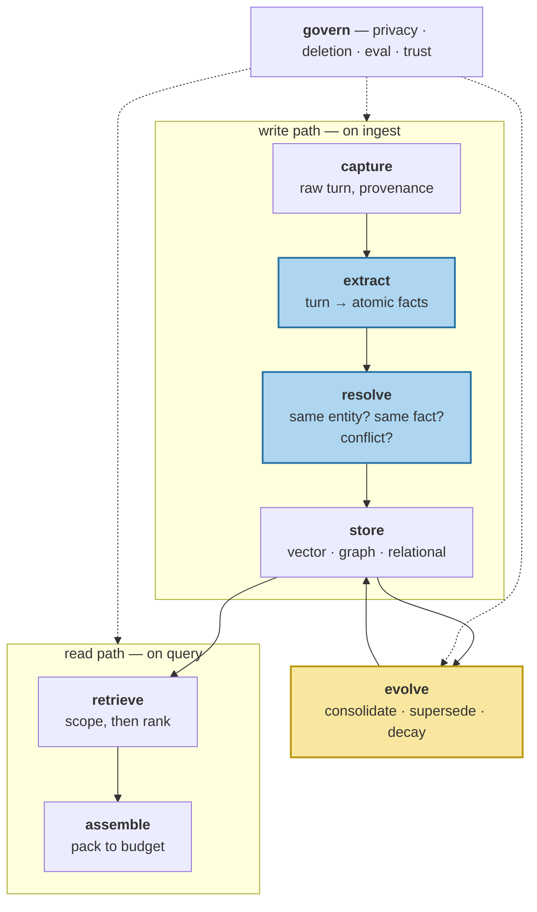

# Anatomy of a Memory Layer

> **In one line.** Seven components, two paths, one loop — the reference diagram every remaining lesson in this course points back to.

## Where this sits

<!-- graph:begin -->
**Stage:** `orientation` · **Level:** beginner · **~35 min**

**You need first:** [Context Is Not Memory](../context-is-not-memory/index.md)

**Concepts assumed:** [The Memory Lifecycle](../../../concepts/memory-lifecycle.md)

**This unlocks:** [Designing the Memory Record](../the-memory-record/index.md)
<!-- graph:end -->

## The problem

You now know what memory is not: not retrieval, not a taxonomy poster, not a bigger window. This lesson is the positive statement — the parts list — so that every later lesson can say *which box it is working inside*.

It matters because the components fail independently and their symptoms look identical from the outside. "The assistant said I work at Northwind" is consistent with a broken extractor, a missing supersession rule, a retriever with no recency signal, and an assembler that dropped the right memory at the budget line. Four different bugs, one user-visible symptom. Without a parts list you debug by guessing.

## Why this isn't RAG

A retrieval pipeline has four boxes — chunk, embed, rank, assemble — and they all live on the read path. The diagram below has seven, and the three that do not appear in any RAG architecture are the three where memory systems actually break.

More importantly, the loop has a **cycle**. `evolve` writes back into `store`, so the store's contents at time T depend on everything that happened before T. A retrieval index has no such feedback; re-running ingestion on the same documents gives the same index. Re-running a memory pipeline does not, and that is what makes idempotency and audit trails load-bearing rather than nice to have.

## Mechanism



**capture** — the raw turn, appended losslessly with its provenance. Cheap, and the only stage you cannot add retroactively: a memory written without a source id can never be deleted on request, because nothing identifies what to delete.

**extract** — turns into atomic facts. Caps everything downstream.

**resolve** — is this the same person? the same fact? does it contradict? Absent in Beginner, which is why Sam, Samira and Sammy are three people by the end of the corpus.

**store** — the substrate. One JSONL file here; vector, graph and relational stores share the job by Level 2.

**evolve** — the loop back into the store. Merges duplicates, retires superseded beliefs, decays what stopped mattering. This is the box with no counterpart anywhere in retrieval, and roughly a quarter of this course.

**retrieve** — scope by hard keys, *then* rank.

**assemble** — pack what survived into the token budget.

**govern** — wrapped around everything, because privacy, deletion and evaluation are not a stage you run at the end. A deletion request has to reach the episode, the extracted fact, the embedding, the summary that quoted it, and the graph edge that referenced it.

The useful discipline: **for any bug, name the box.** Below, the same symptom in four boxes.

| The assistant said "Northwind" because… | Box | Fix lives in |
|---|---|---|
| the job change was never turned into a fact | `extract` | [naive extraction](../naive-extraction/index.md) |
| both employers are stored, neither retired | `resolve` / `evolve` | Level 2 |
| the current fact ranked 35th of 36 | `retrieve` | [retrieval is not enough](../retrieval-is-not-enough/index.md) |
| it ranked 4th but the budget stopped at 3 | `assemble` | [context assembly](../context-assembly-v0/index.md) |

## Design decisions

**Synchronous or deferred write path?** In Beginner, synchronous — extraction runs inline on every turn, because it is easier to reason about and you can watch it happen. It is also the expensive choice: extraction is an LLM call on the hot path. Which stages move to a background worker is the central production tradeoff, and it gets its own lesson in Level 2.

**Does `resolve` run at write time or read time?** Write time, so the store stays clean and every reader benefits. Read-time reconciliation is tempting because it is easy to add later, and it means paying the cost on every query forever while the store rots underneath.

**One store or several?** One, until a memory type's access pattern actually hurts. Splitting early buys nothing and makes cross-type queries painful.

## Lab

**You'll implement:** `trace` — push one turn through every stage and print what each box produced.

**Run:**
```
uv run python curriculum/beginner/anatomy-of-a-memory-layer/lab/lab.py
```

**Expected output:** session 8's job change, traced against a store already holding everything else Priya said.

```
capture   session 8, provenance s8:2025-12-08T09:00:00Z
extract   2 memories (episodic)                 <- no semantic employer fact
resolve   4 conflict(s) detected, 0 resolved    <- it saw them and shrugged
store     2 written, 35 total
retrieve  this turn's memories ranked: [21, 15] <- out of 35
assemble  0 of 2 survived the budget
```

Six boxes, and you can name the one that lost the answer: `extract` produced two events where a state was needed, and everything downstream behaved correctly given that input.

**Stretch:** run the trace for session 12, the gluten diagnosis. Same pipeline, and `extract` yields a semantic fact this time — it ranks **5th** and reaches the context. The difference is entirely in how the turn was phrased, which is the strongest evidence you will get that the write path is where the leverage is.

## What this adds to the capstone

The vocabulary and the seams. `memlab`'s package layout mirrors this diagram one-to-one — `memlab.extract`, `memlab.store`, `memlab.retrieve`, `memlab.assemble`, `memlab.evolve`, `memlab.govern` — so a lesson that says "this happens in `resolve`" tells you the import path.

## Failure modes

| Symptom | Cause | How to detect | Mitigation |
|---|---|---|---|
| Debugging by guessing | No component boundaries; one function does everything | Ask which box a bug is in and find there is no answer | Keep the seams; trace per stage |
| Fix in one box, regression in another | Stages implicitly coupled through shared mutable state | Change extraction, watch retrieval tests fail | Pass explicit records between stages |
| Deletion misses derived data | `govern` treated as a stage instead of a cross-cut | Delete a memory, grep summaries and indexes for it | Cascade by provenance |
| Re-ingestion doubles the store | Feedback cycle without idempotent writes | Run ingest twice, count | Content-addressed ids |

## Check yourself

??? question "Which box does the 'Sam / Samira / Sammy' failure belong to?"
    `resolve` — specifically entity resolution, which Beginner does not implement at all. The extractor did its job correctly on each turn in isolation; nothing was ever asked whether the three names denote one person.

??? question "Why is `govern` drawn around the diagram rather than as a stage?"
    Because its obligations touch every stage. A right-to-be-forgotten request has to reach the captured episode, the extracted fact, its embedding, any summary that consumed it, and any graph edge that referenced it. As a final stage it would only ever see the last of those.

??? question "The write path has four boxes and the read path two. Is that proportionate to the difficulty?"
    Roughly, and it under-sells it — `evolve` sits on the write side too. About half this course lives in `evolve` and `govern` combined, and around 11% in `retrieve`.

## Connections

<!-- graph:begin -->
**Stage:** `orientation` · **Level:** beginner · **~35 min**

**You need first:** [Context Is Not Memory](../context-is-not-memory/index.md)

**Concepts assumed:** [The Memory Lifecycle](../../../concepts/memory-lifecycle.md)

**This unlocks:** [Designing the Memory Record](../the-memory-record/index.md)
<!-- graph:end -->
