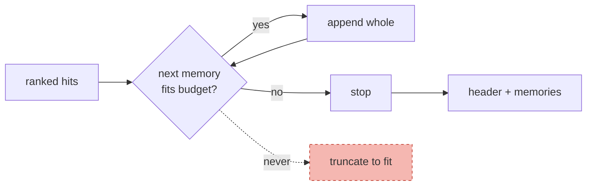

# Getting Memories Into the Prompt

> **In one line.** Assembly is where retrieval quality becomes behaviour, and two choices that look cosmetic — how you frame a memory, and what you do at the budget line — decide whether the system can be corrected.

## Where this sits

<!-- graph:begin -->
**Stage:** `assemble` · **Level:** beginner · **~35 min**

**You need first:** [Retrieval Is Not Enough](../retrieval-is-not-enough/index.md)

**Concepts assumed:** [Token Budget](../../../concepts/token-budget.md) · [Retrieval Scoping](../../../concepts/retrieval-scoping.md)

**This unlocks:** [Session Memory vs Long-Term Memory](../session-vs-longterm/index.md)
<!-- graph:end -->

## The problem

Ranked memories are not an answer. Something has to turn them into text the model reads, and the naive version is one line:

```python
prompt = "Facts about the user:\n" + "\n".join(m.content for m in hits)
```

Two things are wrong with it, and both are about framing rather than content.

**It asserts.** Under that header the model receives *"Priya works at Northwind Labs"* as a fact from the system, not a belief from a store. When Priya says "no, I'm at Calico" — which she does, in session 9 — the model now has a conflict between its instructions and its user, and it will often defend the instructions. You have built a system that argues with people about their own lives.

**It has no budget.** Six memories fit today. At six hundred, this line silently consumes the entire window and the model stops following its actual instructions — a failure that presents as "the model ignores the system prompt", which is nearly impossible to diagnose from the symptom.

## Why this isn't RAG

Assembling retrieved documents is largely a formatting problem: cite the source, keep the passage intact, let the model quote it. The passage is *evidence*, and the model's job is to report what it says.

A memory is not evidence, it is a **claim about the user that may be wrong**, and the user is present and authoritative. That changes the framing requirement completely. Documents do not get offended when you contradict them, and a user's correction has to beat your store, every time.

## Mechanism

**Frame memories as recalled beliefs.** One header does most of the work:

> Here is what you remember about this user. These are recalled beliefs, not verified facts, and some may be out of date.

That sentence costs about 20 tokens and makes the difference between a model that updates when corrected and one that argues. It is the cheapest reliability improvement in the whole system.

**Enforce the budget by dropping whole memories.** Never truncate one. Half a memory is worse than none — *"Priya is allergic to"* is not a degraded fact, it is a hazard. Pack highest-scoring first, stop when the next memory would not fit, and drop the rest entirely.



**Date every memory.** `- [2025-03-04] Priya is a data engineer at Northwind Labs`. The model cannot resolve a contradiction without knowing which claim is older, and until Level 2 retires the stale one, the date is the only signal available. It is a mitigation, not a fix — the model still has to guess — but it converts a coin flip into an informed one.

**Order by score, not by date.** Chronological order buries the most relevant memory in the middle, where attention is weakest. Score order puts it first.

## Design decisions

**Budget in tokens or in count?** Tokens. A count is a proxy that breaks the moment one memory is a long procedure — session 6's workflow is worth six ordinary facts, and `k=5` treats them as equals.

**Include scores in the prompt?** No. It invites the model to reason about numbers it has no calibration for, and the ranking has already been applied by ordering.

**One block or several?** One, in Beginner. Splitting by type — preferences here, history there — helps and gets its own lesson in Level 2, once there are enough memories for the structure to earn its tokens.

## Lab

**You'll implement:** `assemble` — header, dating, budget enforcement by whole-memory drops.

**Run:**
```
uv run python curriculum/beginner/context-assembly-v0/lab/lab.py
```

**Expected output:** the same ranked memories assembled at three budgets, and a comparison against a truncating variant. At 60 tokens the truncating version emits:

```
- [2025-09-14] Priya's weekly report process
```

which reads as a complete sentence and has lost the entire workflow. The correct version emits one fewer memory and no fragments. This is the failure mode in miniature: not obviously broken, just silently wrong.

**Stretch:** assemble at a budget that admits both the coffee memories and read the result as if you were the model. There is no signal that these two are the same claim in conflict — only two dates. Note how much work the assembler is being asked to do that belongs upstream.

## What this adds to the capstone

`memlab.assemble.simple` — `assemble`, `estimate_tokens`, and the header. This is the last component of v0.1; the next lesson wires them together.

## Failure modes

| Symptom | Cause | How to detect | Mitigation |
|---|---|---|---|
| Model argues with the user about their own facts | Memories framed as system-asserted truth | Correct it mid-conversation; see if it concedes | Frame as recalled beliefs |
| Model stops following instructions | Unbudgeted memory block crowding the window | Log token shares per prompt section | Hard token budget |
| A fact appears half-written | Truncating to fit | Assemble at a tiny budget; look for cut lines | Drop whole memories |
| Contradictions presented as equals | No dates, or no retirement | Assemble a contradictory pair and read it | Date every memory; supersede upstream |
| Most relevant memory ignored | Chronological ordering burying it mid-context | Place a known-critical memory last and query | Order by score |

## Check yourself

??? question "Why does the 'recalled beliefs' header matter more than the memories themselves?"
    Because it sets what the model does when the store is wrong — and the store is often wrong. Under an assertive header a stale fact becomes something to defend; under this one it becomes something to update. Same memories, opposite behaviour on the case that matters most.

??? question "Why never truncate a memory to fit?"
    Because a truncated fact is not partially useful, it is misleading. *"Priya is allergic to"* reads as a complete-looking assertion with the critical half missing. Dropping it loses one fact; truncating it manufactures a wrong one.

??? question "The assembler dates each memory so the model can judge recency. Isn't that solving staleness?"
    It is mitigating it, and the distinction matters. The model still has to guess which of two dated contradictions is live, and it will sometimes guess wrong. Supersession removes the guess. Dating is what you do until you have it.

## Connections

<!-- graph:begin -->
**Stage:** `assemble` · **Level:** beginner · **~35 min**

**You need first:** [Retrieval Is Not Enough](../retrieval-is-not-enough/index.md)

**Concepts assumed:** [Token Budget](../../../concepts/token-budget.md) · [Retrieval Scoping](../../../concepts/retrieval-scoping.md)

**This unlocks:** [Session Memory vs Long-Term Memory](../session-vs-longterm/index.md)
<!-- graph:end -->
