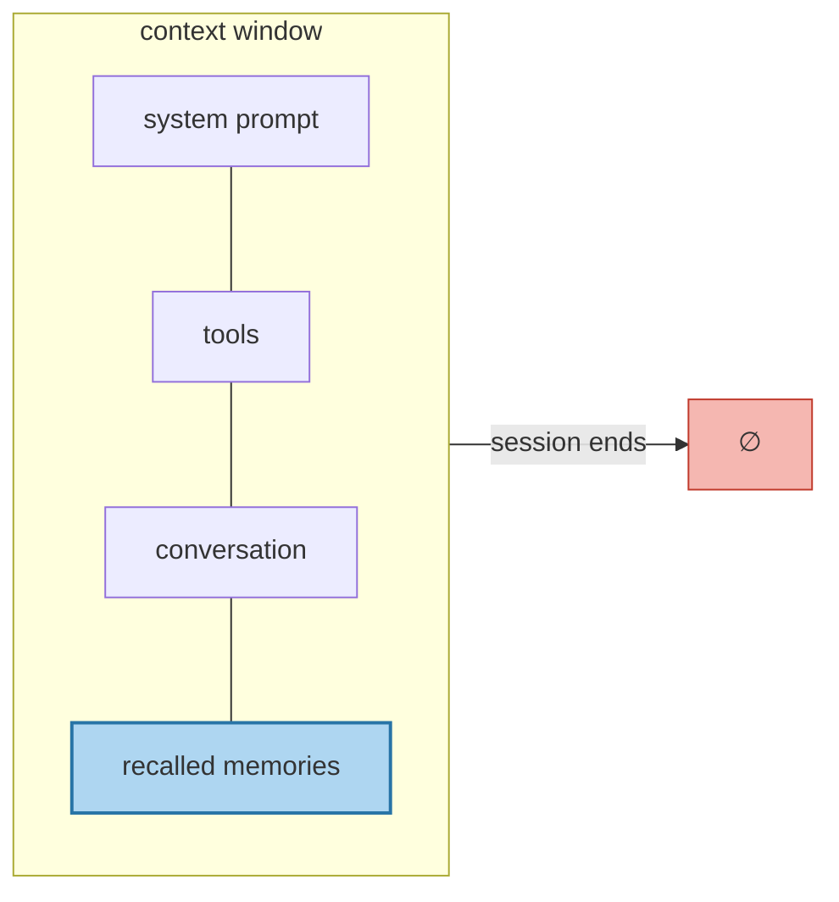

# Context Is Not Memory

> **In one line.** A bigger context window buys you room, not memory — it adds no selection, no persistence, and no way to change a belief.

## Where this sits

<!-- graph:begin -->
**Stage:** `orientation` · **Level:** beginner · **~25 min**

**You need first:** [The Taxonomy That Actually Routes](../memory-taxonomy/index.md)

**Concepts assumed:** [Working Memory](../../../concepts/working-memory.md) · [The Memory Lifecycle](../../../concepts/memory-lifecycle.md)

**This unlocks:** [Anatomy of a Memory Layer](../anatomy-of-a-memory-layer/index.md)
<!-- graph:end -->

## The problem

The cheapest possible answer to "how do I give my agent memory" is: don't. Windows are large now. Put the whole conversation in the prompt every turn and let attention sort it out.

For Priya's seventeen months, that is **501 tokens**. It genuinely fits, with room to spare. So try it and ask the session-14 question with the entire history in context.

It still gets the employer wrong — but now for a different reason, and that difference is the lesson. The model is not missing the fact. It is holding the old employer, stated confidently in session 1, alongside a job change phrased as an aside nine months later, with nothing marking which one is current. You have not solved the problem. You have moved it inside the model, where you can no longer inspect or fix it.

Then the window fills, and you discover the three things it was never going to do.

## Why this isn't RAG

This one is not aimed at RAG — it is aimed at the argument that you need *neither*. Worth separating, because "just use a big window" and "just use RAG" fail differently. RAG has a read path and no write path. A big window has neither: nothing decides what is worth keeping, and nothing survives the session.

## Mechanism

Three things a window cannot do, none of which are fixed by making it larger.

**It does not select.** Everything in the window competes for attention. Recall degrades for material in the middle of a long context, so a fact can be present and still not used — the worst failure mode there is, because the fact is *right there* and the system still gets it wrong.

**It does not persist.** The window is reconstructed every call. Anything not deliberately written down is gone at session end. Replaying the full transcript works until "the full transcript" no longer fits, which is a cliff rather than a slope.

**It cannot change its mind.** This is the one that never improves. To mark Priya's old employer superseded you need somewhere to write "invalid from 2026-01-01". A window has no such place. You can *append* a correction and hope attention prefers it — which is exactly what session 9 is, Priya correcting the assistant out loud, and it does not stick past the turn.



The shaded slice is the only part a memory layer controls, and it is a few hundred tokens. That constraint — not window size — is what makes ranking matter.

## Design decisions

**Replay the transcript, or recall facts?** Recall facts. Replay is simpler and correct until it isn't, and its failure is discontinuous: costs scale with history length forever, and the day it stops fitting you need the whole memory layer anyway, with no data prepared for it. *Deviate when* sessions are genuinely short-lived and nothing needs to persist across them — that is a chatbot, and it does not need this course.

**How much of the window for memories?** Budget it explicitly, in tokens, and enforce it. An unbudgeted memory section grows until it starves the conversation, and the failure looks like the model ignoring instructions.

## Lab

**You'll implement:** `fit_to_budget` — pack the transcript into a fixed budget, oldest-first, and watch which facts fall off the edge.

**Run:**
```
uv run python curriculum/beginner/context-is-not-memory/lab/lab.py
```

**Expected output:** at a 250-token budget, oldest-first keeps 10 of 25 turns — her **Northwind** job and her vegetarian baseline, but not the job change or either diet update. Newest-first keeps 14 turns and inverts the result exactly: **Calico**, fish and gluten, but the no-meat baseline has fallen off the edge.

Neither ordering answers session 14 correctly, and there is no third ordering that does. That is the argument for extraction, in one experiment.

**Stretch:** raise the budget to 400 and re-run oldest-first. Now *both* employers are in context and the model has to pick, with nothing to pick on. Truncation was hiding the contradiction; more room only exposes it.

## What this adds to the capstone

The token budget, as a number the assembler will have to respect. Nothing else — this lesson exists to close off the shortcut before you spend nine lessons building the alternative.

## Failure modes

| Symptom | Cause | How to detect | Mitigation |
|---|---|---|---|
| Works in testing, fails for long-tenured users | Transcript replay that fits in test and not in production | Measure context length against account age | Extract facts; stop scaling with history |
| Recalls the beginning and end, misses the middle | Attention degradation over long contexts | Plant a fact mid-context and query it | Retrieve a few relevant memories instead of everything |
| Corrections don't stick past the turn | Correction appended to context, never written to a store | Ask again in a fresh session | Persist beliefs, with supersession |
| Memory section crowds out instructions | Unbudgeted recall growing without a cap | Log token shares per section | Enforce a hard budget; drop whole memories |

## Check yourself

??? question "Priya's whole history is 2,300 tokens. Why not just include it?"
    You can, and it will work for a while. It gets the employer wrong anyway, because nothing in the transcript marks the old one dead — the ambiguity is real, not a capacity problem. And the approach has no path forward: costs grow forever and the failure at the limit is a cliff.

??? question "Does a 10M-token window change the argument?"
    It changes the deadline, not the argument. Selection, persistence, and belief revision are absent at every size. It also makes the cost per turn worse, since you pay for the whole history on every call.

??? question "Truncation drops the oldest turns. Isn't that the right heuristic?"
    It is the *least bad* one-line heuristic, and the lab shows it systematically preserves stale facts while dropping their corrections. Any fixed ordering loses something; that is why selection has to be driven by the query.

## Connections

<!-- graph:begin -->
**Stage:** `orientation` · **Level:** beginner · **~25 min**

**You need first:** [The Taxonomy That Actually Routes](../memory-taxonomy/index.md)

**Concepts assumed:** [Working Memory](../../../concepts/working-memory.md) · [The Memory Lifecycle](../../../concepts/memory-lifecycle.md)

**This unlocks:** [Anatomy of a Memory Layer](../anatomy-of-a-memory-layer/index.md)
<!-- graph:end -->
