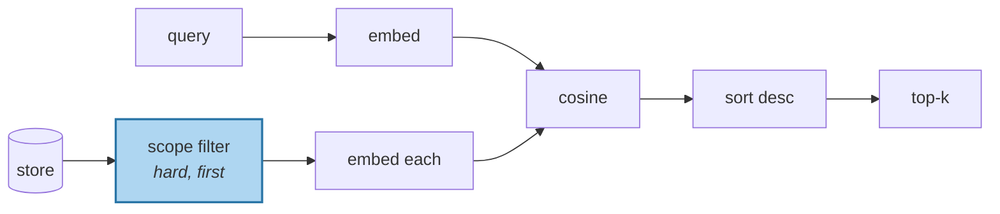

# Embedding Recall

> **In one line.** Cosine similarity finds memories that are *about the same thing* — and cannot tell you whether that means duplicated, refined, retracted, or contradicted.

## Where this sits

<!-- graph:begin -->
**Stage:** `retrieve` · **Level:** beginner · **~40 min**

**You need first:** [Writing Memories Down](../writing-memories-down/index.md)

**Concepts assumed:** [The Read Path](../../../concepts/read-path.md) · [The Append-Only Log](../../../concepts/append-only-log.md)

**This unlocks:** [Retrieval Is Not Enough](../retrieval-is-not-enough/index.md)
<!-- graph:end -->

## The problem

Thirty-six memories in a file. To get any of them into a prompt you need an ordering, and the standard answer is to embed everything and rank by cosine distance.

It works, and this lesson is not going to tell you it doesn't. Build it, then measure precisely what it is measuring — because the mistake is not using embeddings, it is believing the number means more than it does.

Score every pair of memories in Priya's store against each other, and the top of the list looks like this:

| Score | Pair | The actual relationship |
|--:|---|---|
| **0.778** | *Samira got a promotion to charge nurse* / *Samira is a charge nurse* | **duplicate** — one fact, stored twice |
| 0.747 | *is a data engineer at Northwind Labs* / *is leaving Northwind Labs* | **retraction** — a fact and its own cancellation |
| 0.739 | *has a gluten intolerance* / *was diagnosed with a gluten intolerance last week* | **duplicate** |
| 0.669 | *is vegetarian* / *is pescatarian* | **refinement** — the second narrows the first |
| 0.557 | *drinks tea* / *drinks three coffees a day* | **contradiction** |

Five pairs, scoring between 0.56 and 0.78, and five *completely different* relationships. Each one needs a different action: merge, supersede, merge, narrow, arbitrate. Similarity found all five and can distinguish none of them.

That is not a defect in the embedding — it is what similarity *is*. Two statements about one subject share vocabulary and sentence shape whether they agree, repeat, or cancel each other out.

## Why this isn't RAG

For a document corpus, "about the same thing" is a good enough proxy for "relevant", because the corpus is not supposed to contradict itself. Passages that discuss the same subject genuinely are the ones you want.

A memory store is full of records that stand in *relationships* to each other — one supersedes another, two are the same fact in different words, a third narrows a fourth. That is its normal condition, not a data quality problem. Similarity is blind to all of it, so the same signal that makes retrieval work over documents will happily rank a retired fact above its replacement. As far as the geometry is concerned they are near-identical, and it is right about that.

## Mechanism

Embed, score, sort, cut. The interesting part is what to do with the number.



**Scope before score.** The filter is not an optimisation — it is a correctness boundary. Ranking across users and trusting similarity to keep them apart is how memory systems leak between tenants, and the failure is silent: the wrong person's fact simply scores well and gets injected. Filter first, always.

**Cache the vectors.** Memory content is immutable, so an embedding is valid for the life of the record. Recomputing per query is the most common waste in a memory layer.

**What the score is good for.** Similarity is an excellent *candidate generator* and a poor *arbiter*. The pair table is genuinely how Level 2 finds work to do: duplicates to merge, facts to supersede, refinements to narrow. High similarity is the signal that says *these two records need a decision*. Something else has to make it.

**What it is blind to.** Recency, authority, whether a fact has been retired, and negation. Three of those are fields on your record already, unused by this retriever. That is the shape of the Level 2 upgrade: not a better embedding, but a ranking function that reads the rest of the row.

## Design decisions

**Embed content only, or content plus context?** Content only. Embedding a memory together with its source turn drags the phrasing of the original conversation back in — exactly the event/state mismatch extraction just worked to remove.

**Cosine or dot product?** Cosine, on normalised vectors. Magnitude tracks length, and a long memory is not a more relevant one.

**Pick k now, or later?** Later, and per query. Beginner hardcodes 5 so you can watch it fail; the real answer is a token budget, not a count.

## Lab

**You'll implement:** `search` — scope, embed, rank, cut — and then `most_similar_pairs`, which scores every pair in the store against each other.

**Run:**
```
uv run python curriculum/beginner/embedding-recall/lab/lab.py
```

**Expected output:** the retriever working correctly, followed by the pair table above. The top pair scores **0.778** and is a pure duplicate the extractor created; four rows below it, at **0.557**, sits a flat contradiction. Nothing in the score separates them.

**Stretch:** call `search` with a scope for a user who has no memories. It must return an empty list, not "the closest thing we could find". If your implementation scores first and filters after, this is where it leaks — and it is worth seeing that failure once, deliberately, on a store you control.

## What this adds to the capstone

`memlab.retrieve.embedding` — `EmbeddingRetriever`, `Hit`, and the vector cache. Level 2 replaces the scoring function and keeps the interface.

## Failure modes

| Symptom | Cause | How to detect | Mitigation |
|---|---|---|---|
| Retired facts rank alongside current ones | Similarity is blind to validity | Query a subject the user changed | Filter on `invalid_at`; add recency to the score |
| A user sees another user's memory | Scope applied after ranking, or not at all | Query with an empty scope; check the result is empty | Hard filter before scoring |
| Retrieval slows as the store grows | Re-embedding memories on every query | Profile a query; count embed calls | Cache by content; persist vectors |
| Negation retrieves its opposite | Embeddings encode topic, not polarity | Score "does not drink coffee" against "drinks coffee daily" | Do not use similarity to decide truth |
| Long memories dominate | Dot product without normalisation | Correlate score against content length | Cosine on normalised vectors |

## Check yourself

??? question "Why does a duplicate outscore a contradiction?"
    Because a duplicate shares nearly all of its vocabulary, and a contradiction only shares the subject. Score tracks surface overlap, so it tracks *how similarly the two were phrased* — which has no reliable relationship to how they logically interact.

??? question "If similarity can't name the relationship, why keep it?"
    Because "about the same thing" is exactly the right first question, and nothing else answers it as cheaply. It narrows 36 memories to 5 candidates for retrieval, and in Level 2 it is how you find the pairs that need a decision. The error is treating a candidate generator as an arbiter.

??? question "Two of the top pairs are duplicates. Where did they come from?"
    The extractor, one lesson ago. Session 12 produced both *has a gluten intolerance* and *was diagnosed with a gluten intolerance last week* — one state, one episode, same fact. Naive extraction manufactures redundancy, and similarity is how you will find it again in [deduplication](../../intermediate/deduplication/index.md).

??? question "The retriever already receives records carrying `recency`, `salience` and `invalid_at`. Why does it ignore them?"
    So the failures are visible and attributable. Beginner builds each stage in its simplest correct form, then measures the cost; a ranker that quietly patched staleness would hide the reason supersession is needed.

## Connections

<!-- graph:begin -->
**Stage:** `retrieve` · **Level:** beginner · **~40 min**

**You need first:** [Writing Memories Down](../writing-memories-down/index.md)

**Concepts assumed:** [The Read Path](../../../concepts/read-path.md) · [The Append-Only Log](../../../concepts/append-only-log.md)

**This unlocks:** [Retrieval Is Not Enough](../retrieval-is-not-enough/index.md)
<!-- graph:end -->
