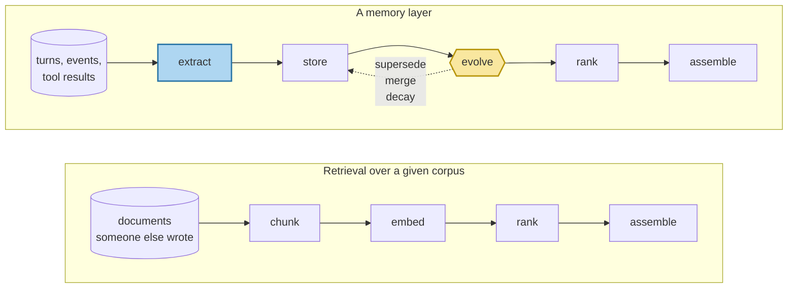

# Memory Is Not RAG

> **In one line.** Retrieval searches a corpus someone else wrote; memory writes its own — and almost everything that makes memory hard lives in the writing.

## Where this sits

<!-- graph:begin -->
**Stage:** `orientation` · **Level:** beginner · **~30 min**

**This unlocks:** [The Taxonomy That Actually Routes](../memory-taxonomy/index.md)
<!-- graph:end -->

## The problem

Priya has been talking to an assistant for seventeen months. In session 14 she asks something trivially easy:

> where do I work and what should I not eat?

Everything needed is in the history. She named her employer in session 1 and changed it in session 8. She said she was vegetarian in session 1, added fish in session 7, and cut gluten in session 12. Nothing is missing, ambiguous, or buried in a document nobody read.

So we do the obvious thing: embed every turn she has ever said, embed the question, rank by cosine similarity. A retrieval pipeline, honestly built. Here is what comes back, out of 24 candidate memories:

| Rank | Score | Session | Memory | |
|--:|--:|--:|---|---|
| **1** | 0.339 | 1 | *"I work as a data engineer at Northwind Labs"* | ← employer, **true until Dec 2025** |
| 4 | 0.245 | 12 | *"diagnosed with a gluten intolerance"* | ← diet, an addition |
| 7 | 0.158 | 7 | *"started eating fish again. Still no meat"* | ← diet, the refinement |
| 17 | 0.089 | 1 | *"I'm vegetarian"* | ← diet, later refined |
| **18** | 0.082 | 8 | *"leaving Northwind. Starting at Calico Systems"* | ← employer, **true now** |

The correct answer ranks 18th out of 24. The wrong answer ranks 1st.

This is not a tuning problem. Raise `k` and you now hand the model both employers with no way to choose. Swap the embedding model and the ordering barely moves, because the ranking is not wrong — session 1 really is more textually similar to *"where do I work"* than session 8 is. Similarity is doing exactly what it promises. The promise is just not the one we needed.

## Why this isn't RAG

RAG's contract is: *there exists a corpus, it is approximately correct, find the part that matches.* Every assumption in that sentence fails here.

The corpus does not exist in advance — it is a byproduct of talking to Priya. It is not internally consistent — it contains her old job and her new one, both stated with equal confidence. And "matches" is the wrong question, because two memories match and one of them is dead.

Nothing in a retrieval pipeline can express *"this fact retired that fact in December."* There is no field for it, no stage that would compute it, and no moment in the pipeline where it could be written down. That is not an implementation gap; the shape of the problem is different.

## Mechanism

Both systems share a read path. Only one has a write path.



The two shaded boxes have no counterpart in the top row.

**`extract`** turns raw interaction into addressable facts. Session 8 is an *event*: "I'm leaving Northwind. Starting at Calico Systems in January." The question asks for a *state*: "where do I work." Those two sentences share almost no surface form, which is exactly why the right answer ranked 18th. Extraction normalises the event into `employer = Calico Systems` — and the lab has you verify that this alone lifts it from 18th to mid-pack.

**`evolve`** is the part with no analogue at all. Once `employer = Calico Systems` exists alongside `employer = Northwind Labs`, something must decide they are the same slot, that the newer one wins, and that the older one is not deleted but *retired* — marked invalid from a date, kept for audit. A corpus never has to do this. A corpus does not change its mind.

Run those two stages and the question becomes easy. Skip them and no amount of retrieval quality recovers.

## Design decisions

**Is the query part of the corpus?** No — and you have to say so explicitly. Leave session 14 in the searchable set and it retrieves *itself* at 0.650, comfortably beating every real memory. What goes in the index is a decision, not a default. *Deviate when* you deliberately want conversational self-reference, which is rarer than it sounds.

**Store turns, or store facts?** Facts. Turns are cheap to store and nearly useless to update — you cannot mark half a sentence superseded. This is the single decision that determines whether Level 2 is possible at all. *Deviate when* you need the verbatim record for audit, in which case keep both: raw episodes append-only, extracted facts mutable on top. That is the design this course builds.

**Delete on change, or supersede?** Supersede. Deleting the Northwind fact answers session 14 correctly and makes *"where did I work before Calico?"* unanswerable, permanently. Retirement costs one nullable timestamp. *Deviate when* a legal deletion request demands real erasure — a genuinely different operation, covered in [deletion that actually deletes](../../advanced/deletion-that-actually-deletes/index.md).

## Lab

**You'll implement:** `retrieve_topk` — a complete RAG read path, in about ten lines.

**Run:**
```
uv run python curriculum/beginner/memory-is-not-rag/lab/lab.py
```

**Expected output:** all 24 candidate memories ranked, with the stale employer at rank 1 (score 0.339) and the current one at rank 18 (score 0.082).

**Stretch:** the final test in `test_lab.py` appends a normalised fact — `"Priya works at Calico Systems as a staff engineer"` — and re-ranks. It climbs sharply and *still* loses to session 1. Work out why before reading Level 2. (Answer: extraction fixed the phrasing mismatch; nothing yet has told the system that one fact retired the other.)

## What this adds to the capstone

Nothing yet, deliberately. This lesson builds the baseline you spend the rest of Beginner replacing.

What you leave with is the measurement: **rank 1 vs rank 18** on a question with an unambiguous answer. Every mechanism added between here and [watching it fail](../watching-it-fail/index.md) gets judged against it, and the same question is the eval harness's headline metric in Advanced.

## Failure modes

| Symptom | Cause | How to detect | Mitigation |
|---|---|---|---|
| Confidently states an outdated fact | No supersession; similarity has no opinion about time | Ask for something the user changed; check whether both versions are live in the store | Extract to facts, retire on conflict — [belief updating](../../../concepts/belief-updating.md) |
| Raising `k` makes answers worse | More contradictory context, no ranking signal to resolve it | Sweep `k` and watch accuracy fall while recall rises | Fix the write path; `k` is not the lever |
| "Our embeddings are bad" | Blaming the read path for a missing write path | Hand the model the correct facts directly. If it answers, retrieval was never the problem | Measure extraction quality separately from recall |
| Question retrieves itself | The query was left in the index | Check whether the top hit is the current turn | Decide explicitly what is indexable |

## Check yourself

??? question "Priya's employer changed in session 8. Why does session 1 still rank first?"
    Because "I **work** as a data engineer at Northwind Labs" shares surface form with "where do I **work**", and session 8 is phrased as an event — "leaving", "starting at" — that shares almost none. Similarity is computed correctly. It is answering a different question than the one asked.

??? question "Would a better embedding model fix this?"
    It would help with the phrasing mismatch and would not touch the real problem. Even after normalising session 8 into a clean state fact, it still loses to session 1 — you can run that in the lab. Nothing in the read path can represent "retired in December."

??? question "Sessions 1, 7 and 12 are all about diet. What relationship does retrieval see between them?"
    None. Three independent chunks with three independent scores. One of them narrows another and one adds to it, and no field anywhere records either relationship.

??? question "So is RAG useless for memory?"
    No — the read path is real and you will build a good one. It is roughly a fifth of the system. The mistake is shipping that fifth and calling it memory.

## Connections

<!-- graph:begin -->
**Stage:** `orientation` · **Level:** beginner · **~30 min**

**This unlocks:** [The Taxonomy That Actually Routes](../memory-taxonomy/index.md)
<!-- graph:end -->

<!-- landscape:begin -->
!!! info "How real systems do this — verified 2026-08-27"
    See [the framework landscape](../../../landscape/index.md) for how shipping memory systems structure extraction and conflict resolution, and why their published benchmark numbers should be read with care.
<!-- landscape:end -->
