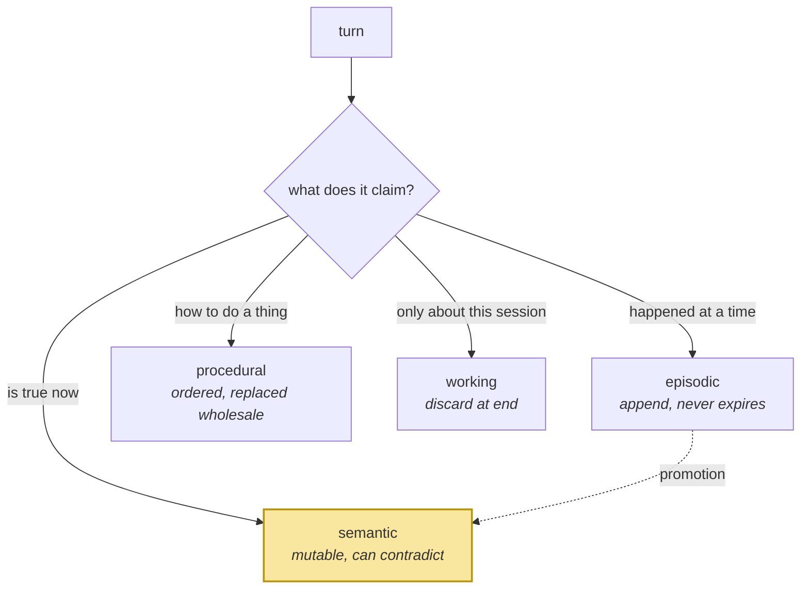

# The Taxonomy That Actually Routes

> **In one line.** Memory types are not a borrowed neuroscience metaphor — they are four different update rules, and choosing the wrong one is how facts go stale.

## Where this sits

<!-- graph:begin -->
**Stage:** `orientation` · **Level:** beginner · **~30 min**

**You need first:** [Memory Is Not RAG](../memory-is-not-rag/index.md)

**Concepts assumed:** [The Memory Lifecycle](../../../concepts/memory-lifecycle.md)

**This unlocks:** [Context Is Not Memory](../context-is-not-memory/index.md)
<!-- graph:end -->

## The problem

Most write-ups of agent memory open with a diagram borrowed from cognitive psychology: episodic, semantic, procedural, working. It is presented as background, and then never used again — the implementation stores everything in one collection and ranks it all the same way.

That is worse than skipping the taxonomy, because the categories are doing real engineering work and the diagram implies they have been handled.

Take three things Priya says:

| Session | What she said | |
|--:|---|---|
| 8 | *"I'm leaving Northwind. Starting at Calico Systems in January."* | happened, at a time |
| 10 | *"Can you keep answers shorter from now on?"* | true until she says otherwise |
| 6 | *"Pull the metrics, diff against last week, flag over 15% drift, write it up. Always in that order."* | how to do a thing |

Store all three the same way and each one breaks differently. The first is retrieved by nobody asking about "leaving". The second silently coexists with the opposite preference from session 1. The third comes back with its steps out of order, which makes it wrong rather than merely unhelpful.

## Why this isn't RAG

A document corpus has one type: text that was true enough when it was written. Chunking treats every passage identically because, for a corpus, that is roughly correct.

Memory has no such luxury. These four types differ in **when they expire, what it means for two of them to conflict, and what a correct update looks like** — and none of those questions arise for a document. There is no chunking strategy that expresses "this one may go stale and that one may not."

## Mechanism

The type is a **routing decision made at write time** that determines an update rule.

| Type | Claims | Can it go stale? | Two conflict → | Retrieved by |
|---|---|---|---|---|
| **Episodic** | X happened at T | No — it becomes past | Both are true | time, participants |
| **Semantic** | X is true now | **Yes** | One must retire | topic |
| **Procedural** | do X this way | On method change | Newer wins wholesale | task, not topic |
| **Working** | we are discussing X | Dies with session | Irrelevant | position |

The column that matters is the third. **Only semantic memories can contradict.** Two episodes that disagree are just two things that happened. That single distinction is why every mechanism in Level 2 — conflict detection, belief updating, supersession — applies almost entirely to one of the four types.



The dotted arrow is the interesting one. Session 8 is an episode; the fact that Priya *works at Calico* is semantic, and nothing in the corpus states it directly. Deriving the second from the first is [promotion](../../../concepts/memory-promotion.md), and it is the step whose absence you measured in the previous lesson.

## Design decisions

**Who assigns the type — the model or a rule?** The model, with a constrained enum, and a rule as backstop. Type is a judgement about claim shape, which models do well; the risk is silent invention of new categories, which the enum prevents. *Deviate when* your domain has a small closed set of memory shapes, where rules are cheaper and auditable.

**Four types, or more?** Four, until something hurts. Every additional type multiplies the routing surface and the number of cross-type conflict rules. Identity and preferences are commonly split out as a fifth, and they are semantic memories with a longer half-life — a `salience` field expresses that without a new type.

**One store or four?** One store, four types, in Beginner. Physically separating them is a Level 2 decision driven by access patterns, not by taxonomy, and doing it early makes cross-type queries painful for no benefit.

## Lab

**You'll implement:** `route` — classify each turn in the corpus by claim shape, then apply the type's own expiry rule.

**Run:**
```
uv run python curriculum/beginner/memory-taxonomy/lab/lab.py
```

**Expected output:** 36 memories routed — 22 semantic, 12 episodic, 2 procedural — followed by the check that matters: **only the 22 semantic memories are capable of contradicting each other**, and among them sit three live groups that already do.

**Stretch:** find the memory whose type is arguably wrong. (`Priya is at Calico now` is stored as semantic, which is right — but `Priya is starting at Calico Systems in January` is episodic, and it is the *only* record naming her employer with a searchable keyword. The type is correct and the coverage is not. That gap is the write path's, not the taxonomy's.)

## What this adds to the capstone

`MemoryType` on the record, and the routing that populates it. Nothing yet acts on the type — Beginner stores all four the same way on purpose, so that the `evolve` machinery in Level 2 has something to be *added to* rather than retrofitted.

## Failure modes

| Symptom | Cause | How to detect | Mitigation |
|---|---|---|---|
| Old preferences never die | Preferences stored as episodic, which never expires | Look for two live semantic-shaped facts that disagree | Route claims about *now* to semantic |
| Workflow steps come back shuffled | Procedure stored as several semantic facts and re-ranked | Ask the system to perform a taught procedure | Keep procedures whole and ordered; retrieve by task |
| "It forgot what we just discussed" | Working memory persisted, or durable memory treated as working | Check what survives a restart | Decide promotion explicitly |
| Every memory is semantic | Type assigned by a model with no enum and no examples | Histogram the types; a flat distribution is a smell | Constrain to an enum; test the router |

## Check yourself

??? question "Priya said she was vegetarian in session 1 and eats fish in session 7. Do these conflict?"
    As semantic memories, yes — both claim to describe her diet now, and something must reconcile them. As episodes ("on 2025-03-04 she said she was vegetarian") they never conflict; both remain permanently true. The type determines whether there is a problem at all.

??? question "Why can't episodic memories go stale?"
    Because their truth is pinned to a moment. "Priya left Northwind in December 2025" will be true forever. It can become *irrelevant*, which is a salience question, not a validity one.

??? question "The session-6 procedure is stored as one long memory. Isn't that a violation of atomicity?"
    Yes, and it is the right call. Order is load-bearing here — Priya says so explicitly. Splitting the steps into atomic facts makes each retrievable and the procedure unusable. Atomicity serves updatability; when the two conflict, procedures keep their shape.

??? question "Where does 'Priya works at Calico Systems' live?"
    Nowhere. It is the semantic fact the whole corpus implies and no turn states. Producing it is promotion, and its absence is the top-ranked failure in this course.

## Connections

<!-- graph:begin -->
**Stage:** `orientation` · **Level:** beginner · **~30 min**

**You need first:** [Memory Is Not RAG](../memory-is-not-rag/index.md)

**Concepts assumed:** [The Memory Lifecycle](../../../concepts/memory-lifecycle.md)

**This unlocks:** [Context Is Not Memory](../context-is-not-memory/index.md)
<!-- graph:end -->
