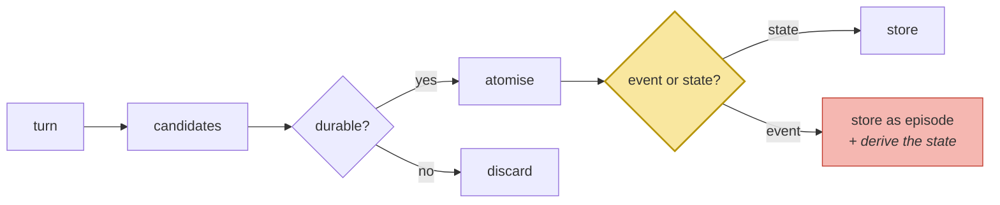

# Naive Extraction

> **In one line.** Extraction is the stage retrieval does not have, it caps everything downstream, and the naive version fails in a way that is invisible until session 14.

## Where this sits

<!-- graph:begin -->
**Stage:** `extract` · **Level:** beginner · **~45 min**

**You need first:** [Designing the Memory Record](../the-memory-record/index.md)

**Concepts assumed:** [The Memory Record](../../../concepts/memory-record.md) · [The Write Path](../../../concepts/write-path.md)

**This unlocks:** [Writing Memories Down](../writing-memories-down/index.md)
<!-- graph:end -->

## The problem

You have a record shape. Now something has to fill it, turn by turn.

The naive approach is one prompt: *"extract durable facts from this message."* It works immediately and it feels finished — 24 turns in, 36 memories out, all of them plausible, none of them obviously wrong. Nothing in the output tells you that a specific one is malformed in a way that will lose the course's headline question.

Here is what the extractor did with session 8:

> *"Big news — I'm leaving Northwind. Starting at Calico Systems in January as a staff engineer."*

```
episodic: "Priya is leaving Northwind Labs"
episodic: "Priya is starting at Calico Systems in January as a staff engineer"
```

Both are true. Both are faithful. Neither is the fact you need. Nowhere in the store does the string *Priya works at Calico Systems* exist, so no query about where she works can find it — the memory you want was never created, and no ranking function invents it.

That is the whole reason extraction quality caps retrieval quality.

## Why this isn't RAG

RAG has no extraction stage, so this failure has no analogue there. A corpus arrives pre-written: the passage saying *"the API rate limit is 100 req/s"* already exists in the form someone will search for.

A memory layer authors its own corpus, which means it also authors the *phrasing*, which means it can author it badly. The corpus is now a dependent variable, and getting it wrong is not a retrieval bug you can tune your way out of.

## Mechanism

Three decisions inside one prompt.

**What is durable?** *"Debugging a Spark job"* is true for an afternoon. *"Priya is vegetarian"* is true for two years. The naive extractor has no notion of half-life, so it keeps both — and the Spark job competes for a slot in the token budget forever.

**What is the grain?** [Atomicity](../../../concepts/atomic-fact.md) means one fact per record, standing alone without its turn. It matters because you cannot mark half a record superseded: a compound memory has to be deleted and rewritten wholesale, losing its history. Session 7 shows the extractor getting this right — three separate facts from one sentence — and session 6 shows it correctly *breaking* the rule, because the procedure's order is load-bearing and splitting it would destroy it.

**Event or state?** The one that costs you session 14. A turn describes a change; a question asks about a condition.

| The turn says | The extractor writes | A question asks | Match? |
|---|---|---|---|
| *"I'm leaving Northwind, starting at Calico"* | `leaving Northwind` / `starting at Calico in January` | *"where do I work?"* | **no** |
| *"I was diagnosed with a gluten intolerance"* | `Priya has a gluten intolerance` | *"what should I not eat?"* | yes |

Same extractor, same prompt, opposite outcomes — decided entirely by whether the turn happened to be phrased as a state. Normalising events into states is a deliberate instruction, and the naive prompt does not give it.



The shaded decision is absent in Beginner. The red box is what you get instead: the episode, and no derived state.

## Design decisions

**Extract every turn, or batch by session?** Every turn, in Beginner — simpler to trace, and you can watch it work. It is also the expensive choice, since extraction is an LLM call on the hot path; when to defer it is the cost lesson in Level 2.

**Let the model decide durability, or gate it?** Gate it eventually, and accept over-extraction for now. Over-extraction is the failure that looks like success: the store fills up fast and looks healthy, while every junk memory is embedded, ranked and competing for budget forever. Precision at write time buys more than any reranker.

**Prompt for states explicitly?** Yes — and Beginner deliberately does not, so you can measure the cost. One added instruction ("if the turn describes a change, also record the resulting state") fixes session 8. Knowing *why* it fixes it is worth more than shipping it now.

## Lab

**You'll implement:** `extract` — turn to memories — and then `audit_against_gold`, which scores what came out.

**Run:**
```
uv run python curriculum/beginner/naive-extraction/lab/lab.py
```

**Expected output:** 36 memories from 24 turns (session 14 is the question, and is held out). The audit then reports the three things the naive extractor got wrong, in order of cost: **no employer state** (session 8), **PII stored ungated** (session 5), and **a deletion request filed as a memory instead of honoured** (session 13).

**Stretch:** add one sentence to `PROMPT` telling the model to record the resulting state when a turn describes a change, then author the fixture for session 8 by hand with `register_fixture`. Re-run the retrieval from lesson 00. The employer climbs sharply — and still loses to the stale fact, because nothing retires anything. Extraction is necessary and not sufficient.

## What this adds to the capstone

`memlab.extract.naive` — the prompt, the schema, and the turn-to-`Memory` mapping. Level 2 replaces it with a staged pipeline; the interface stays.

## Failure modes

| Symptom | Cause | How to detect | Mitigation |
|---|---|---|---|
| A fact is unfindable despite being "stored" | Stored as an event when the query wants a state | Search for the fact in the words a user would use | Normalise changes into resulting states |
| Store grows fast, recall gets worse | Over-extraction; no durability gate | Track memories per turn over time | Salience gate at write time |
| A memory can't be updated | Compound record; several facts in one string | Try to supersede half of one | Enforce atomicity |
| Procedure steps come back shuffled | Atomised something whose order was load-bearing | Ask the system to perform a taught procedure | Keep procedures whole |
| PII stored silently | No classification on the write path | Grep the store for addresses and numbers | Gate before write |

## Check yourself

??? question "The session-8 extraction is faithful to what Priya said. Why is it wrong?"
    It is not wrong as a transcription — it is wrong as a *memory*. Memories are written to be retrieved later by questions phrased differently from the turn that produced them. Faithfulness to the utterance and usefulness as a memory are different targets, and extraction serves the second.

??? question "Session 6's procedure is one long record. Doesn't that violate atomicity?"
    Yes, correctly. Atomicity exists to make records updatable; a procedure's order is load-bearing, and splitting it produces steps that are individually retrievable and collectively useless. When the two principles conflict, procedures keep their shape.

??? question "Why does over-extraction get worse over time rather than staying constant?"
    Because the costs are per-retrieval, not per-write. Every junk memory is embedded once and then ranked on every query forever, competing for a token budget that does not grow. A store with 10% noise at 100 memories has 10% noise at 100,000, and by then it is crowding out the facts that matter.

## Connections

<!-- graph:begin -->
**Stage:** `extract` · **Level:** beginner · **~45 min**

**You need first:** [Designing the Memory Record](../the-memory-record/index.md)

**Concepts assumed:** [The Memory Record](../../../concepts/memory-record.md) · [The Write Path](../../../concepts/write-path.md)

**This unlocks:** [Writing Memories Down](../writing-memories-down/index.md)
<!-- graph:end -->
