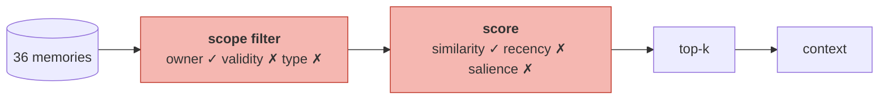

# Retrieval Is Not Enough

> **In one line.** Sweep `k` from 3 to 36 and the system goes silent, then confidently wrong, then ambiguous — there is no value of `k` that is right, because `k` is not the broken part.

## Where this sits

<!-- graph:begin -->
**Stage:** `retrieve` · **Level:** beginner · **~35 min**

**You need first:** [Embedding Recall](../embedding-recall/index.md)

**Concepts assumed:** [Vector Search](../../../concepts/vector-search.md) · [The Read Path](../../../concepts/read-path.md)

**This unlocks:** [Getting Memories Into the Prompt](../context-assembly-v0/index.md)
<!-- graph:end -->

## The problem

The retriever works. It scopes correctly, ranks sensibly, and returns what it was asked for. The obvious next move when an answer is missing is to return more.

So sweep it. Same question, same store, `k` from 3 to 36:

| `k` | Employer recalled | Diet facts | Live contradictions in context |
|--:|---|---|--:|
| 3 | — | meat | 0 |
| 5 | — | meat, gluten | 0 |
| 10 | **Northwind only** | meat, gluten | 0 |
| 15 | **Northwind only** | meat, gluten | 1 |
| 20 | both, ambiguous | meat, gluten | 2 |
| 25 | both, ambiguous | meat, fish, gluten | 2 |
| 36 | both, ambiguous | meat, fish, gluten, vegetarian | **3** |

Read the employer column top to bottom. At small `k` the system says nothing. At `k=10` it says **Northwind** — the worst outcome available, because it is now confidently wrong where before it was merely unhelpful. Push higher and the truth arrives, but never alone: it arrives alongside the fact it was supposed to replace, with nothing to separate them.

The contradiction column only goes up. Every increment of `k` admits more of the store, and the store's contradictions come with it. At `k=36` the model has everything Priya ever said and three live contradictions to reconcile with no evidence for doing so.

## Why this isn't RAG

Over a document corpus, raising `k` genuinely trades precision for recall along a smooth curve, and there is usually a `k` that is about right. That works because the corpus does not disagree with itself: more passages means more context, not more conflict.

Here, recall and *coherence* trade against each other, and the curve has no good point on it. Retrieving more is not neutral — it is actively adding contradictions to the prompt. This is the clearest case in the course where a technique that is correct for retrieval is harmful for memory.

## Mechanism

Three signals are missing, and none of them is `k`.

**Scope is a filter, not a score.** Owner, agent, type, validity — hard predicates applied before ranking. Beginner filters on owner only. Once `invalid_at` is populated in Level 2, filtering on validity removes the Northwind fact from consideration entirely, and the ambiguity at `k=20` simply stops existing.

**Recency is not in the score.** Cosine has no time term. The record already carries `happened_at`; the retriever ignores it. Adding it is a few lines and it is deliberately deferred, because a recency-weighted ranker would paper over staleness well enough to hide why supersession is needed.

**Salience is not in the score.** Everything sits at 0.5 with `access_count` 0, so the system cannot distinguish a fact Priya repeated four times from one she mentioned once in passing.



Five of the seven inputs a real ranker uses are absent, and four of the five are already **fields on the record**. The upgrade in Level 2 is not a better embedding model — it is reading the rest of the row.

## Design decisions

**Fix this with a bigger `k` or a smaller one?** Neither. The sweep is the argument. Pick `k` by token budget and treat the ambiguity as a write-path bug, which is where it will actually be fixed.

**Add recency weighting now?** No, and this is a deliberate cost. Two lines of code would visibly improve these numbers and would teach the wrong lesson: that staleness is a ranking problem. It is a *belief* problem, and the fix belongs in `evolve`.

**Filter on validity now?** The filter is already written — `live_only=True` in `search`. Nothing ever sets `invalid_at`, so it does nothing. The seam exists; Level 2 gives it something to do.

## Lab

**You'll implement:** `sweep_k` — reproduce the table above — and `contradictions_in_context`, which counts what each `k` admitted.

**Run:**
```
uv run python curriculum/beginner/retrieval-is-not-enough/lab/lab.py
```

**Expected output:** the sweep, and the finding that matters — the employer goes **absent → stale-only → ambiguous**, while live contradictions rise monotonically from 0 to 3. No `k` produces a correct, unambiguous answer.

**Stretch:** pass `live_only=True` and manually set `invalid_at` on the Northwind memory, then re-run the sweep. Every row changes at once: the employer column reads "Calico" from `k=10` onward and never becomes ambiguous. One field, correctly populated, does what no amount of `k` tuning could.

## What this adds to the capstone

Nothing new — this lesson audits what you already built. Its output is the `k` sweep, which becomes a regression test: when Level 2 adds supersession, this table is how you prove it worked.

## Failure modes

| Symptom | Cause | How to detect | Mitigation |
|---|---|---|---|
| Raising `k` makes answers worse | More context, more contradictions, no arbitration | Sweep `k` and count contradictions | Fix the write path |
| Silent at low `k`, wrong at medium `k` | Correct fact ranks below a stale one | Check the rank of the known-correct memory | Recency and validity in the ranker |
| Rare-but-critical facts never recalled | Flat salience; nothing marks importance | Query for a fact stated once and never repeated | Salience scoring |
| Answers drift between sessions | `k` near a rank boundary; ties break arbitrarily | Same query repeatedly; diff the recalled set | Stable sort; budget instead of count |

## Check yourself

??? question "At k=10 the system says 'Northwind'. Why is that worse than k=5 saying nothing?"
    Because a missing answer is visibly missing and a wrong one is not. At `k=5` a user notices and rephrases. At `k=10` they get a fluent, confident, incorrect answer with a real fact behind it, and no signal that anything went wrong.

??? question "At k=36 the model has every memory. Isn't that maximum information?"
    Maximum information, minimum usable signal. It now holds both employers, both preferences, both coffee facts and every diet fact, with no evidence about which are current. That is not context, it is a puzzle — and you have paid full price in tokens for it.

??? question "Which single field would improve this table most?"
    `invalid_at`. Populated by supersession, filtering on it removes the retired employer before scoring, and the ambiguity disappears at every `k` at once. It is one nullable timestamp on a record you already designed.

## Connections

<!-- graph:begin -->
**Stage:** `retrieve` · **Level:** beginner · **~35 min**

**You need first:** [Embedding Recall](../embedding-recall/index.md)

**Concepts assumed:** [Vector Search](../../../concepts/vector-search.md) · [The Read Path](../../../concepts/read-path.md)

**This unlocks:** [Getting Memories Into the Prompt](../context-assembly-v0/index.md)
<!-- graph:end -->
