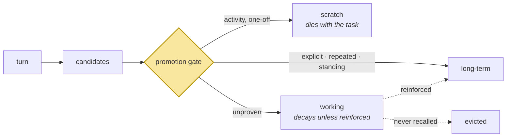

# Session Memory vs Long-Term Memory

> **In one line.** Promotion is where "is this worth keeping forever" actually gets decided, and Beginner answers yes to everything — which is why 8 of Priya's 36 memories were dead on arrival.

## Where this sits

<!-- graph:begin -->
**Stage:** `evolve` · **Level:** beginner · **~30 min**

**You need first:** [Getting Memories Into the Prompt](../context-assembly-v0/index.md)

**Concepts assumed:** [Working Memory](../../../concepts/working-memory.md) · [Extraction](../../../concepts/extraction.md) · [Context Assembly](../../../concepts/context-assembly.md)

**This unlocks:** [Your First Memory Layer](../your-first-memory-layer/index.md)
<!-- graph:end -->

## The problem

Everything the extractor produced went straight into the durable store. That was never a decision; it was the absence of one.

Look at what it kept. *"Priya is debugging a Spark job"* — true for an afternoon in March 2025, stored forever, embedded, ranked on every query for the rest of the account's life. *"Priya completed her first week at the new job"* — true for a week. *"Priya asked to forget her old address"* — a request, filed as a fact, never acted on.

None of these are extraction errors. Each is a faithful reading of what Priya said. They are **promotion** errors: the extractor's job is to find candidate facts, and something else has to decide which survive the session. In Beginner nothing does.

The cost is not storage — 36 records is nothing. The cost is that every one of them competes for a slot in a token budget that does not grow, forever.

## Why this isn't RAG

Documents have no session. A corpus is durable by construction, so "should this persist" is not a question anyone asks, and there is no stage in a RAG pipeline where it could be asked.

A memory layer sees a continuous stream in which most content is transient and a little is durable, and it must sort them **at write time**, before knowing which questions will be asked. That is a genuinely hard judgement and there is no equivalent of it anywhere in retrieval.

## Mechanism

Three tiers, distinguished by what ends them.

| Tier | Ends when | Example from the corpus |
|---|---|---|
| **scratch** | the task ends | *"debugging a Spark job"* |
| **working** | it stops being reinforced | *"planning a trip around Sam's rota"* |
| **long-term** | explicitly retired | *"Priya does not eat meat"* |

Promotion is movement up this ladder, and it is where the *"is this worth keeping"* decision lives. Four signals argue for promotion:

**Explicit instruction.** *"Memorise this"*, *"keep that in mind"*, *"from now on"*. Priya marks four memories this way and they are among the most durable things she says. This signal is nearly free and routinely ignored.

**Repetition.** Sam's night shifts come up in sessions 2 and 11. A fact restated across sessions has demonstrated its own durability.

**Claim shape.** *"I am vegetarian"* is a standing condition; *"I am debugging a Spark job"* is an activity. The distinction is usually visible in the verb.

**Retrieval feedback.** A memory that keeps getting recalled and used is earning its slot. This is the strongest signal and the only one that needs the system to have been running for a while — it arrives properly in Level 2 with `access_count`.



The shaded gate is the whole lesson, and Beginner's version is `return LONG_TERM`.

**Promotion is lossy, and that is the risk.** Turning *"on Tuesday she said she prefers short answers"* into *"Priya prefers short answers"* discards the hedge. Usually right, occasionally badly wrong — the travel-agent memory in the corpus is a colleague's speculation that Priya is relocating, and promoted to a plain fact it silently corrupts her profile. Provenance is what keeps that recoverable, which is why it is a field on the record.

## Design decisions

**Promote at write time or after the session?** After the session, ideally — repetition and outcome are only visible once the session is over, and it moves an LLM call off the hot path. Beginner promotes inline because it is easier to watch; the deferred version is the Level 2 async lesson.

**Gate with a model or with rules?** Rules first. Explicit markers and claim shape are cheap and auditable, and they catch most of it. A model call to adjudicate the remainder is a reasonable second pass, not a first one.

**Delete demoted memories or archive them?** Archive. Demotion is a judgement that can be wrong, and a memory that stops being recalled is not proven worthless.

## Lab

**You'll implement:** `promotion_tier` — a rules-first gate — and `would_promote`, which reruns the corpus through it.

**Run:**
```
uv run python curriculum/beginner/session-vs-longterm/lab/lab.py
```

**Expected output:** the current system promotes **36 of 36**. The rules gate promotes 30 to long-term and demotes 6 — the trip planning, the first week, the deletion request, the house move, Samira's promotion, and the Northwind departure.

Then the finding that makes the case. One of those 6 — *"Priya completed her first week at the new job"*, true for a week in January 2026 — ranks **6th of 36** for the session-14 question. It is not quietly wasting storage; it is spending one of the ten slots the model will ever see. Demote it and a genuinely new memory enters the window, with nothing relevant lost.

**Now find what it missed.** *"Priya is debugging a Spark job"* survives to long-term, and it is the most obviously transient thing in the corpus. Work out why before reading on.

??? note "Why the Spark job survives"
    Session 1's third turn is: *"Debugging a Spark job. Also — I'm vegetarian, so if you ever suggest restaurants, keep that in mind."* The explicit marker is real, and it applies to the **turn**. The gate reads turn-level signals and applies them to every fact extracted from that turn — so the marker Priya attached to her diet also protected an afternoon's debugging.

    Turn-level signals do not map cleanly onto fact-level decisions. Attributing a marker to the right fact needs the extractor to carry that association through, which is a write-path change, not a gate change.

**Stretch:** the gate demotes *"planning a trip around Sam's shift rota"* to scratch. Argue the other side — it is a goal, goals persist, and Priya may ask about it in six months. No rule settles it, which is why retrieval feedback eventually beats every heuristic here.

## What this adds to the capstone

The `Tier` field starts being used rather than defaulted. No new module — this lesson is a decision the existing pipeline was making silently, made explicit.

## Failure modes

| Symptom | Cause | How to detect | Mitigation |
|---|---|---|---|
| Store grows without bound | Everything promoted; nothing ever demoted | Plot memories per session over time | A promotion gate |
| Transient facts crowd out durable ones | No tier distinction in ranking | Check top-k for finished activities | Tier as a retrieval filter |
| Speculation stored as fact | Promotion discarded the hedge | Look for third-party claims stated flatly | Carry provenance; promote by authority |
| "It forgot something I said once" | Gate too strict; no explicit-marker signal | Test a single unrepeated instruction | Always promote explicit markers |
| Instructions treated as facts | Requests promoted rather than executed | Search for memories containing "asked to" | Route imperatives to actions |

## Check yourself

??? question "Why is 'Priya is debugging a Spark job' a promotion error rather than an extraction error?"
    Because the extraction is correct — she was, and the record says so accurately. The error is keeping it forever. Extraction asks *what was said*; promotion asks *what should outlive this session*, and only the second one was skipped.

??? question "Session 13 stores 'Priya asked to forget her old address'. Which stage should have caught it?"
    Promotion, first — an imperative is not a fact and should route to an action rather than the store. `govern` should have caught it second, by executing the deletion. Both failed, which is why the address is still there and there is now a memory documenting that she asked for it not to be.

??? question "The gate demotes 6 of 36 memories. Is a 17% reduction worth this machinery?"
    At 36 memories, no. At 36,000 it is the difference between a store that works and one that does not — and the ratio holds, because junk arrives at a steady rate. The machinery is also where `access_count` plugs in later, which is the signal that actually scales.

??? question "The gate applies an explicit marker to every fact from that turn. What breaks?"
    Precision, in both directions. Priya's *"keep that in mind"* was about being vegetarian and it also protected *"debugging a Spark job"* from demotion. Turn-level signals are cheap and blunt; binding a marker to the fact it was actually about requires the extractor to carry the association, which is a write-path change.

## Connections

<!-- graph:begin -->
**Stage:** `evolve` · **Level:** beginner · **~30 min**

**You need first:** [Getting Memories Into the Prompt](../context-assembly-v0/index.md)

**Concepts assumed:** [Working Memory](../../../concepts/working-memory.md) · [Extraction](../../../concepts/extraction.md) · [Context Assembly](../../../concepts/context-assembly.md)

**This unlocks:** [Your First Memory Layer](../your-first-memory-layer/index.md)
<!-- graph:end -->
