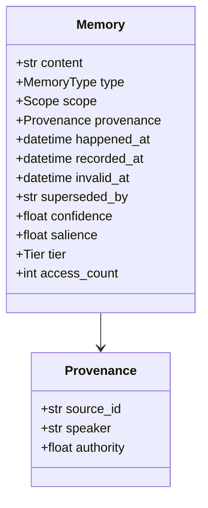

# Designing the Memory Record

> **In one line.** Four fields cost nothing today and are impossible to add later — miss them and Level 2 is unreachable.

## Where this sits

<!-- graph:begin -->
**Stage:** `store` · **Level:** beginner · **~40 min**

**You need first:** [Anatomy of a Memory Layer](../anatomy-of-a-memory-layer/index.md)

**Concepts assumed:** [Episodic Memory](../../../concepts/episodic-memory.md) · [Semantic Memory](../../../concepts/semantic-memory.md)

**This unlocks:** [Naive Extraction](../naive-extraction/index.md)
<!-- graph:end -->

## The problem

The obvious memory record is `{"text": ..., "embedding": [...]}`. It works. You can store, retrieve, and inject with it, and for a demo it is complete.

Now try to serve four ordinary requests against it:

| Request | What the record needs |
|---|---|
| *"I changed jobs — stop saying Northwind."* | somewhere to mark a fact retired |
| *"What did I tell you about my commute last year?"* | when it was true, separate from when it was learned |
| *"Forget my old address."* | which turn each memory came from |
| *"Why do you think I'm vegetarian?"* | who said it, and how sure we are |

None are exotic and none are answerable. Worse, none can be *retrofitted*: by the time you want event time, the events are gone. The schema is the one decision in this course with no second chance.

## Why this isn't RAG

A chunk needs to be findable. A memory needs to be findable, **updatable, attributable, and revocable**. Those last three are schema properties, not index properties, and no amount of retrieval quality substitutes for a missing column.

The tell is that a document chunk has exactly one timestamp — when the document was written — and nobody misses the second one, because a document does not make claims about *now* that later stop being true.

## Mechanism

Four fields carry the weight.

**Two clocks.** `happened_at` is when the fact was true in the world; `recorded_at` is when the system learned it. Session 11 makes the case in one sentence: *"Before the move I used to cycle to work. Can't now, it's 40 minutes on the train."* Spoken in April 2026, about a change in August 2025, containing both a retired fact and a current one. Collapse the clocks and the system believes she cycles today.

**Provenance.** `source_id`, `speaker`, `authority`. Keeping speaker separate from authority is what stops *"my colleague thinks she's moving to Berlin"* from being stored as *"Priya is moving to Berlin"*. And `source_id` is the field that makes deletion possible at all — [deletion that actually deletes](../../advanced/deletion-that-actually-deletes/index.md) is impossible without it, which is why it is written here, nine lessons before anything uses it.

**Validity.** `invalid_at` plus `superseded_by`. Retirement, not deletion. Setting `invalid_at` answers "where do I work" correctly while keeping "where did I work before" answerable. Deleting the row answers the first and destroys the second forever.

**Scope.** `user`, `agent`, `session`. The key every read filters on before it ranks. It is a correctness boundary — ranking across users and trusting similarity to keep them apart is how memory systems leak between tenants.



The id is **derived from content plus source**, not a counter. That one choice makes re-ingesting a turn idempotent for free, which matters more than it sounds: retries, replays and backfills are normal, and without it each one silently doubles the store.

## Design decisions

**Content-addressed ids or sequential?** Content-addressed. Idempotency for free, and an id that is stable across a rebuild. *Deviate when* you need ordering baked into the id, which a separate sequence handles better anyway.

**Mutable records or immutable-plus-supersession?** Immutable, always. A mutated record loses its own history, and "what did I believe last March" becomes unanswerable. Supersession costs one nullable timestamp and preserves the audit trail that privacy and debugging both need.

**Store `confidence` and `salience` now, unused?** Yes. Both default sensibly, cost nothing, and backfilling them means reprocessing history you may no longer have. This is the one place in the course where speculative fields are the right call, because the schema is the only irreversible decision.

## Lab

**You'll implement:** `supersede` — retire a belief without destroying it — and the `as_of` query it enables.

**Run:**
```
uv run python curriculum/beginner/the-memory-record/lab/lab.py
```

**Expected output:** the employer fact retired as of 2026-01-01. `as_of(2025-06-01)` returns **Northwind**; `as_of(2026-06-01)` returns **Calico**; both are correct, and the second is only possible because the first was not deleted.

**Stretch:** try answering *"what did I believe about Priya's diet in October 2025?"* using only `recorded_at`. It cannot be done — you need `happened_at` to distinguish when the fish refinement became true from when it was mentioned. That is the two-clock argument, felt rather than asserted.

## What this adds to the capstone

`memlab.types` — `Memory`, `Scope`, `Provenance`, `MemoryType`, `Tier`. Everything else in `memlab` is built on this module, and the Intermediate and Advanced levels add behaviour to these fields rather than new fields.

## Failure modes

| Symptom | Cause | How to detect | Mitigation |
|---|---|---|---|
| Can't answer "what did I believe then" | One timestamp | Ask a historical question; see if it is expressible | Two clocks, from day one |
| Deletion request has no target | No `source_id` on the record | Try to honour "forget my old address" | Stamp provenance at capture |
| History destroyed by a correction | Records mutated in place | Update a fact, look for the previous value | Immutable + `superseded_by` |
| One user sees another's memories | Scope filtered after ranking, or not at all | Query with a scope holding no memories; check the result is empty | Hard filter before scoring |
| Re-running ingest doubles the store | Sequential ids | Ingest twice, count | Content-addressed ids |

## Check yourself

??? question "Why not just delete the Northwind fact when Priya changes jobs?"
    It answers "where do I work" and permanently breaks "where did I work before", "when did I change jobs", and any audit of why the system believed something. Retirement costs one nullable field and keeps all of them.

??? question "Session 11 contains both a retired fact and a current one in a single sentence. Which clock separates them?"
    `happened_at`. Both have the same `recorded_at` — April 2026 — so ingestion time cannot distinguish them at all. Cycling has a `happened_at` before the August 2025 move; the train commute has one after it.

??? question "`authority` defaults to 1.0 and nothing reads it in Beginner. Why is it there?"
    Because the travel-agent memory in the corpus is hearsay about Priya relocating, and flattening it to a plain fact silently corrupts the user model. The field costs nothing now and cannot be backfilled once the distinction is lost.

## Connections

<!-- graph:begin -->
**Stage:** `store` · **Level:** beginner · **~40 min**

**You need first:** [Anatomy of a Memory Layer](../anatomy-of-a-memory-layer/index.md)

**Concepts assumed:** [Episodic Memory](../../../concepts/episodic-memory.md) · [Semantic Memory](../../../concepts/semantic-memory.md)

**This unlocks:** [Naive Extraction](../naive-extraction/index.md)
<!-- graph:end -->
