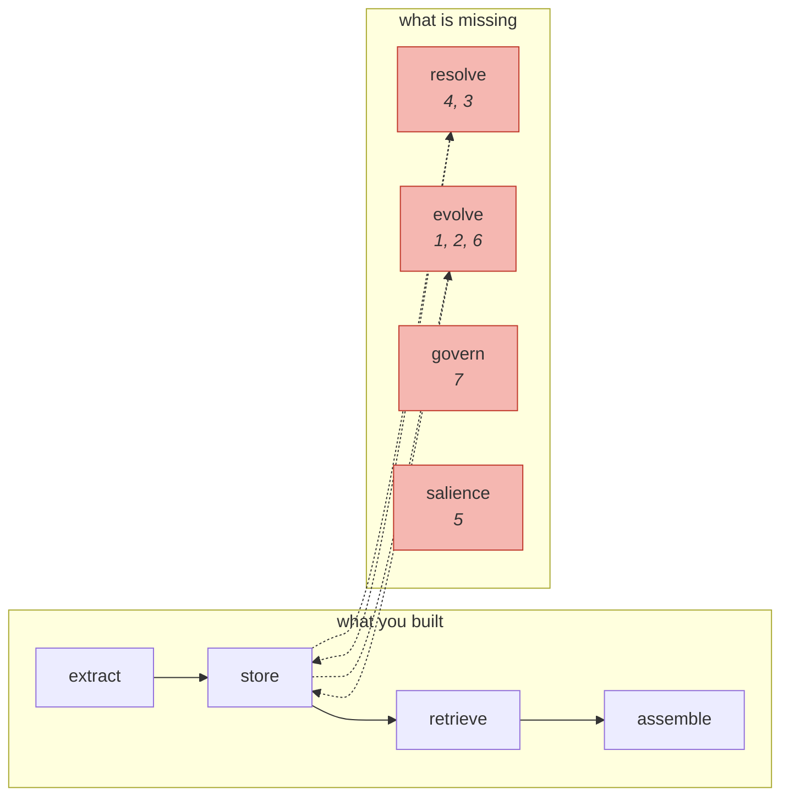

# Watching It Fail

> **In one line.** Seven failures, each measured on your own store, each naming the Intermediate module that fixes it — this is the hinge of the course.

## Where this sits

<!-- graph:begin -->
**Stage:** `govern` · **Level:** beginner · **~45 min**

**You need first:** [Your First Memory Layer](../your-first-memory-layer/index.md)

**Concepts assumed:** [Promotion](../../../concepts/memory-promotion.md) · [Retrieval Scoping](../../../concepts/retrieval-scoping.md) · [Vector Search](../../../concepts/vector-search.md)
<!-- graph:end -->

## The problem

Priya has one question, asked in session 14:

> where do I work and what should I not eat?

The correct answer: **Calico Systems**; avoid **meat** and **gluten**; **fish is fine**.

Your system gets it wrong in four different ways at once, and every one of them traces to a mechanism you can name. This lesson is where Beginner stops being a build and becomes a measurement.

| Wrong answer | Why |
|---|---|
| "Northwind Labs" | nothing retired the old employer; similarity has no opinion about time |
| "avoid fish" | session 7 refined session 1; the system treats it as an unrelated new fact |
| omits gluten | session 12 should ADD to the diet; nothing decided between adding and replacing |
| "moving to Berlin" | a colleague's speculation, flattened into a first-party belief |

## Why this isn't RAG

Every failure below is a **write-path** failure surfacing at read time. That is the sentence this level exists to earn.

Not one of them is fixed by a better embedding model, a reranker, a larger `k`, or a bigger context window. You have measured all four of those directly: `k` made it worse, the window made it ambiguous, the embedding correctly ranked a contradiction as the most similar pair in the store, and normalising the phrasing improved the rank and still lost.

If you take one thing from Beginner into Level 2, take this: **when memory is wrong, look at what was written, not at how it was found.**

## Mechanism

The seven, in the order they will bite you.

**1 · Staleness.** *"Priya is a data engineer at Northwind Labs"* ranks **9th of 36**; *"Priya is at Calico now"* ranks **35th**. The dead fact wins because it was stated early, stated clearly, and reinforced for nine months. Staleness gets *worse* as a system gets more confident. → [contradiction detection](../../intermediate/contradiction-detection/index.md), [supersession](../../intermediate/supersession-not-deletion/index.md)

**2 · Contradictions accumulate.** Both coffee memories are live. Both preferences are live, ranking one position apart, so the model receives *"prefers detailed explanations"* and *"prefers shorter answers"* adjacently with nothing to choose between them. → [memory operations](../../intermediate/memory-operations/index.md), [deterministic arbitration](../../intermediate/deterministic-freshness/index.md)

**3 · Refinement mistaken for noise.** *"Still no meat"* narrows *"vegetarian"*; it does not negate it. A system that treats every change as a contradiction destroys a constraint that still holds — which is how you get "avoid fish". → [contradiction detection](../../intermediate/contradiction-detection/index.md)

**4 · Entity fragmentation.** Sam, Samira and Sammy are three people with three jobs. Plus *"She works nights most of the month"*, stored with the pronoun unresolved and attached to nobody. Evidence about one person is split across records that never meet, so nothing accumulates and no contradiction is detectable. → [entity resolution](../../intermediate/entity-resolution/index.md)

**5 · Over-extraction.** 36 memories from 25 turns, and *"Priya completed her first week at the new job"* — true for one week — ranks **6th** for a question about employment and diet. It is not wasting storage; it is spending a slot the model will actually see. → [extraction quality](../../intermediate/extraction-quality/index.md), [salience scoring](../../intermediate/salience-scoring/index.md)

**6 · No forgetting.** Every memory sits at salience 0.5 with `access_count` 0. Nothing is more important than anything else, so nothing can be evicted, so the store only grows. → [forgetting](../../intermediate/why-forgetting-is-a-feature/index.md), [decay and tiers](../../intermediate/decay-and-tiers/index.md)

**7 · No time model.** One clock is used. *"Before the move I used to cycle to work"* is stored as though it were current. And the deletion request from session 13 is filed as a memory *about asking*, while the address itself remains — the system recorded the request and did not honour it. → [two clocks](../../advanced/two-clocks/index.md), [deletion that actually deletes](../../advanced/deletion-that-actually-deletes/index.md)



Six of the seven live in two boxes you have not built. That is Level 2.

## Design decisions

**Fix these now or measure them first?** Measure. Every one is pinned by a test in `capstone/tests/test_v1_failures.py`, which asserts the system is broken in exactly these ways. When Level 2 fixes one, its test moves and flips its expectation — so progress is demonstrated rather than asserted.

**Which to fix first?** Supersession. It resolves failures 1 and 2, fixes the headline question, and is one nullable field plus the logic to set it. Entity resolution is the largest and it is second.

**Is any of this acceptable to ship?** Failure 7's second half is not. Priya asked for her address to be deleted and the system stored a note about the request instead. That is a compliance problem, not a quality problem, and it is the one item here that is not a matter of degree.

## Lab

**You'll implement:** `diagnose` — run all seven checks against your own store and produce the catalogue.

**Run:**
```
uv run python curriculum/beginner/watching-it-fail/lab/lab.py
```

**Expected output:** seven findings, each with the evidence that proves it and the Intermediate lesson that fixes it. Then the exam: the session-14 question answered from memory, with the four wrong answers identified in the output.

**Stretch:** pick the failure that bothers you most and estimate the fix. Supersession is roughly forty lines. Entity resolution is a subsystem. That ratio — how much correctness the cheapest mechanism buys — is why Level 2 is ordered the way it is.

## What this adds to the capstone

Nothing. It measures. `capstone/tests/test_v1_failures.py` is the deliverable, and it is the baseline every later claim in this course is compared against.

## Failure modes

| Symptom | Cause | How to detect | Mitigation |
|---|---|---|---|
| "Memory quality" tracked as one number | Seven distinct failures averaged into a score | Ask which mechanism a regression came from | Measure per failure mode |
| Fixes that do not fix anything | Tuning the read path for a write-path bug | Change `k` or the embedding; see if it moves | Diagnose by stage |
| Regression after a Level 2 change | Baseline not executable any more | Try to re-run the naive system | Keep `--profile beginner` runnable |
| Compliance failure found late | Deletion never tested end to end | Delete a memory; grep every derived artifact | Test deletion as a cascade |

## Check yourself

??? question "The system answers 'what should I not eat?' with 'meat' and 'gluten'. That's correct. Is anything wrong?"
    It is correct for the wrong reasons, which means it is unstable. *"Priya is vegetarian"* and *"Priya eats fish"* are both live and neither made the cut at this `k`. Change `k`, add a memory, or reword the question and the answer changes. Right-by-luck fails silently the moment anything shifts.

??? question "Failure 1 says staleness gets worse as the system gets more confident. Why?"
    Because confidence signals — early statement, clear phrasing, repeated reinforcement — are exactly what ranking rewards. Priya's Northwind fact has all three and her Calico fact has none, so the better your ranker, the more reliably it surfaces the dead one. Only supersession breaks that.

??? question "Which failure is a compliance problem rather than a quality problem?"
    The deletion request. Priya asked in session 13 for her old address to be forgotten; the system stored *"Priya asked to forget her old address"* and kept the address. Every other failure here is a degree of wrongness. This one is a commitment that was made and not kept.

??? question "You are about to start Level 2. What is the one sentence to carry into it?"
    When memory is wrong, look at what was written, not at how it was found.

## Connections

<!-- graph:begin -->
**Stage:** `govern` · **Level:** beginner · **~45 min**

**You need first:** [Your First Memory Layer](../your-first-memory-layer/index.md)

**Concepts assumed:** [Promotion](../../../concepts/memory-promotion.md) · [Retrieval Scoping](../../../concepts/retrieval-scoping.md) · [Vector Search](../../../concepts/vector-search.md)
<!-- graph:end -->
