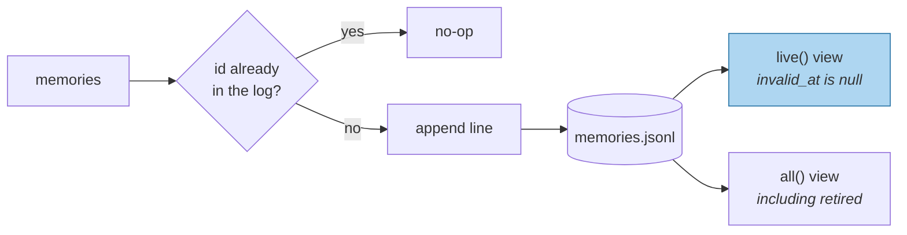

# Writing Memories Down

> **In one line.** Append-only is the right first store and the right permanent substrate — and the thing it cannot do is the reason Level 2 exists.

## Where this sits

<!-- graph:begin -->
**Stage:** `store` · **Level:** beginner · **~35 min**

**You need first:** [Naive Extraction](../naive-extraction/index.md)

**Concepts assumed:** [The Memory Record](../../../concepts/memory-record.md) · [Extraction](../../../concepts/extraction.md)

**This unlocks:** [Embedding Recall](../embedding-recall/index.md)
<!-- graph:end -->

## The problem

A vector database feels like the obvious first move. It is the wrong one, and not because it is too heavy — because it teaches the wrong instinct. Reaching for a similarity index first frames memory as a search problem, which is the mistake this entire level exists to unlearn.

Start with a file. One JSON object per line, appended. It is durable, inspectable with `cat`, diffable, and it makes provenance free. You can read your entire memory store with your eyes, which you will want to do more often than you expect.

Then Priya changes jobs, and you discover what you have built: a log that can record *that she said she was leaving* and has no way to record *that the old fact is no longer true*.

## Why this isn't RAG

An index over a corpus is a **derived artifact**. Delete it and rebuild it from the documents; nothing is lost. That is why re-ingestion is safe and why nobody writes idempotency tests for a RAG pipeline.

A memory store is the **source of truth**. There is nothing to rebuild it from — the conversation that produced it is gone, and the extraction that shaped it was a model call that will not return the same thing twice. So the store has to be durable in a way an index never does, and every write has to be safe to repeat.

## Mechanism

**Append-only means corrections arrive as new entries.** Nothing is edited in place. The log is the history, and "what is true now" is a *view* computed over it — the live records, those with no `invalid_at`. That separation is what makes audit free: you never lose the previous belief, because you never overwrote it.

**Idempotency comes from the id.** `Memory.id` is a hash of content, scope, type and `source_id`, so extracting the same turn twice produces the same id twice, and the second write is a no-op. This is not defensive programming — re-ingestion is routine. Retries, replays, backfills, a consolidation job that runs twice on a bad deploy. With a sequential id every one of those silently doubles the store, and duplicate facts then out-vote unique ones in retrieval, because two copies of a memory occupy two slots in the top-k.



Two views over one log. Beginner only ever needs `all()`, because nothing is ever retired — but the seam is cut now so Level 2 has somewhere to put supersession without a migration.

**What it cannot do** is the honest part. A flat file has no index, so every query is a full scan; that is fine at 36 memories and fatal at 36,000. It has no transactions, so a crash mid-write can truncate a line. And "which records are live" requires reading everything. Each of those is a real limit with a real fix in Level 2, and none of them is a reason to start somewhere heavier.

## Design decisions

**JSONL over SQLite, for now?** Yes. The goal in Beginner is that you can open the store in an editor and see exactly what your extractor did. That feedback loop is worth more than indexing at this scale. *Deviate when* full scans start to hurt — which is the [relational stores](../../intermediate/relational-stores/index.md) lesson, and SQLite is the answer there too.

**Content-addressed ids, or a UUID per write?** Content-addressed. Idempotency for free, and ids stable across a rebuild. The cost is that editing a memory's content changes its id — correct, since an edited memory *is* a different memory, and the old one should be superseded rather than mutated.

**Store retired memories in the same file?** Yes. Splitting live from retired doubles the write path and creates a consistency problem between two files, to save a scan that is not yet expensive.

## Lab

**You'll implement:** `add` with idempotent writes, and the `live()` / `all()` split.

**Run:**
```
uv run python curriculum/beginner/writing-memories-down/lab/lab.py
```

**Expected output:** the first ingest writes 36 memories. The second ingest of the identical corpus writes **0**. Then a deliberately non-idempotent variant is run for contrast: it writes 36 again, and the duplicated employer memory now occupies two of the top-5 slots for "where do I work" — one junk write consuming 40% of the context budget.

**Stretch:** append a corrected memory rather than editing the original, then compute the `live()` view. Notice that `live()` cannot yet distinguish them, because nothing sets `invalid_at`. The view is right; the mechanism that populates it is missing, and that is precisely the Level 2 boundary.

## What this adds to the capstone

`memlab.store.jsonl` — `add`, `all`, `live`, `clear`. Every later store implements the same four methods, so swapping in SQLite or a vector index in Level 2 is a constructor change.

## Failure modes

| Symptom | Cause | How to detect | Mitigation |
|---|---|---|---|
| Store doubles after a redeploy | Non-idempotent writes | Ingest twice, count | Content-addressed ids |
| Duplicates crowd out other facts | Same memory occupying several top-k slots | Check top-k for repeated content | Idempotency at write; dedupe at read |
| Corrections lose history | Editing records in place | Update a fact, look for the previous value | Append + supersede |
| Truncated last line after a crash | No atomic write | Parse the store after a hard kill | Write-then-rename, or a real database |
| Queries slow as the store grows | Full scan per query | Time a query at 100 vs 100k memories | Index — Level 2 |

## Check yourself

??? question "Why is idempotency worth designing in before there is any retry logic?"
    Because re-ingestion happens for reasons that are not retries: a replay after a fix, a backfill, a job that ran twice on a bad deploy. And the failure is silent — nothing errors, the store just quietly doubles, and duplicates begin winning retrieval by occupying multiple slots.

??? question "An append-only log can't express an update. Isn't that a fatal flaw?"
    It is the *design*. The log records what was believed and when; "what is true now" is a view over it. The missing piece is not mutation, it is the `invalid_at` field that makes the view meaningful — which is why the record was designed before the store.

??? question "Two copies of a memory rank identically. Why is that worse than one?"
    Because top-k is a fixed budget. A duplicate does not just add noise, it *evicts* a different fact that would otherwise have made the cut. At k=5, one duplicate costs you 20% of everything the model gets to see.

## Connections

<!-- graph:begin -->
**Stage:** `store` · **Level:** beginner · **~35 min**

**You need first:** [Naive Extraction](../naive-extraction/index.md)

**Concepts assumed:** [The Memory Record](../../../concepts/memory-record.md) · [Extraction](../../../concepts/extraction.md)

**This unlocks:** [Embedding Recall](../embedding-recall/index.md)
<!-- graph:end -->
