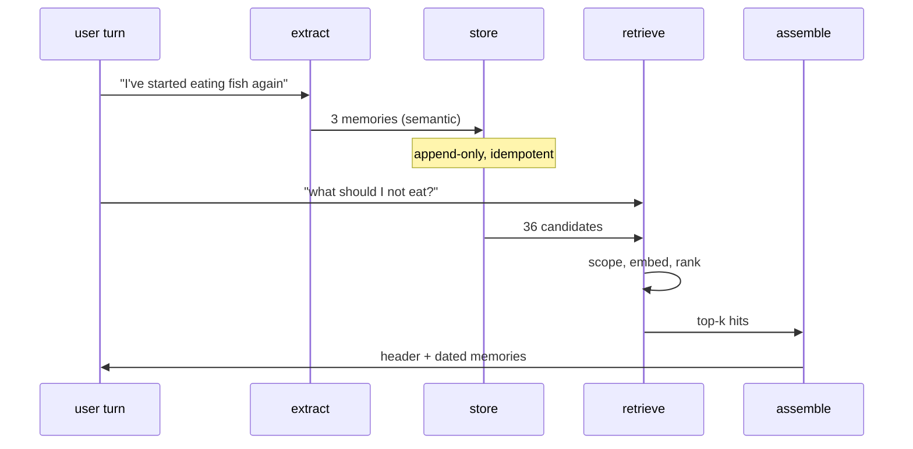

# Your First Memory Layer

> **In one line.** Nine lessons of components, wired into something that survives a restart and remembers a person — genuinely working, and about to be measured.

## Where this sits

<!-- graph:begin -->
**Stage:** `assemble` · **Level:** beginner · **~40 min**

**You need first:** [Session Memory vs Long-Term Memory](../session-vs-longterm/index.md)

**Concepts assumed:** [Context Assembly](../../../concepts/context-assembly.md) · [Promotion](../../../concepts/memory-promotion.md) · [Vector Search](../../../concepts/vector-search.md)

**This unlocks:** [Watching It Fail](../watching-it-fail/index.md)
<!-- graph:end -->

## The problem

You have six components and no system. This lesson wires them together and, for the first time, the thing runs:

```
uv run python -m memlab.app.chat --ingest --ask "what should I not eat?"
```

Kill the process, start it again, ask again. It still knows. That is not a small thing — it is the actual difference between an LLM call and a memory layer, and every remaining lesson in this course is an improvement on something that already works.

It is worth being precise about what you have built, because it is easy to under- and over-claim. It **is** a memory layer: it authors its own corpus from conversation, types what it stores, persists across process boundaries, retrieves by relevance scoped to a person, and fits the result to a budget. It is **not** correct: it holds three contradictions, three copies of one person, and PII it was asked to delete.

Both of those are true at once, and holding them simultaneously is the point of the level.

## Why this isn't RAG

The end-to-end shape makes it concrete. There was no corpus before Priya spoke. There is no ingestion job pointed at a document store, no chunking, and no source you could re-index from — the extraction that produced these 36 memories was a model call that will not return identical output twice.

Delete a RAG index and rebuild it. Delete this store and the memories are gone, because the conversation that produced them is gone. That is the difference between a derived artifact and a source of truth, and it is why the next lesson is about failure modes rather than features.

## Mechanism



Two paths meeting at one store. The write path runs on every turn; the read path runs on every question. They share nothing but the store, which is what lets Level 2 replace either without touching the other.

**Profiles, not branches.** `--profile beginner` runs the system as it exists now. As Level 2 and 3 add machinery, the profile flag disables it, so you can always re-run today's system and watch the same failures — the baseline stays executable rather than becoming a memory.

**The seams that matter.** Four interfaces are already in their final shape: `extract(turn, scope) -> list[Memory]`, `store.add(memories) -> int`, `retriever.search(query, memories, scope, k) -> list[Hit]`, `assemble(hits, budget) -> str`. Every upgrade in the next two levels replaces an implementation behind one of those signatures. That is the whole reason to build the naive version properly rather than sketchily.

## Design decisions

**One store instance or one per user?** One store, scoped per query. Sharding by user is a real Level 3 decision driven by scale, and doing it now makes cross-user operations — evaluation, migration, admin — needlessly hard.

**Ingest inline or as a job?** Inline in Beginner, so you can trace it. It is the expensive choice — an LLM call per turn on the hot path — and moving it off is the central production tradeoff in Level 2.

**Ship this?** For a demo, yes. For a product, no — and the next lesson is the specific list of reasons, in the order they will bite you.

## Lab

**You'll implement:** `answer` — the full loop, retrieve to assembled context — and `restart_check`, which proves persistence is real.

**Run:**
```
uv run python curriculum/beginner/your-first-memory-layer/lab/lab.py
```

**Expected output:** 25 turns ingested to 36 memories. Four questions answered from memory. Then the restart check: a brand-new store object over the same file recalls identically, and a second ingest writes **0** new memories.

**Stretch:** ask *"who is Sam?"* and read the recalled memories carefully. Sam, Samira and Sammy all appear, described as separate people with separate jobs. The system is not confused — it never had the concept that they might be one person. That is [entity resolution](../../intermediate/entity-resolution/index.md), and it is the first thing Level 2 fixes.

## What this adds to the capstone

`memlab.app.chat` — `ingest`, `ask`, and the CLI. **memlab v0.1 ships here.**

## Failure modes

| Symptom | Cause | How to detect | Mitigation |
|---|---|---|---|
| Works in demo, wrong in week two | Contradictions accumulate as history grows | Ask about anything the user changed | Level 2 |
| Ingest is slow | An LLM call per turn on the hot path | Time ingest per turn | Defer extraction |
| Memories vanish after deploy | Store on ephemeral disk | Restart on a clean container | Durable storage |
| One person appears as several | No entity resolution | Ask about someone referred to several ways | Entity resolution |
| Re-running ingest doubles everything | Non-idempotent writes | Ingest twice, count | Content-addressed ids |

## Check yourself

??? question "The system answers 'what should I not eat?' reasonably. Is it correct?"
    It is *partially* correct by luck. It recalls "does not eat meat" and the gluten intolerance, and it also holds "Priya is vegetarian" — superseded but live — and "eats fish". Nothing marks which are current, so a different `k` gives a different answer. Right for the wrong reasons is the characteristic Beginner failure.

??? question "Why keep the naive version runnable once Level 2 exists?"
    Because every later claim is comparative. "Supersession fixes staleness" is only meaningful against a measured baseline, and a baseline you can no longer execute is an anecdote. `--profile beginner` keeps it honest.

??? question "What is the single highest-value change from here?"
    Supersession. It fixes the headline question, removes the ambiguity at every `k` at once, and it is one nullable field plus the logic to set it. Entity resolution is a close second and considerably more work.

## Connections

<!-- graph:begin -->
**Stage:** `assemble` · **Level:** beginner · **~40 min**

**You need first:** [Session Memory vs Long-Term Memory](../session-vs-longterm/index.md)

**Concepts assumed:** [Context Assembly](../../../concepts/context-assembly.md) · [Promotion](../../../concepts/memory-promotion.md) · [Vector Search](../../../concepts/vector-search.md)

**This unlocks:** [Watching It Fail](../watching-it-fail/index.md)
<!-- graph:end -->
