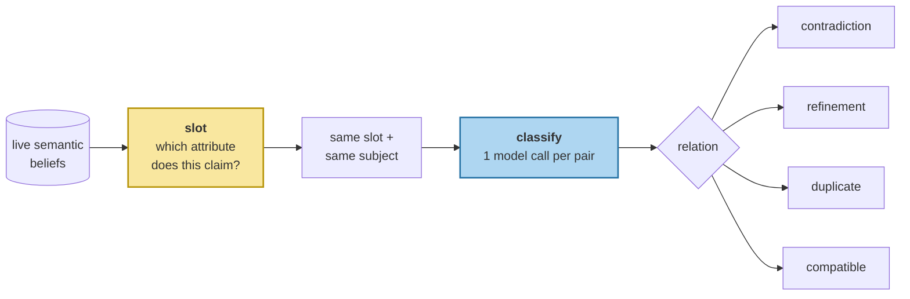

# Contradiction Detection

> **In one line.** The employer contradiction scores 0.285 on similarity — below unrelated noise — so candidates are grouped by the *attribute* they claim, and only then does a model name the relationship.

## Where this sits

<!-- graph:begin -->
**Stage:** `evolve` · **Level:** intermediate · **~50 min**

**You need first:** [From Episode to Belief](../episodic-to-semantic/index.md)

**Concepts assumed:** [Corroboration](../../../concepts/corroboration.md) · [Type Rules](../../../concepts/type-rules.md) · [Canonical Entity](../../../concepts/canonical-entity.md)

**This unlocks:** [ADD, UPDATE, MERGE, NOOP](../memory-operations/index.md)
<!-- graph:end -->

## The problem

I3 ended by deferring everything here. Now find the conflicts.

The obvious candidate generator is similarity: compare beliefs that look alike. Score the pairs whose true relationship is known and it collapses immediately:

| similarity | pair | |
|--:|---|---|
| 0.669 | `is vegetarian` / `is pescatarian` | refinement |
| 0.478 | `drinks tea` / `works at Calico Systems` | **pure noise** |
| 0.446 | `detailed explanations` / `shorter answers` | contradiction |
| 0.439 | `does not drink coffee` / `drinks three coffees` | contradiction |
| **0.285** | `is a data engineer at Northwind Labs` / `works at Calico Systems` | **the contradiction this whole course is about** |

The headline failure ranks **below two beliefs that have nothing to do with each other**. Any threshold low enough to catch it admits every pair in the store.

Nothing is wrong with the embedding. *"Data engineer at Northwind Labs"* and *"works at Calico Systems"* disagree completely and share one word. **Contradiction is a property of meaning; similarity is a property of wording**, and the two come apart hardest exactly where a fact has been replaced — because a replacement usually arrives phrased differently from what it replaces.

## Why this isn't RAG

Retrieval never needs to know that two passages disagree. A corpus is assumed roughly consistent, and where it isn't, surfacing both and letting the reader judge is the correct behaviour.

A memory layer cannot pass the decision along. It has to *hold* one belief, and something must decide which. That makes disagreement-detection a first-class stage — and it is the stage where similarity, the workhorse of the read path, stops being useful at all.

## Mechanism

Two stages, deliberately different in kind.



**Slots, not similarity.** A slot is the attribute a claim fills — `employer`, `diet`, `beverage`, `response_style`. Two beliefs are candidates when they fill the same slot for the same subject, whatever words they use. On this corpus that gives **24 candidate pairs against similarity's 46**, and it includes all three contradictions similarity missed or buried.

The `SLOTS` table here is a keyword map. In production, extraction emits the slot against a schema; a keyword map is the auditable version of the same idea, and it keeps the grouping inspectable instead of magical.

**Then a model, one pair at a time.** Classification is a genuine language judgement — only a reader can tell that *pescatarian* narrows *vegetarian* while *three coffees a day* negates *does not drink coffee*.

Per-pair is a design commitment, not an implementation detail. The prompt sees two strings and nothing else, so its fixture key depends only on that pair. A prompt that included surrounding store state would produce keys that change whenever any upstream extraction changes, and one edit would invalidate every downstream fixture. **Small, stable inputs keep a fixture-backed system authorable by hand.**

### What it finds

24 pairs, classified:

| relation | count | |
|---|--:|---|
| compatible | 15 | *does not eat meat* and *eats fish*; *drinks tea* and *does not drink coffee* |
| **contradiction** | 6 | employer, coffee, response style, `vegetarian`/`eats fish`, and the Berlin hearsay against her address |
| **refinement** | 2 | `vegetarian` → `pescatarian`; `is a nurse` → `is a charge nurse` |
| duplicate | 1 | `She works nights` / `Sam still works nights` |

**Fifteen of twenty-four same-slot pairs are compatible**, which is the result worth sitting with. Filling the same attribute is what makes two claims worth *comparing* — it is not evidence that they disagree. A system that assumed same-slot meant conflict would retire eleven true beliefs.

## Design decisions

**Slots from a keyword table, or from extraction?** From extraction, in production, against a schema — the slot is a property of the claim and belongs where the claim is made. The keyword table here keeps the mechanism visible and avoids re-authoring every extraction fixture, which would have obscured the actual lesson.

**Classify with a model, or with rules?** A model, and this is the one place in the write path where that is right. *Narrows* versus *negates* is a semantic judgement with no reliable surface signal — the refinement outscores the contradiction on every lexical measure available. Rules take over immediately afterwards, in [arbitration](../deterministic-freshness/index.md).

**Four relations, or more?** Four. `contradiction`, `refinement`, `duplicate`, `compatible` map cleanly onto four distinct operations. Every extra label needs its own operation and its own test, and *"partially supersedes"* is a refinement with extra steps.

## Lab

**You'll implement:** `slot_of`, `candidates`, and `classify`.

**Run:**
```
uv run python curriculum/intermediate/contradiction-detection/lab/lab.py
```

**Expected output:** the similarity table above with the employer pair at **0.285**; then slot grouping finding **24 candidates including that pair**; then the classification breakdown, 15 compatible.

**Stretch:** run the similarity-based generator at whatever threshold catches the employer pair and count what else it admits. Then remove `employer` from `SLOTS` and re-run the whole pipeline: the exam reverts to Northwind, because the pair is never generated and the model never gets a chance to classify it. **Candidate generation, not classification, is where this stage lives or dies.**

## What this adds to the capstone

`memlab.evolve.conflict` — `Relation`, `SLOTS`, `slot_of`, `candidates`, `classify`, `detect`.

## Failure modes

| Symptom | Cause | How to detect | Mitigation |
|---|---|---|---|
| A replaced fact is never detected | Candidates generated by similarity | Score a known contradiction; compare to noise | Group by slot |
| True beliefs get retired | Same-slot assumed to mean conflict | Count how many same-slot pairs are compatible | Classify before acting |
| A refinement destroys a live constraint | Refinement classified as contradiction | Check the narrower claim's parts survive | Distinguish the two relations |
| One fixture edit breaks many | Prompt includes store state | Change an extraction fixture; count broken keys | Key on the pair alone |
| Cost grows quadratically | Every pair classified | Count model calls per consolidation | Slot grouping first |

## Check yourself

??? question "Why does the employer contradiction score lower than two unrelated beliefs?"
    Because cosine measures shared wording, and a replacement is usually phrased unlike the thing it replaces — *"data engineer at Northwind Labs"* and *"works at Calico Systems"* share the subject and nothing else. Meanwhile *"drinks tea"* and *"works at Calico Systems"* share sentence shape and a common subject. The measure is behaving correctly; it is answering a question about form when the question is about meaning.

??? question "Fifteen of twenty-four same-slot pairs are compatible. Doesn't that make slots a weak signal?"
    It makes them the right signal for the right job. Slots are a *candidate generator* — their job is to surface everything worth examining without missing the important case, and they do that with a set nearly half the size of similarity's. Deciding is the classifier's job, and the 15 compatible pairs are it doing that job correctly.

??? question "Why keep the model's contribution to a single label?"
    Because that is the part it is genuinely better at than code, and every additional decision handed to it is one that varies between runs and cannot be audited. Naming a relationship is a language judgement. Choosing what to do about it is policy, and the next two lessons keep it in code.

## Connections

<!-- graph:begin -->
**Stage:** `evolve` · **Level:** intermediate · **~50 min**

**You need first:** [From Episode to Belief](../episodic-to-semantic/index.md)

**Concepts assumed:** [Corroboration](../../../concepts/corroboration.md) · [Type Rules](../../../concepts/type-rules.md) · [Canonical Entity](../../../concepts/canonical-entity.md)

**This unlocks:** [ADD, UPDATE, MERGE, NOOP](../memory-operations/index.md)
<!-- graph:end -->
