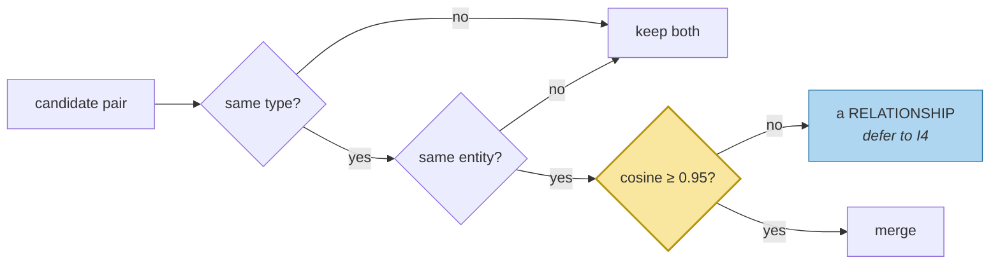

# Deduplication

> **In one line.** Idempotency already stopped the same turn being processed twice — and the store still holds an exact duplicate, because the same fact arrived from two different turns.

## Where this sits

<!-- graph:begin -->
**Stage:** `evolve` · **Level:** intermediate · **~40 min**

**You need first:** [Scopes and Namespaces](../scopes-and-namespaces/index.md)

**Concepts assumed:** [Idempotent Writes](../../../concepts/idempotency.md) · [Entity Resolution](../../../concepts/entity-resolution.md) · [Vector Search](../../../concepts/vector-search.md)

**This unlocks:** [Summarization and Compaction](../summarization-and-compaction/index.md)
<!-- graph:end -->

## The problem

`writing-memories-down` solved duplication. Content-addressed ids, re-ingest writes zero, a test proves it.

Score every pair in the intermediate store and the top result is this:

| similarity | | |
|--:|---|---|
| **1.000** | `Priya works at Calico Systems` | `Priya works at Calico Systems` |

Identical content. Two records. Different ids — because `Memory.id` derives from content **plus source**, and these came from different turns: session 8's *"Starting at Calico Systems in January"* and session 9's *"I'm at Calico now"*. Both normalised to the same state, exactly as I1 intended.

Idempotency is not broken. It answers *"have I processed this turn before?"* and the answer is no, twice. **Deduplication answers a different question** — *"do I already know this fact?"* — and nothing has been asking it.

## Why this isn't RAG

A corpus can contain the same sentence in ten documents and it costs almost nothing: ranking surfaces one, the others sit in the index, and no one has to decide which is authoritative.

Here a duplicate is a live belief with its own id, its own provenance, and its own vote. It occupies a slot in the token budget, and when supersession arrives in I4, retiring one copy leaves the other asserting the retired fact. **A duplicate is not redundancy; it is a second opinion that will disagree with the first the moment either is updated.**

## Mechanism

Three eligibility gates, then a strict threshold.



**Same type** matters most. An event and the state it produced score high and do different jobs: `Priya was diagnosed with a gluten intolerance` and `Priya has a gluten intolerance` sit at **0.739**, and merging them would destroy either the date or the standing fact.

**Threshold at 0.95**, which is close to certainty and far above everything tempting. The near-misses in this corpus are worth listing, because each one is a different mistake avoided:

| | pair | what it actually is |
|--:|---|---|
| 0.739 | `was diagnosed with…` / `has a gluten intolerance` | event and its state |
| 0.697 | `is leaving Northwind` / `left Northwind last month` | one event, reported twice |
| 0.669 | `is vegetarian` / `is pescatarian` | a **refinement** |

Every one scores high because it is about the same subject — `embedding-recall`'s finding, arriving with consequences. Only a threshold near 1.0 is safe when the signal cannot distinguish repetition from relationship.

**The merge keeps the earlier assertion** and raises its confidence. That is the one thing a merge produces rather than destroys: an independent restatement is evidence, and the surviving record should reflect it.

Result: **38 → 37 memories**, one merge, all three near-misses intact.

## Design decisions

**Dedupe at write time or as a consolidation pass?** Consolidation, alongside resolution — and *after* it, because eligibility compares `entities`, which do not exist until resolution has run. Order is a real dependency here, not a preference.

**Merge or supersede?** Merge, and only here. Supersession records that a belief *stopped being true*; a duplicate was never false, so retiring one would put a misleading `invalid_at` in the audit trail. Different operations for different facts about the world.

**Threshold at 0.95 rather than tuned?** Because the gap between 1.000 and 0.739 is enormous, so anything in it behaves identically. When a threshold sits in a wide gap it is not doing the work — and when it sits in a narrow one, as it would at 0.7, it is doing work it cannot be trusted with.

## Lab

**You'll implement:** `_eligible`, `duplicate_pairs`, and `dedupe`.

**Run:**
```
uv run python curriculum/intermediate/deduplication/lab/lab.py
```

**Expected output:** one merge at 1.000, `38 → 37`, and an explicit check that the three near-miss pairs all survive.

**Stretch:** drop the threshold to 0.65 and re-run. `is vegetarian` and `is pescatarian` merge — and Priya's dietary constraint on meat quietly becomes whichever of the two happened to be recorded first. Then try dropping the same-type gate at 0.95 and watch the gluten event and state collapse into one record with a single timestamp.

## What this adds to the capstone

`memlab.evolve.dedupe` — `duplicate_pairs`, `dedupe`, `Merge`. The intermediate consolidation stage becomes `resolve → dedupe`.

This also introduces **module snapshots**: `pipeline.at("I1")` is the system as I1 left it. Dedupe changes the store size, and every count I1 measured would otherwise rot. Lesson tests now pin against their own module's snapshot, so a number measured once stays true.

## Failure modes

| Symptom | Cause | How to detect | Mitigation |
|---|---|---|---|
| Same fact stored twice | Idempotency mistaken for deduplication | Score all pairs; look for ≥0.95 | A dedupe pass |
| A refinement silently vanishes | Threshold too low | Check that known near-misses survive | Threshold near certainty |
| An event loses its date | Same-type gate missing | Look for merged records spanning two timestamps | Gate on type first |
| Dedupe merges two people's facts | Run before entity resolution | Inspect `entities` on merged pairs | Resolve, then dedupe |
| Retiring a fact leaves it asserted | A duplicate was never merged | Supersede one copy, query again | Dedupe before supersession |

## Check yourself

??? question "Idempotency and deduplication both prevent duplicates. Why keep both?"
    They answer different questions at different times. Idempotency is settled at write time from content plus source, and catches replays and retries. Deduplication is a store-wide judgement about facts, and catches the same claim arriving from different sentences on different days. Neither can do the other's job.

??? question "Why not merge at 0.739, where the gluten event and state sit?"
    Because they are not the same fact. One says a diagnosis happened on a date, the other says a condition holds now. Merging keeps one and loses the other, and which one you lose depends on the merge policy rather than on what is true.

??? question "The threshold is 0.95 and the top near-miss is 0.739. Is that too conservative?"
    It leaves a wide margin on purpose, because the errors are asymmetric. A missed duplicate costs a slot; a wrong merge destroys a distinction that nothing downstream can reconstruct. When one direction is recoverable and the other is not, the threshold belongs on the recoverable side.

## Connections

<!-- graph:begin -->
**Stage:** `evolve` · **Level:** intermediate · **~40 min**

**You need first:** [Scopes and Namespaces](../scopes-and-namespaces/index.md)

**Concepts assumed:** [Idempotent Writes](../../../concepts/idempotency.md) · [Entity Resolution](../../../concepts/entity-resolution.md) · [Vector Search](../../../concepts/vector-search.md)

**This unlocks:** [Summarization and Compaction](../summarization-and-compaction/index.md)
<!-- graph:end -->
