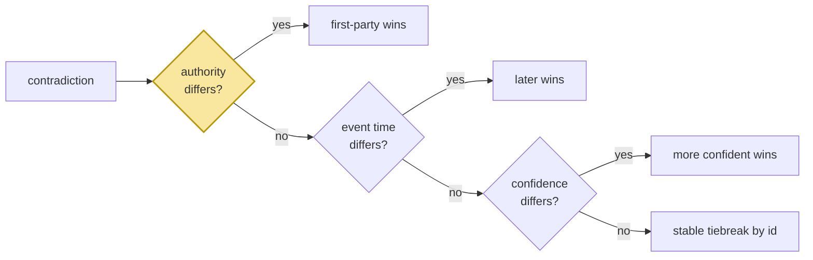

# Deterministic Arbitration

> **In one line.** Four rules in a fixed order, and the first one exists because recency alone would let a colleague's guess overwrite Priya's own address.

## Where this sits

<!-- graph:begin -->
**Stage:** `evolve` · **Level:** intermediate · **~45 min**

**You need first:** [ADD, UPDATE, MERGE, NOOP](../memory-operations/index.md)

**Concepts assumed:** [Memory Operations](../../../concepts/memory-operations.md) · [Provenance](../../../concepts/provenance.md) · [Event Time vs Ingestion Time](../../../concepts/event-time.md)

**This unlocks:** [Supersede, Never Destroy](../supersession-not-deletion/index.md)
<!-- graph:end -->

## The problem

Eight pairs need one belief retired. Which one?

"The newer one" is nearly right, and it is wrong in the case that matters most. In session 12 a travel agent writes into shared scope:

> *Priya's colleague mentioned she is relocating to Berlin.* — `authority: 0.3`

It is newer than her address from session 5. Recency alone retires *"Priya lives at 47 Halloway Road, Bristol"* on the strength of a third party's speculation, and the system now believes Priya lives in Berlin because someone else guessed.

There is a second trap in the same corpus. Session 11 says *"Before the move I used to cycle to work. Can't now, it's 40 minutes on the train."* Both facts arrive on the same day, and one is about 2025. Ordering by *when the system learned things* gets that backwards.

## Why this isn't RAG

Retrieval never arbitrates. Two passages disagree, both are returned, and the reader decides — which is the correct design when the reader is a person looking at sources.

A memory layer answers on its own behalf and must hold one belief. That makes arbitration unavoidable, and it makes *how* it arbitrates an auditable property of the system: when a user asks why it thinks something, the answer has to be a rule with a name, not a model's disposition on a Tuesday.

## Mechanism

Rules in priority order. The first that discriminates decides, and names itself.

| # | rule | why it outranks the next |
|--:|---|---|
| 1 | **authority** | a relayed claim never beats a first-party one, whatever its date |
| 2 | **recency**, by **event time** | later facts supersede earlier ones — but *when they were true*, not when learned |
| 3 | **confidence** | tiebreak within the same moment |
| 4 | **stable tiebreak** by id | so the same input always gives the same answer |

**Authority first** is what saves the Berlin case. `FIRST_PARTY = 0.5`; the travel agent's 0.3 sits below it, Priya's own statements at 0.9 sit above, and the rule fires before recency is ever consulted. That threshold is the entire defence against hearsay outranking the truth, and it works only because `scopes-and-namespaces` kept `speaker` and `authority` as separate fields instead of flattening them into the content.

**Recency by event time** is what saves the commute case. `_when()` prefers `happened_at` over `recorded_at` — the two clocks from [the memory record](../../beginner/the-memory-record/index.md), finally load-bearing. Both commute facts share an ingestion date; only event time separates them.

**A stable tiebreak, not a coin flip.** Two beliefs can be equal on every signal. Sorting by id is arbitrary and *reproducible*, which matters more: a system that resolves the same pair differently across runs has no explicable state, and no test can pin it.



**Why not let the model arbitrate?** It would read fluently and it would be unauditable. The same pair could resolve differently on two runs; nothing would record why; and *"why do you believe I live in Berlin?"* would have no answer. Detection is a language judgement and belongs to the model. Arbitration is policy, and policy that cannot be printed cannot be trusted.

### What it decides

All eight retirements, with the rule that fired:

| retired | rule |
|---|---|
| `Priya is a data engineer at Northwind Labs` | recency |
| `Priya is vegetarian` | recency |
| `Priya prefers detailed explanations with reasoning` | recency |
| `Priya does not drink coffee` | recency |
| `Priya's partner Sam is a nurse at St. Aubyn's` | recency |
| **`Priya's colleague mentioned she is relocating to Berlin`** | **authority** |

Seven on recency, one on authority — and that one is the reason the rule sits first.

## Design decisions

**Threshold at 0.5?** It separates first-party from relayed, which is the distinction that matters. The corpus has 0.9 and 0.3 and nothing between, so the exact value is not load-bearing — which is the same argument as the entity-resolution threshold, and the same reassurance.

**Should a low-authority claim be stored at all?** Yes. It is *visible and disbelieved*, which is a real state — if Priya later confirms the move, the memory is already there with its provenance, and the confirmation raises it rather than creating it from nothing. Refusing to store it would make the eventual first-party statement look like the first anyone had heard.

**Recency by event time always?** Where it exists. Some memories only have an ingestion time, and falling back to it is correct — the failure is *preferring* it when both are present.

## Lab

**You'll implement:** `arbitrate` with the four rules in order.

**Run:**
```
uv run python curriculum/intermediate/deterministic-freshness/lab/lab.py
```

**Expected output:** the table above — seven retirements on recency, one on authority — and each verdict naming its rule.

**Stretch:** delete the authority rule and re-run. Berlin now beats the Bristol address on recency, and `Priya lives at 47 Halloway Road` is retired on the strength of a colleague's guess. Then restore it and reorder recency above authority: the same failure, because priority order *is* the policy.

## What this adds to the capstone

`memlab.evolve.arbitrate` — `Verdict`, `arbitrate`, `FIRST_PARTY`.

## Failure modes

| Symptom | Cause | How to detect | Mitigation |
|---|---|---|---|
| Hearsay overwrites a first-party fact | Recency ranked above authority | Retire a low-authority claim against a user statement | Authority first |
| A past fact retires a current one | Recency by ingestion time | Look for a turn describing the past | Order by event time |
| Same pair resolves differently each run | Model arbitration, or an unstable tiebreak | Run twice; diff the retirements | Rules; stable tiebreak |
| "Why is this retired?" unanswerable | Verdict discarded after applying | Try to explain one retirement | Name the rule on the verdict |
| A confirmed rumour looks new | Low-authority claim never stored | Confirm a rumour; check provenance | Store and disbelieve |

## Check yourself

??? question "Why does authority outrank recency rather than being a tiebreak?"
    Because the case it exists for has recency pointing the wrong way. The Berlin claim is newer, and if recency runs first the decision is made before authority is ever consulted. A rule that only applies when everything else ties is not a rule, it is a formality.

??? question "Both commute facts arrive in the same turn. Which rule separates them?"
    Recency, but only because it reads `happened_at`. They share an ingestion time entirely, so a system with one clock has nothing to arbitrate on and would fall through to the tiebreak — resolving a real distinction by sorting ids.

??? question "Isn't a stable tiebreak by id just an arbitrary choice dressed up?"
    It is arbitrary and it is not a coin flip, and the difference is the whole point. Arbitrary-but-reproducible means the store is explicable, tests pin it, and re-running consolidation is safe. Arbitrary-and-varying means the system's beliefs depend on execution order, which nothing records.

## Connections

<!-- graph:begin -->
**Stage:** `evolve` · **Level:** intermediate · **~45 min**

**You need first:** [ADD, UPDATE, MERGE, NOOP](../memory-operations/index.md)

**Concepts assumed:** [Memory Operations](../../../concepts/memory-operations.md) · [Provenance](../../../concepts/provenance.md) · [Event Time vs Ingestion Time](../../../concepts/event-time.md)

**This unlocks:** [Supersede, Never Destroy](../supersession-not-deletion/index.md)
<!-- graph:end -->
