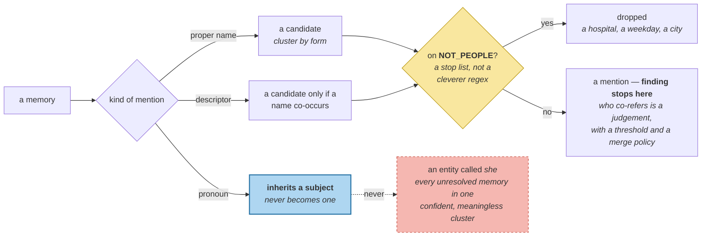

# Entities and Aliases

> **In one line.** Finding the names in a memory is a separate job from deciding who they refer to — and the hardest mention in Priya's corpus contains no name at all.

## Where this sits

<!-- graph:begin -->
**Stage:** `store` · **Level:** intermediate · **~35 min**

**You need first:** [Atomic Memories](../atomic-memories/index.md)

**Concepts assumed:** [Entity Fragmentation](../../../concepts/entity-fragmentation.md) · [The Extraction Pipeline](../../../concepts/extraction-pipeline.md)

**This unlocks:** [Entity Resolution](../entity-resolution/index.md)
<!-- graph:end -->

## The problem

Six memories in the intermediate store are about one person:

```
Priya's partner Sam is a nurse at St. Aubyn's
She works nights most of the month
Samira got a promotion to charge nurse
Samira is a charge nurse
Sammy's commute got worse
Sam still works nights
```

Every record is correct. Together they hold a coherent picture — a nurse, night shifts, a promotion, a worse commute. The system holds none of it, because nothing says these are one person.

The consequences compound. `Samira is a charge nurse` and `Priya's partner Sam is a nurse` never meet, so the promotion never updates the earlier fact. Ask *"who is Sam?"* and you get one sixth of what is known. And the worst record is the second one: **`She works nights most of the month` names nobody**. It is attached to no entity, retrievable by no query about any person, and it looks perfectly well-formed.

## Why this isn't RAG

In a document corpus, coreference is mostly handled by chunk boundaries: keep the passage together and "she" still has its antecedent two sentences up. The context travels with the text.

Extraction deliberately destroys that context. It turns a turn into standalone facts, which is what makes them updatable — and in doing so it severs every pronoun from its antecedent. The write path *creates* this problem, so the write path has to solve it, and there is no chunking strategy that helps because there are no chunks.

## Mechanism

Three kinds of mention, three difficulties.

| Kind | Example | Resolvable from the record alone? |
|---|---|---|
| **proper name** | `Samira`, `Sammy` | yes — cluster by form |
| **descriptor** | `my partner`, `Priya's partner` | only if a name co-occurs |
| **pronoun** | `She works nights…` | **no** — needs the surrounding session |

`memlab.entity.aliases` only *finds* these. The split matters: mention detection is a text problem with a cheap regex answer, while deciding which mentions co-refer is a judgement with a scoring threshold and a merge policy. Fusing them produces a function nobody can tune.

Two details carry most of the weight.

**A stop list, not a cleverer regex.** `NOT_PEOPLE` holds organisations, places, dates and the capitalised sentence-openers this corpus produces. Capitalisation is a weak signal, and every attempt to make the pattern smarter trades one class of false positive for another; an explicit list is honest, auditable, and the thing you actually maintain.

Every entry on it was added the same way — by running the extractor and reading what came out. `Aubyn` because *St. Aubyn's* is a hospital. Then `Tuesday`, `Friday`, `March` and `Berlin`, all of which appeared as "people" only once the shared-agent writes were ingested (*"Priya declined all Friday meetings since March 2026"*). The list is grouped by category in the source for exactly that reason: it grows, and it grows from observation rather than from reasoning about it in advance.

**Pronouns only inherit; they never create.** `leading_pronoun` fires only when a memory *opens* with one, which is the case where no antecedent survived extraction. A pronoun must never become an entity in its own right — an entity called `she` would collect every unresolved memory in the store into one confident, meaningless cluster.



## Design decisions

**Detect mentions at extraction or at resolution?** At resolution. Extraction has one model call and a job to do; mention detection is cheap, deterministic, and needs to be re-runnable when the stop list changes. Baking it into extraction would freeze today's list into every stored memory.

**Store the mention text, or only the resolved id?** Only the id, in `entities`. The content already contains the surface form verbatim, so keeping a copy invites the two to disagree. This is also why resolution links rather than rewrites — [entity resolution](../entity-resolution/index.md) leans on it.

**Resolve pronouns at all, given how crude it is?** Yes. The alternative is a memory attached to nobody, which is strictly worse than one attached to a plausible-but-wrong person — that at least surfaces and can be corrected. Getting it wrong is recoverable; leaving it orphaned is not.

## Lab

**You'll implement:** `proper_names`, `descriptors`, `leading_pronoun` and `mentions`.

**Run:**
```
uv run python curriculum/intermediate/entities-and-aliases/lab/lab.py
```

**Expected output:** the six partner memories with their detected mentions. Five yield a proper name or a descriptor; **`She works nights most of the month` yields only a pronoun**, and the lab prints it flagged, because it is the one the next lesson has to work hardest for.

**Stretch:** remove `Aubyn` from `NOT_PEOPLE` and re-run. A hospital becomes a person, gets its own canonical entity, and `Priya's partner Sam is a nurse at St. Aubyn's` is linked to two people. Nothing downstream can detect that — which is the argument for the stop list being explicit and maintained rather than inferred.

## What this adds to the capstone

`memlab.entity.aliases` — `proper_names`, `descriptors`, `leading_pronoun`, `mentions`, `NOT_PEOPLE`. No resolution yet; the next lesson consumes this.

## Failure modes

| Symptom | Cause | How to detect | Mitigation |
|---|---|---|---|
| A memory is retrievable by no one | Unresolved pronoun, attached to no entity | Count memories with an empty `entities` that mention a person | Coreference from session context |
| A place becomes a person | Capitalisation treated as a name signal | Read the detected mention list, do not assume it | An explicit, maintained stop list |
| One entity absorbs everything | A pronoun allowed to form its own cluster | Look for a canonical id with implausibly many members | Pronouns inherit only |
| Stop-list changes do not take effect | Mentions frozen at extraction time | Change the list, re-run, diff the entities | Detect at resolution; keep it re-runnable |

## Check yourself

??? question "Why is 'She works nights most of the month' worse than a memory that was never extracted?"
    Because it is stored, embedded, and competing for token budget while being unreachable by any question about a person. A missing memory costs you one fact. This one costs a fact *and* a slot, and looks healthy in every store-shaped check.

??? question "Extraction created the pronoun problem. Should it just keep the context instead?"
    Then the memory is not standalone, and standalone is what makes it updatable — you would be trading a coreference problem for the atomicity problem. The right move is to sever the context and then repair the reference, which is why resolution is a separate stage rather than a constraint on extraction.

??? question "Why keep a hand-maintained stop list rather than improving the pattern?"
    Because capitalisation genuinely does not distinguish people from places, and every regex refinement trades one class of false positive for another. Every entry got there by running the code and reading the output — `Aubyn` from a hospital name, then `Tuesday`, `Friday`, `March` and `Berlin` once the agent writes arrived. No amount of thinking about the regex would have produced that list.

??? question "The calendar words only became a problem after agent writes were ingested. What does that suggest?"
    That the stop list is coupled to the *sources* feeding the pipeline, not just to the language. Every new writer — a new agent, a new integration, a new document type — brings its own vocabulary of capitalised non-people, and the list needs revisiting at that moment rather than on a schedule.

## Connections

<!-- graph:begin -->
**Stage:** `store` · **Level:** intermediate · **~35 min**

**You need first:** [Atomic Memories](../atomic-memories/index.md)

**Concepts assumed:** [Entity Fragmentation](../../../concepts/entity-fragmentation.md) · [The Extraction Pipeline](../../../concepts/extraction-pipeline.md)

**This unlocks:** [Entity Resolution](../entity-resolution/index.md)
<!-- graph:end -->
