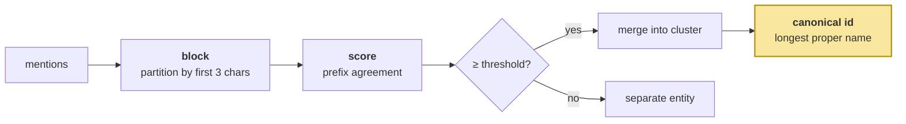

# Entity Resolution

> **In one line.** Block, score, merge — and the discovery that resolution run incrementally gives an entity a different name depending on when you asked.

## Where this sits

<!-- graph:begin -->
**Stage:** `store` · **Level:** intermediate · **~50 min**

**You need first:** [Entities and Aliases](../entities-and-aliases/index.md)

**Concepts assumed:** [Coreference](../../../concepts/coreference.md) · [Entity Fragmentation](../../../concepts/entity-fragmentation.md)

**This unlocks:** [Scopes and Namespaces](../scopes-and-namespaces/index.md)
<!-- graph:end -->

## The problem

You have the mentions. Now decide which ones are the same person.

`Sam`, `Samira`, `Sammy` and a bare `She` — obviously one person to a reader, and the obvious implementation is to compare every mention against every other. On 38 memories that is fine. On 38,000 it is not, and worse, exact matching gets `Samira` = `Samira` and nothing else.

But the failure this lesson is actually about only appears once it is running. Wire resolution in per-turn, ingest the corpus, and print the entities:

```
('sam',)      Priya's partner Sam is a nurse at St. Aubyn's     <- session 2
('samira',)   Samira got a promotion to charge nurse            <- session 3
('samira',)   Sam still works nights                            <- session 11
```

The same name, two different canonical ids. In session 2 `Sam` was alone in its cluster, so the cluster's best name was `Sam`. In session 3 `Samira` arrived, the cluster's best name became `Samira`, and every memory linked before that moment now points at an id nothing else uses.

**An entity's canonical form depends on evidence that has not arrived yet.** That is not a bug in the scorer; it is a property of the problem, and it decides where resolution has to live.

## Why this isn't RAG

An index over documents is derived: rebuild it and nothing is lost. So incremental indexing is safe, and nobody worries about whether chunk 400 changes the meaning of chunk 3.

Resolution writes *into the store*, and the store is the source of truth. A link written under incomplete evidence is a wrong fact recorded, not a stale cache entry — and the record it corrupted may be the one a later merge needed in order to be detected. This is the first mechanism in the course where **the order data arrives changes the result**, and handling that is a memory-layer concern with no retrieval analogue.

## Mechanism

Three stages, and then the question of when to run them.



**Block** by the first three lowercase characters, so `Sam` / `Samira` / `Sammy` land in one bucket and are the only forms ever compared. Cheap, and it makes the cost linear in cluster size rather than quadratic in store size.

**Score** on prefix agreement rather than raw edit distance. Diminutives and full forms share their opening — `Sam`/`Samira` scores **0.75** — while unrelated names rarely do: `Sam`/`Priya` scores **0.25**. The threshold sits at 0.55, comfortably between.

**Canonical id** is the *longest proper name in the cluster*, slugified — so all three resolve to `samira`. Deriving it from the whole cluster rather than from whichever form arrived first is what makes it stable, once the cluster is complete.

### Where it has to run

The instability above has one honest fix: **resolution needs the whole store**. It runs as a consolidation pass, not per turn:

```python
def intermediate() -> Pipeline:
    return replace(
        beginner(),
        extract=staged_extract,
        consolidate=resolve_all,      # not the per-turn resolve hook
    )
```

Run over all 38 memories at once, every partner mention resolves to `samira`, including the pronoun:

| entities | content |
|---|---|
| `('samira',)` | Priya's partner Sam is a nurse at St. Aubyn's |
| `('samira',)` | **She works nights most of the month** |
| `('samira',)` | Samira got a promotion to charge nurse |
| `('samira',)` | Samira is a charge nurse |
| `('samira',)` | Sammy's commute got worse |
| `('samira',)` | Sam still works nights |

**Content is unchanged.** Resolution links; it does not rewrite. Editing `Sammy` to `Samira` inside a memory would destroy the record of what Priya actually said, and provenance is what makes deletion and audit possible in Advanced. Because `Memory.id` derives from content, scope, type and source — never from `entities` — linking leaves identity untouched and the pass is safely re-runnable.

Two smaller rules carry real weight. A **descriptor binds to a name when they co-occur**: *"Priya's partner Sam is a nurse"* is the one sentence that ties `my partner` to `samira`, and without it the descriptor clusters alone forever. And a **pronoun inherits from the nearest earlier naming memory in the same session** — crude, and it is what makes the second row of that table possible.

## Design decisions

**Blocking on a prefix, or on a phonetic key?** Prefix, here. Phonetic keys catch `Catherine`/`Kathryn`, which this corpus does not contain, and they add a dependency plus a class of surprising merges. Blocking is a recall/cost trade you should tune against real names, not anticipated ones.

**Threshold at 0.55?** Chosen because the scores it separates are 0.75 and 0.25 — a threshold anywhere in that gap behaves identically, which is the sign of a well-separated signal rather than a tuned one. When the gap is narrow, the threshold is doing work it should not be trusted with.

**Merge automatically, or queue for review?** Automatically at this scale, and the lab prints the merges so they are inspectable. A wrong merge corrupts a whole neighbourhood at once and is much harder to undo than a missed one — which is why `resolve_all` is idempotent and re-runnable rather than destructive.

## Lab

**You'll implement:** `block_key`, `score`, `cluster`, and `resolve_all`.

**Run:**
```
uv run python curriculum/intermediate/entity-resolution/lab/lab.py
```

**Expected output:** the score matrix (0.75 within the Sam cluster, 0.25 across), the resulting clusters, and the six-row table above with a single canonical id. Then the incremental comparison: resolving per-turn produces **two ids for one person**, resolving store-wide produces one.

**Stretch:** raise the threshold to 0.8 and re-run. The cluster splits — `Sam` and `Sammy` separate from `Samira` — and the promotion stops connecting to the nurse. Then lower it to 0.2 and watch `Priya` merge into the same entity as her partner. Both failures are silent, and only one of them is recoverable.

## What this adds to the capstone

`memlab.entity.resolve` — `block_key`, `score`, `cluster`, `canonical_id`, `resolve_all`. The `intermediate` profile switches on `consolidate=resolve_all`.

**This flips the fourth pinned failure.** `test_entity_fragmentation` now asserts one canonical id under intermediate and none under beginner — and asserts content strings are byte-identical in both, because a resolution that rewrote them would have been the wrong fix.

## Failure modes

| Symptom | Cause | How to detect | Mitigation |
|---|---|---|---|
| One person has two ids | Resolution run incrementally | Ingest, then re-resolve; diff the entity ids | Resolve over the whole store |
| Two people merged into one | Threshold too low, or blocking too coarse | Inspect cluster membership, not just counts | Raise threshold; log every merge |
| A promotion never updates the earlier fact | The two records resolved to different entities | Query by entity id and count what comes back | Fix resolution before conflict detection |
| The original wording is gone | Resolution rewrote content instead of linking | Diff content before and after the pass | Link via `entities`; never touch content |
| Re-running resolution changes memory ids | `id` derived from a field resolution mutates | Run twice, compare id sets | Derive `id` from content, scope, type, source |

## Check yourself

??? question "Why does resolution belong in `consolidate` rather than the per-turn `resolve` hook?"
    Because the canonical id depends on the whole cluster, and the cluster is not complete until the last member arrives. Session 2's `Sam` was correctly resolved *given what was known*, and still ended up pointing at an id nothing else uses. Anything whose correct answer depends on future evidence either sees everything or gets re-run.

??? question "'Sam' and 'Samira' score 0.75; 'Sam' and 'Priya' score 0.25. Why is that gap more reassuring than the threshold value?"
    Because it means the threshold is not doing the work — anything between 0.3 and 0.7 gives the same answer. A tuned threshold sitting in a narrow gap is a sign the signal cannot actually separate the classes, and it will not survive new data.

??? question "Why link rather than rewrite, when rewriting would make retrieval easier?"
    It would, and it would destroy the record of what was said. Deletion in Advanced has to find every memory derived from a given turn, and audit has to answer why the system believes something. Both need the original wording. Linking keeps retrieval improvements available — an entity-aware retriever can use `entities` — without paying for them in provenance.

??? question "Resolution is idempotent. Why does that matter here more than elsewhere?"
    Because it must be re-run whenever new evidence arrives, which is constantly. A pass that changed memory ids or content on each run would make "re-resolve the store" a destructive operation, and you would end up avoiding the very thing that keeps entities correct.

## Connections

<!-- graph:begin -->
**Stage:** `store` · **Level:** intermediate · **~50 min**

**You need first:** [Entities and Aliases](../entities-and-aliases/index.md)

**Concepts assumed:** [Coreference](../../../concepts/coreference.md) · [Entity Fragmentation](../../../concepts/entity-fragmentation.md)

**This unlocks:** [Scopes and Namespaces](../scopes-and-namespaces/index.md)
<!-- graph:end -->
