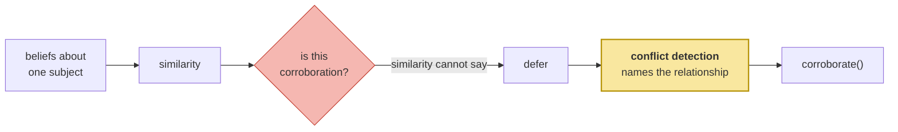

# From Episode to Belief

> **In one line.** A claim restated across sessions should be more strongly held — and measurement says similarity cannot tell you which claims those are, so this lesson ships a stage that deliberately promotes nothing.

## Where this sits

<!-- graph:begin -->
**Stage:** `evolve` · **Level:** intermediate · **~40 min**

**You need first:** [Semantic Drift](../semantic-drift/index.md)

**Concepts assumed:** [Promotion](../../../concepts/memory-promotion.md) · [Semantic Drift](../../../concepts/semantic-drift.md) · [Events and States](../../../concepts/event-vs-state.md)
<!-- graph:end -->

## The problem

Priya says her partner works nights in session 2, and again in session 11. Nine months apart, independently. That belief should be held more firmly than one mentioned once in passing.

The rule writes itself: find semantic claims about the same subject that recur across sessions, and raise their confidence. No model call, a few lines, obviously right.

Implement it, run it over the store, and look at what it wants to promote:

| similarity | pair | what it actually is |
|--:|---|---|
| 0.669 | `is vegetarian` / `is pescatarian` | a **refinement** |
| 0.505 | `She works nights…` / `Sam still works nights` | **the real corroboration** |
| 0.439 | `does not drink coffee` / `drinks three coffees a day` | a **contradiction** |
| 0.412 | `does not eat meat` / `eats fish` | compatible, unrelated |
| 0.250 | `Sam is a nurse` / `Samira is a charge nurse` | a refinement |

**The genuine corroboration sits fifth from top — below a refinement, above a contradiction.** There is no threshold. Set it to catch the real one and you also promote a refinement; set it to exclude the contradiction and you exclude the corroboration too.

## Why this isn't RAG

`embedding-recall` already established that similarity measures aboutness, not agreement. There the cost was a bad ranking — recoverable, visible, fixable downstream.

Here the same signal would drive **confidence**, and that inverts the damage. A wrongly-promoted contradiction does not merely rank badly; it becomes a belief the system holds *more firmly than the truth*, and every later mechanism that respects confidence inherits the error. Retrieval systems have no confidence to corrupt. This is the first stage in the course where being wrong makes the system more certain.

## Mechanism

So the stage promotes nothing, and says so:

```
46 candidate pairs, 0 promoted -- similarity cannot distinguish
corroboration from refinement or contradiction, so all of them
defer to conflict detection
```

Two things it *does* contribute.

**`subject_of` fixes a real blind spot.** A belief with no linked entity is about the account holder — `Priya is vegetarian` names nobody, because `Priya` is on the stop list, and it is obviously a claim about Priya. Without that fallback the system can only reason about third parties and is blind to every fact about its own user. That is a one-line fix for a failure that would have been very hard to notice.

**`corroborate` is written and left uncalled.** It is what promotion looks like *once a relationship has been named* — confidence rises by the number of supporters, and `derived_from` records which sources justified the boost, so it can be traced and undone when a supporter is later retired. I4 calls it. Shipping it now, unused, keeps the deferral visible in the code rather than implied by an absence.



**The general shape is worth keeping.** A signal that correlates with the thing you want is not the same as a signal that identifies it, and the way to tell the difference is to look at the ranked candidates rather than the aggregate. The mean similarity of corroborating pairs probably *is* higher than that of contradicting ones; the distributions overlap completely, and a per-pair decision lives or dies on the overlap.

## Design decisions

**Ship a stage that does nothing, or leave it out?** Ship it. An absent stage looks like an oversight; a stage that reports 46 candidates and 0 promotions documents a decision. It is also where I4 plugs in, so the seam exists before it is needed.

**Could a model classify the pairs instead?** Yes — and that is exactly what conflict detection is, so building it here would be building I4 twice. The right move is to notice the cheap signal fails and stop, rather than to escalate inside a lesson about consolidation.

**Why not promote just the pairs above 0.95?** Those are duplicates, and deduplication already merged them and raised confidence. Corroboration is interesting precisely in the range where the signal does not work.

## Lab

**You'll implement:** `subject_of`, `analyse`, and `corroborate`.

**Run:**
```
uv run python curriculum/intermediate/episodic-to-semantic/lab/lab.py
```

**Expected output:** 46 candidate pairs, 0 promoted, and the ranked table above. Note the sixth row — `Priya drinks tea` / `Priya works at Calico Systems` at **0.478**, pure noise, scoring above the compatible diet pair and only just below the real corroboration.

**Stretch:** pick any threshold and count what it would promote correctly versus wrongly. There is no value that gets more than one of the three relationship types right. Then compute the *mean* similarity of corroborating pairs against contradicting ones — the means separate, and the distributions overlap completely. That gap between "correlates in aggregate" and "decides per case" is why the aggregate is the wrong thing to look at.

## What this adds to the capstone

`memlab.evolve.promote` — `analyse`, `PromotionReport`, `subject_of`, and `corroborate`, which I4 calls once relationships are named.

**I3 ends here.** The intermediate consolidation stage is `resolve → dedupe`, the store is **37 memories**, and the exam still answers Northwind. Three of the seven pinned failures now flip; the remaining employer failure is I4's, and everything this lesson deferred lands there.

## Failure modes

| Symptom | Cause | How to detect | Mitigation |
|---|---|---|---|
| System is most confident about wrong facts | Confidence driven by similarity | List the top-scoring pairs and read them | Never promote on similarity alone |
| Refinements strengthen the superseded claim | Refinement scored as corroboration | Check whether a promoted pair contradicts | Name relationships before promoting |
| No facts about the user are ever compared | Subject fallback missing; user is not an entity | Count beliefs with no entity | `subject_of` falls back to the scope user |
| A boost survives its evidence | Confidence raised without recording sources | Retire a supporter; check the boosted claim | Record supporters in `derived_from` |
| A metric looks good and decisions are wrong | Judged on aggregates, not per-case | Inspect the ranked list, not the mean | Evaluate where the distributions overlap |

## Check yourself

??? question "Why is a wrongly-promoted contradiction worse than a wrongly-ranked one?"
    Because ranking errors are visible and local — the wrong memory surfaces, and the next query might not repeat it. A confidence error is durable and compounding: it makes the system prefer the wrong belief everywhere confidence is consulted, including in the arbitration that was supposed to catch it.

??? question "The corroboration scores 0.505 and a refinement scores 0.669. Is that a flaw in the embedding?"
    No — it is correct behaviour for a similarity measure. `is vegetarian` and `is pescatarian` really are more textually alike than the two night-shift sentences, which share almost no wording. The measure is doing its job; the mistake is asking it a question about agreement.

??? question "Would a better embedding model close the gap?"
    It would move the numbers and not the shape. Corroboration and refinement are distinguished by *logical relationship*, not by surface similarity, and no distance metric encodes "this narrows that". You need something that classifies the relation, which is the next module.

## Connections

<!-- graph:begin -->
**Stage:** `evolve` · **Level:** intermediate · **~40 min**

**You need first:** [Semantic Drift](../semantic-drift/index.md)

**Concepts assumed:** [Promotion](../../../concepts/memory-promotion.md) · [Semantic Drift](../../../concepts/semantic-drift.md) · [Events and States](../../../concepts/event-vs-state.md)
<!-- graph:end -->
