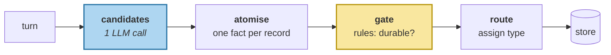

# Extraction Pipelines

> **In one line.** One added instruction — *if the turn describes a change, record the state it produced* — takes the course's headline answer from nonexistent to rank 18, and proves in the same breath that extraction alone cannot finish the job.

## Where this sits

<!-- graph:begin -->
**Stage:** `extract` · **Level:** intermediate · **~50 min**

**You need first:** [The Typed Memory Model](../typed-memory-model/index.md)

**Concepts assumed:** [Extraction](../../../concepts/extraction.md) · [Type Rules](../../../concepts/type-rules.md) · [Atomicity](../../../concepts/atomic-fact.md) · [Promotion](../../../concepts/memory-promotion.md)

**This unlocks:** [Precision and Recall on the Write Path](../extraction-quality/index.md)
<!-- graph:end -->

## The problem

`watching-it-fail` left seven failures. The first one traced back here.

Session 8 says *"Big news — I'm leaving Northwind. Starting at Calico Systems in January as a staff engineer."* Beginner's extractor read it faithfully and produced two **events**. Then session 14 asked *"where do I work"* — a question about a **state** — and no memory in the store said `Priya works at Calico Systems`. Not ranked badly. Not present.

The naive prompt was doing four jobs at once: decide what is durable, choose the grain, pick a type, and phrase the result. When a fact goes missing you cannot tell which of the four failed. Splitting them apart is what makes the missing one addressable.

## Why this isn't RAG

A retrieval corpus arrives already phrased. The passage saying *"the rate limit is 100 req/s"* exists in the form someone will search for, because a human wrote it to be read.

A memory layer **authors its own corpus**, so it also authors the phrasing — and can author it unreachably. That is a failure mode with no analogue in retrieval, and it is invisible to every store-shaped check: the fact is there, the count looks right, and the question cannot reach it. You cannot tune your way out of a corpus that was written wrong.

## Mechanism

Four stages, one model call.



**Candidates** is the only stage that calls a model, and its prompt gains one paragraph:

> if the message describes a CHANGE, record both the event and the resulting state — a question about the present must be answerable without re-reading the event

**The gate is rules, not a second model call.** This is a design commitment, not a shortcut. It keeps the write path cheap and auditable, and — because the fake backend keys on the request — it keeps the fixture tables hand-authorable. One model call per turn, and nothing else on this path talks to a model.

The gate itself is the promotion logic you already wrote, in [session vs long-term](../../beginner/session-vs-longterm/index.md), where it could only *analyse* the store. Here it moves onto the write path, which is where the decision belonged.

### What it actually changed

| | beginner | intermediate |
|---|--:|--:|
| memories stored | 36 | **38** |
| semantic / episodic / procedural | 22 / 12 / 2 | **27 / 9 / 2** |
| `Priya works at Calico Systems` | **absent** | present |
| its rank for *"where do I work?"* | — | **18 of 38** |
| over-extraction rate | 8% | **0%** |

The store got *smaller in episodes* and *larger in states*: the gate dropped three transient activities, and change-normalisation added the states that were owed. That shift — fewer things that happened, more things that are true — is what the whole stage is for.

### And it is not enough

The employer state now exists and ranks 18th. **The exam still fails.**

`Priya is a data engineer at Northwind Labs` is still live and still ranks 9th, so the retriever hands over the dead fact first and nothing has any grounds to prefer the new one. Extraction fixed the phrasing; nothing has yet recorded that one fact *retired* the other.

That is the honest shape of this level: I1 makes the answer **reachable**, I4 makes it **win**. A lesson that claimed extraction alone fixed the headline question would be measurably wrong, and the test asserting the exam still fails is what keeps it honest.

## Design decisions

**Normalise changes to states — always, or only for tracked slots?** Always, and let the gate filter. Slot lists do not survive contact with real users; the model already knows what "the resulting state" means, and asking it costs nothing per turn.

**Gate before or after routing?** Before. Routing is cheap but the type of a discarded candidate is wasted work, and gating first keeps the stage boundaries honest — each stage sees strictly fewer candidates than the last.

**Re-extract the whole corpus, or migrate the existing store?** Re-extract, here. Migration is the right answer in production and it is a genuinely hard problem — [schema migration on live memory](../../advanced/schema-migration-on-live-memory/index.md) covers it. In a course, re-running the corpus keeps the two profiles independently reproducible.

## Lab

**You'll implement:** `extract` — the four stages wired together — and `compare_profiles`, which measures what the change bought.

**Run:**
```
uv run python curriculum/intermediate/extraction-pipelines/lab/lab.py
```

**Expected output:** the table above. Then the punchline: `Priya works at Calico Systems` at rank 18 of 38, `Priya is a data engineer at Northwind Labs` still at rank 9, and the exam still answering **Northwind**.

**Stretch:** delete the added paragraph from `PROMPT`, re-author the fixtures, and re-run. The Calico state disappears entirely and the rank returns to `None`. One paragraph is the difference between a fact existing and not — and no amount of retrieval work substitutes for it.

## What this adds to the capstone

`memlab.extract.pipeline` (staged extraction), `memlab.extract.gate` (the durability filter), and `memlab.extract.atomise`. The `intermediate` profile now switches on `extract=staged_extract` and `ingest_agent_writes=True` — the latter admits the shared-scope memories another agent wrote, carrying their `authority`, which `deterministic-freshness` will need.

## Failure modes

| Symptom | Cause | How to detect | Mitigation |
|---|---|---|---|
| A fact "is stored" but is unfindable | Recorded as an event when the query wants a state | Search using the words a user would say, not the words the turn used | Normalise changes into states |
| Fixing extraction changes nothing | The competing stale fact is still live and still ranks higher | Check the rank of *both* facts, not just the new one | Supersession — [I4](../supersession-not-deletion/index.md) |
| A missing fact cannot be diagnosed | One prompt doing four jobs | Ask which stage dropped it and find no answer | Stage the pipeline |
| Write path is slow and expensive | A model call per stage | Count model calls per turn | One call for candidates; rules for the rest |
| The store fills with finished activities | No durability gate | Track memories per session over time | Gate at write time |

## Check yourself

??? question "The intermediate store has 38 memories to beginner's 36, but two fewer episodes than you'd expect. Where did they go?"
    The gate dropped three transient activities — the Spark job, the first week, the trip planning — and change-normalisation added five states. Net +2, but the composition shifted from 12 episodes to 9 and from 22 states to 27. The count is the least interesting part of the change.

??? question "Why does the exam still fail after this lesson?"
    Because two live semantic facts now claim to be Priya's employer, and nothing prefers either. Extraction made the right answer *exist*; it has no mechanism to make the wrong one *stop counting*. That mechanism is supersession, and it is three lessons away.

??? question "The gate is rules while extraction is a model call. Isn't that inconsistent?"
    It is deliberate. Candidate generation is a language judgement models are good at; durability is a policy decision you want auditable, cheap, and identical on every run. It also keeps the write path to one model call per turn, which is the difference between a memory layer you can afford and one you cannot.

## Connections

<!-- graph:begin -->
**Stage:** `extract` · **Level:** intermediate · **~50 min**

**You need first:** [The Typed Memory Model](../typed-memory-model/index.md)

**Concepts assumed:** [Extraction](../../../concepts/extraction.md) · [Type Rules](../../../concepts/type-rules.md) · [Atomicity](../../../concepts/atomic-fact.md) · [Promotion](../../../concepts/memory-promotion.md)

**This unlocks:** [Precision and Recall on the Write Path](../extraction-quality/index.md)
<!-- graph:end -->
