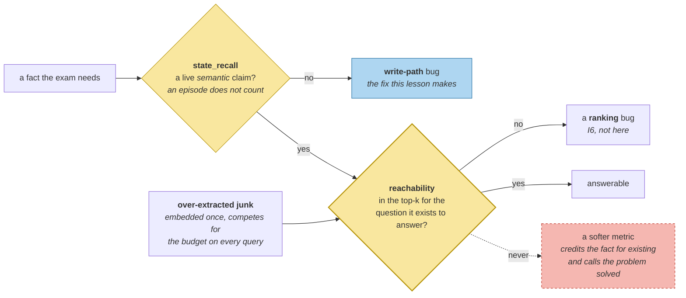

# Precision and Recall on the Write Path

> **In one line.** "Was it written" and "can a question reach it" are different measurements, and the gap between them is invisible to every check that only looks at the store.

## Where this sits

<!-- graph:begin -->
**Stage:** `extract` · **Level:** intermediate · **~40 min**

**You need first:** [Extraction Pipelines](../extraction-pipelines/index.md)

**Concepts assumed:** [The Extraction Pipeline](../../../concepts/extraction-pipeline.md) · [Events and States](../../../concepts/event-vs-state.md) · [Over-Extraction](../../../concepts/over-extraction.md)

**This unlocks:** [Atomic Memories](../atomic-memories/index.md)
<!-- graph:end -->

## The problem

You just changed the extractor. Did it get better?

The obvious check is whether the facts you need are in the store. Run it against both profiles and you get an answer that is true and useless:

| | beginner | intermediate |
|---|--:|--:|
| required states **written** | **100%** | **100%** |

Beginner scores full marks. It did write an employer state — `Priya is at Calico now`, from session 9 — and by any store-shaped test the fact is present and correct.

It ranks **35th of 36**. It contains no word a question about employment would use. The check says the extractor is perfect; the system cannot answer the question.

## Why this isn't RAG

Retrieval evaluation has one axis, because the corpus is a given. Recall@k measures the read path, and if the passage exists and does not surface, the retriever is at fault.

Here the corpus is a **dependent variable**. A fact can be absent, present-but-unreachable, or present-and-reachable, and only the third is any use. Retrieval metrics cannot see the difference between the last two — the passage is there either way — so a memory layer scored with retrieval metrics alone will send you tuning a reranker for a write-path bug.

## Mechanism

Three numbers, measured against `gold.yml`.

**`state_recall`** — of the facts the exam needs, how many exist as a live *semantic* claim. An episode does not count: a question about the present cannot reach one.

**`reachability`** — of those, how many actually surface in the top-10 for the question they exist to answer. `NATURAL_QUERY` in `memlab.eval.extraction` pairs each required state with the question a user would really ask.

**`over_extraction_rate`** — the share of records the durability gate would drop. Cost here is per-*retrieval*, not per-write: every junk memory is embedded once and then competes for token budget on every query forever.



Measured across both profiles:

| | beginner | intermediate |
|---|--:|--:|
| written | 100% | 100% |
| reachable @10 | 75% | 75% |
| over-extraction | **8%** | **0%** |
| employer rank for *"where do I work?"* | **absent** | **18** |

Read the last two rows together. The headline metrics barely move — and the two numbers that do are the ones that matter. Over-extraction goes to zero because the gate now runs at write time. The employer state goes from *not existing* to rank 18, which is still outside the top 10, so `reachability` correctly refuses to credit it.

**That refusal is the metric working.** A softer measure would have shown improvement and let you believe the problem was solved. The employer is still unreachable, for a reason this lesson cannot fix: `Priya is a data engineer at Northwind Labs` is live and ranks 6th, and three memories about *pipeline work*, *cycling to work* and *Sam working nights* outrank both on pure lexical overlap.

Two different bugs, and now you can tell them apart: one is a **write-path** problem (fixed here), one is a **belief** problem (I4), and one is a **ranking** problem ([hybrid ranking](../hybrid-ranking/index.md), in I6).

## Design decisions

**Score against gold, or against a model judge?** Gold, at this stage. The required states are four specific claims; a judge adds cost, variance, and a second thing to debug. Model grading earns its place where the answer space is open — which is [LLM as judge](../../advanced/llm-as-judge-for-memory/index.md), in Advanced.

**Measure reachability at k=10 or at the real budget?** At a fixed k, deliberately. Tying the metric to the live budget makes it move when the assembler changes, and you want a number that isolates extraction.

**Report a single score?** No. A composite would have averaged 100% written with 0% employer-reachable into something reassuring. Seven distinct failure modes need seven distinct numbers — the same argument `watching-it-fail` makes about "memory quality" as one metric.

## Lab

**You'll implement:** `score` — the three measurements — and run it across both profiles.

**Run:**
```
uv run python curriculum/intermediate/extraction-quality/lab/lab.py
```

**Expected output:** the table above, then the per-state ranks: `no meat` at 1, `fish permitted` at 1, `gluten` at 4–5, and `employer` at `None` in both profiles — present in one, absent in the other, unreachable in both.

**Stretch:** raise `k` to 20 and re-run. `employer` becomes reachable under intermediate and stays absent under beginner. Now decide whether that counts as an improvement — and notice you cannot answer without knowing the assembler's real token budget, which is exactly why the metric is pinned to a fixed k.

## What this adds to the capstone

`memlab.eval.extraction` — `score`, `ExtractionScore`, `REQUIRED_STATES`, `NATURAL_QUERY`. The first piece of the eval harness that [end-to-end eval](../../advanced/end-to-end-eval/index.md) builds out in Advanced.

## Failure modes

| Symptom | Cause | How to detect | Mitigation |
|---|---|---|---|
| Extractor scores perfectly, system answers badly | Measuring presence, not reachability | Query with the words a user would use, not the words in the store | Measure both, separately |
| Reranker work produces no gain | Tuning the read path for a write-path bug | Check whether the fact exists in an answerable form | Fix phrasing at extraction |
| Quality tracked as one number | Distinct failures averaged together | Ask which mechanism a regression came from | One metric per failure mode |
| Metrics drift when unrelated code changes | Metric coupled to the live token budget | Change `k` and watch extraction scores move | Pin evaluation constants |

## Check yourself

??? question "Beginner scores 100% on written recall. Is the metric broken?"
    No — it is reporting something true and narrow. Beginner really did write an employer state. The mistake would be reading "100% recall" as "extraction is fine", which is why `reachability` exists alongside it. A metric that cannot be scored well by a broken system is not measuring anything.

??? question "Reachability is 75% for both profiles. So did this level's work achieve nothing?"
    It moved the employer from absent to rank 18 and over-extraction from 8% to 0%, neither of which the headline number captures. It also made the remaining failure *diagnosable*: the fact now exists, so what is left is a belief problem and a ranking problem, not a phrasing problem.

??? question "Three memories about 'work' outrank both employer facts. Which lesson fixes that?"
    [Hybrid ranking](../hybrid-ranking/index.md), in I6 — lexical overlap on the word *work* is exactly what a hybrid scorer with recency and salience terms is for. Note it is a different fix from supersession: retiring Northwind removes a wrong answer but does not lift Calico past *"Priya mostly does pipeline work"*.

## Connections

<!-- graph:begin -->
**Stage:** `extract` · **Level:** intermediate · **~40 min**

**You need first:** [Extraction Pipelines](../extraction-pipelines/index.md)

**Concepts assumed:** [The Extraction Pipeline](../../../concepts/extraction-pipeline.md) · [Events and States](../../../concepts/event-vs-state.md) · [Over-Extraction](../../../concepts/over-extraction.md)

**This unlocks:** [Atomic Memories](../atomic-memories/index.md)
<!-- graph:end -->
