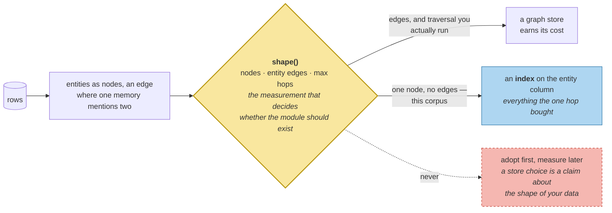

# Graph Stores

> **In one line.** Build the entity graph over this corpus and it has one node and zero edges — and knowing that is worth more than adopting the architecture anyway.

## Where this sits

<!-- graph:begin -->
**Stage:** `store` · **Level:** intermediate · **~40 min**

**You need first:** [The Underrated Default](../relational-stores/index.md)

**Concepts assumed:** [Indexed Predicates](../../../concepts/indexed-predicate.md) · [Canonical Entity](../../../concepts/canonical-entity.md) · [Entity Resolution](../../../concepts/entity-resolution.md)

**This unlocks:** [Hybrid Architecture](../hybrid-architecture/index.md)
<!-- graph:end -->

## The problem

Graph stores are the fashionable answer to agent memory, and the argument is genuinely good. Relations between entities are what a row-oriented store represents badly. Multi-hop questions — *"who is Priya's partner, and where does she work?"* — are one traversal instead of a query, a join in application code, and a second query.

I2 populated `entities`. Build the graph:

```
graph shape: {'nodes': 1, 'entity_edges': 0, 'max_hops': 1}
  nodes: ['samira']
  about('samira'): 4 live of 6 total
  neighbours('samira'): none
```

**One node. No edges.** The only traversal available is *entity → its memories*, which is a dictionary lookup wearing a graph's clothes.

## Why this isn't RAG

Document graphs are usually built from citations or links — structure that already exists in the corpus. A memory graph has to *derive* its structure from unstructured turns, and everything upstream shapes what it can express.

Here that chain is visible end to end. `St. Aubyn's` is not a node because `Aubyn` sits on the `NOT_PEOPLE` stop list — correctly, it is a hospital, and I2 put it there after watching it become a person. So Sam has no employer edge, and *"where does Priya's partner work?"* has no traversal even though the fact is in the store. **The graph's shape is downstream of an extraction decision made four modules ago**, and no graph database fixes that.

## Mechanism

Nodes are canonical entities. An edge exists where one memory mentions two of them — the only entity-to-entity relation this schema can express, and there are none, because every entity-bearing memory in the corpus mentions exactly one person.

```python
def shape(self) -> dict[str, int]:
    return {"nodes": ..., "entity_edges": ..., "max_hops": ...}
```

`shape()` is the important method. It is not a diagnostic bolted on — **it is the measurement that decides whether the rest of the module should exist for your data.**

What the one hop does buy is real, if modest. `about('samira')` gathers everything known about the partner across four surface forms and two retired beliefs, which the relational store answers only by scanning a JSON column. If entity queries were frequent, that alone would justify an index — not necessarily a graph.

### When it would pay

The corpus would need entity-to-entity structure: employers as nodes, colleagues, family relations. Priya's has one person and no relations between people. Extraction never emitted a relation, so there is nothing to traverse.

**That is the honest reading of most memory stores**, and the reason to measure before adopting: a store choice is a claim about the shape of your data, and the claim is checkable in about thirty lines.



## Design decisions

**Ship a store the corpus does not need?** Yes — with its shape measured and stated. A lesson that demonstrated multi-hop traversal on invented data would teach the mechanics and hide the judgement, and the judgement is the harder half.

**Include retired memories in `about()`?** Optional, defaulting to live. *"Who is Sam?"* wants current facts; *"what did we know about Sam last year?"* wants the retired ones. Same traversal, different validity filter — the distinction `scope-then-rank` already drew.

**Derive edges from co-mention?** It is the only relation the schema has, and it is weak: two entities in one sentence may be related in any way or none. A real graph needs extraction to emit typed relations — *employed-by*, *partner-of* — which is a write-path change, not a store change.

## Lab

**You'll implement:** `build`, `about`, `neighbours`, and `shape`.

**Run:**
```
uv run python curriculum/intermediate/graph-stores/lab/lab.py
```

**Expected output:** `{'nodes': 1, 'entity_edges': 0, 'max_hops': 1}`, the single node `samira` with 4 live memories of 6, and no neighbours.

**Stretch:** remove `Aubyn` from `NOT_PEOPLE`, re-ingest, and rebuild. The graph gains a node and an edge — and it is a hospital being modelled as a person, so `about('aubyn')` returns Sam's employment as though the building were a colleague. **A graph makes upstream extraction errors structural**, which is the strongest argument for measuring its shape rather than trusting it.

## What this adds to the capstone

`memlab.store.graph` — `EntityGraph`, `build`, `about`, `neighbours`, `shape`.

## Failure modes

| Symptom | Cause | How to detect | Mitigation |
|---|---|---|---|
| A graph store with nothing to traverse | Adopted before measuring | Call `shape()`; look at edge count | Measure before choosing |
| A place is modelled as a person | Stop list missed it upstream | Inspect node names, not just counts | Maintain the stop list; check the graph |
| Multi-hop questions have no path | Extraction never emitted relations | Try the traversal the architecture promised | Typed relations at extraction |
| Entity queries are slow anyway | Entities stored as opaque JSON | Query by entity on the relational store | Index the entity, or use the graph |
| Graph disagrees with the row store | Rebuilt on some writes and not others | Compare id sets | Rebuild on every write, or fan out — next lesson |

## Check yourself

??? question "The graph has one node and no edges. Was building it a waste?"
    The measurement was the point. Thirty lines told you the architecture your data supports, which is a far better basis than a diagram in someone's blog post. The waste would have been adopting a graph database, migrating to it, and discovering the same thing in production.

??? question "'Where does Priya's partner work?' seems like an obvious multi-hop. Why is there no path?"
    Because `St. Aubyn's` never became a node — `Aubyn` is on the stop list I2 added after it started appearing as a person. The fact is in the store, in one memory, and the graph cannot represent the relation because extraction never emitted one. The limit is upstream of the store.

??? question "Would typed relations from extraction fix it?"
    Yes, and it is a write-path change with real costs: another thing for the extractor to get right, another thing to reconcile when beliefs are superseded, and another source of confident wrongness. Worth it when traversal is central to the questions being asked, which is a claim to check rather than assume.

## Connections

<!-- graph:begin -->
**Stage:** `store` · **Level:** intermediate · **~40 min**

**You need first:** [The Underrated Default](../relational-stores/index.md)

**Concepts assumed:** [Indexed Predicates](../../../concepts/indexed-predicate.md) · [Canonical Entity](../../../concepts/canonical-entity.md) · [Entity Resolution](../../../concepts/entity-resolution.md)

**This unlocks:** [Hybrid Architecture](../hybrid-architecture/index.md)
<!-- graph:end -->
