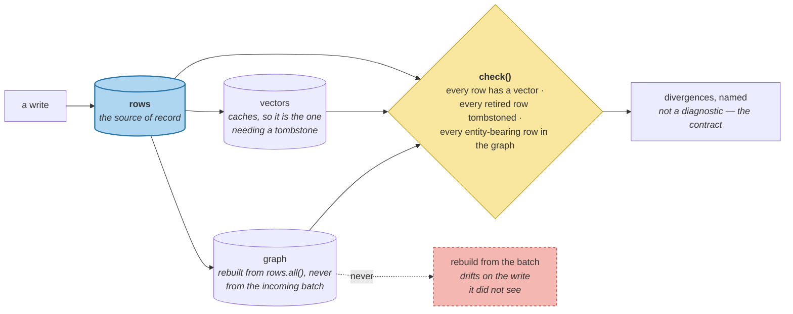

# Hybrid Architecture

> **In one line.** Three specialised stores are easy to write to and hard to keep agreeing — and one supersession is where they diverge.

## Where this sits

<!-- graph:begin -->
**Stage:** `store` · **Level:** intermediate · **~40 min**

**You need first:** [Graph Stores](../graph-stores/index.md)

**Concepts assumed:** [Vector Index](../../../concepts/vector-index.md) · [Indexed Predicates](../../../concepts/indexed-predicate.md) · [Graph Traversal](../../../concepts/graph-traversal.md) · [Supersession](../../../concepts/supersession.md)

**This unlocks:** [The Packing Problem](../the-packing-problem/index.md)
<!-- graph:end -->

## The problem

You now have three stores, each better at its job than the others:

| store | good at |
|---|---|
| relational | scope, validity, tier, time — indexed predicates |
| vector | similarity |
| graph | entity lookup |

The textbook move is to run all three and route each query to the specialist. The diagram is clean. What it leaves out is that one logical write now lands in three places, and **one supersession has to be reflected in all of them.**

Retire `Priya is a data engineer at Northwind Labs` and:

- the **row** gets `invalid_at` — done, it is a column
- the **vector** is unchanged and still perfectly valid, so it needs a tombstone
- the **graph** still lists that memory under `samira` unless it is rebuilt

Miss any one and the system holds a belief in one place and its retraction in another. That is a **correctness** cost, not a performance one, and it does not announce itself.

## Why this isn't RAG

A multi-store retrieval setup — an inverted index beside a vector index — has the same document in both, and if one lags the worst case is a slightly worse ranking. Both are derived from a corpus that is the source of truth.

Here **there is no source of truth behind the stores**; together they *are* it. There is nothing to rebuild from, so a divergence is not a stale cache, it is two contradictory answers to *"is this true?"* with no third party to arbitrate.

## Mechanism

`HybridStore` fans a write out and then checks the result:

```python
def write(self, memories):
    written = self.rows.add(memories)      # the source of record
    self.vectors.index(memories)           # embed new, tombstone retired
    self.graph = EntityGraph().build(self.rows.all())   # rebuild from rows
    return written
```

Two decisions carry the weight.

**The relational store is the source of record**, and the others derive from it. `graph` is rebuilt *from `rows.all()`*, not from the incoming batch, so it can never drift out of step with a write it did not see. That is why the graph is cheap to keep correct and the vector index — which caches — is the one needing a tombstone.

**`check()` is not a diagnostic; it is part of the contract.** It asks three questions:

| question | failure it catches |
|---|---|
| does every row have a vector? | a write that skipped the index |
| is every retired row tombstoned? | a belief retired in one store and servable from another |
| is every entity-bearing row in the graph? | a stale rebuild |



On Priya's store, after a fan-out write: **37 rows, 18 eligible, zero divergences.** The number worth having is the zero, and it is worth having *because it is checked* rather than assumed.

### And the honest recommendation

For this store, one relational store with a vector column would do everything the three do, with none of the fan-out. The graph has one node; the vector index is 37 rows.

The three-specialist architecture earns its cost when one of the specialists is genuinely load-bearing — millions of vectors, or real entity traversal. **Adopting it earlier buys a consistency problem in exchange for a performance benefit nobody has measured**, which is the same trade `graph-stores` made concrete.

## Design decisions

**Which store is authoritative?** The relational one. Something has to be, and the alternative — treating all three as equal — means a divergence has no resolution procedure. Deriving the graph and tombstoning the vectors from the rows makes the direction of truth explicit.

**Rebuild the graph or update it incrementally?** Rebuild, at this size, and it is the same argument `entity-resolution` made: canonical ids depend on the whole store, so an incremental update can be correct given what it saw and wrong once more arrives.

**Run `check()` in production or only in tests?** In production, after every consolidation. It is the same category as `leak_check` — a silent failure needs an explicit assertion, because nothing else will tell you.

## Lab

**You'll implement:** `write`, `eligible`, and `check`.

**Run:**
```
uv run python curriculum/intermediate/hybrid-architecture/lab/lab.py
```

**Expected output:** 37 rows written, 18 eligible, **no divergences** — and then three injected failures, each caught by a different arm of `check()`: a skipped vector, an un-tombstoned retirement, a stale graph.

**Stretch:** retire one more memory in the rows only, skipping the vector index, and re-run `eligible()`. It is still excluded — the SQL `invalid_at IS NULL` catches it — so the system looks correct. Then query with `live_only=False` for an audit and the un-tombstoned vector serves the retired belief as though it were current. **A divergence hides behind whichever store happens to be consulted first.**

## What this adds to the capstone

`memlab.store.hybrid` — `HybridStore`, `write`, `eligible`, `check`, `Divergence`. **I7 ends here**: query cost is bounded at 2 embed calls, filters are indexed, and the store's shape has been measured rather than assumed.

## Failure modes

| Symptom | Cause | How to detect | Mitigation |
|---|---|---|---|
| A retired belief surfaces in one path and not another | Supersession applied to some stores | `check()` after every write | Fan-out plus verification |
| No way to resolve a disagreement | No authoritative store | Ask which store is right and find no answer | Name the source of record |
| Graph drifts from the rows | Incremental updates | Rebuild and diff id sets | Rebuild from the source of record |
| Consistency bugs found by users | `check()` only in tests | Look for divergence alerts in production | Run it after consolidation |
| Three stores, one node, 37 vectors | Architecture adopted before it was needed | Measure each store's actual load | One store until the pressure is real |

## Check yourself

??? question "The vector index needs a tombstone and the graph does not. Why the asymmetry?"
    The graph is rebuilt from the rows on every write, so it cannot hold a belief the rows have retired. The vector index *caches* — that is its entire purpose — and a cache by definition holds something after its source has moved on. Anything that caches needs an invalidation story; anything derived fresh does not.

??? question "If one relational store with a vector column would do, why teach the hybrid?"
    Because you need to know what it costs before you are in a position to be sold it, and the cost is not throughput — it is that one supersession must land in three places. Recognising that a single store suffices *is* the lesson; you cannot make that judgement without having seen the alternative's price.

??? question "Why does `check()` belong in production rather than in tests?"
    Because divergence is caused by the things tests do not have: partial failures, a deploy that updated one writer, a migration that missed a store. It is the same argument as `leak_check` — a failure with no symptom needs an explicit assertion, or its first symptom is a user seeing a retracted belief.

## Connections

<!-- graph:begin -->
**Stage:** `store` · **Level:** intermediate · **~40 min**

**You need first:** [Graph Stores](../graph-stores/index.md)

**Concepts assumed:** [Vector Index](../../../concepts/vector-index.md) · [Indexed Predicates](../../../concepts/indexed-predicate.md) · [Graph Traversal](../../../concepts/graph-traversal.md) · [Supersession](../../../concepts/supersession.md)

**This unlocks:** [The Packing Problem](../the-packing-problem/index.md)
<!-- graph:end -->
