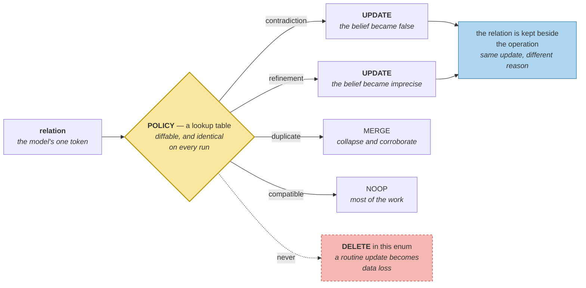

# ADD, UPDATE, MERGE, NOOP

> **In one line.** The relationship is a language judgement and the operation is policy — and letting one model make both decisions is the largest source of silent memory corruption in systems like this.

## Where this sits

<!-- graph:begin -->
**Stage:** `evolve` · **Level:** intermediate · **~40 min**

**You need first:** [Contradiction Detection](../contradiction-detection/index.md)

**Concepts assumed:** [Contradiction vs Refinement](../../../concepts/contradiction-vs-refinement.md) · [Slot](../../../concepts/slot.md) · [Type Rules](../../../concepts/type-rules.md)

**This unlocks:** [Deterministic Arbitration](../deterministic-freshness/index.md)
<!-- graph:end -->

## The problem

You have 24 classified pairs. Now act on them.

The shortest path is one prompt: *"here are two memories, what should I do — ADD, UPDATE, DELETE or NOOP?"* It is a single call, it reads naturally, and it is how a great many memory systems actually work.

Consider what a wrong answer costs. UPDATE overwrites a belief. If the model misreads *"Priya does not eat meat"* and *"Priya eats fish"* as disagreeing — plausible, since one mentions not-eating and the other eating — it retires a live dietary constraint. Nothing errors. Nothing logs. The next run may decide differently on the same pair, because nothing about the decision was recorded, and a user who asks *"why do you think that?"* gets no answer, because there is nothing to give them.

The classifier was already asked one hard question and answered it. This lesson is about not asking it a second one.

## Why this isn't RAG

A retrieval pipeline has one write operation: index this document. There is no UPDATE, no reconciliation, no possibility of overwriting a belief, because nothing in an index claims to be true — it claims only to be *findable*.

The moment a store holds beliefs, writes acquire semantics, and a mis-chosen operation destroys information rather than merely misplacing it. That is why this vocabulary exists here and nowhere in retrieval.

## Mechanism

The whole policy is a lookup table:

```python
POLICY = {
    Relation.CONTRADICTION: Operation.UPDATE,   # one belief retires the other
    Relation.REFINEMENT:    Operation.UPDATE,   # the narrower retires the broader
    Relation.DUPLICATE:     Operation.MERGE,    # collapse and corroborate
    Relation.COMPATIBLE:    Operation.NOOP,     # leave both alone
}
```

Readable in one glance, diffable in review, identical on every run. The model contributed exactly one token — the relation — and everything downstream is code.

**Contradiction and refinement both map to UPDATE, and they are not the same update.** A contradiction retires a belief that became false. A refinement retires one that became *imprecise* — `Priya is vegetarian` is superseded by `Priya is pescatarian`, while `Priya does not eat meat` stays live because it is compatible with both and was never in question. The distinction is preserved in the audit trail even though the operation is the same, which is why the relation is stored alongside the decision rather than discarded once mapped.

**DELETE is deliberately absent.** Nothing in belief updating deletes. A superseded belief keeps its content and gains an `invalid_at` — [supersession](../supersession-not-deletion/index.md), next lesson. Real erasure exists, it is a governance obligation with an entirely different trigger, and it lands in [deletion that actually deletes](../../advanced/deletion-that-actually-deletes/index.md). Putting DELETE in this enum is how a routine update becomes accidental data loss.



Across Priya's store the 24 pairs resolve to **15 NOOP, 8 UPDATE, 1 MERGE**. Two thirds of the work is deciding to do nothing, and that is the correct outcome — most beliefs about the same attribute simply coexist.

## Design decisions

**Table or `if`-chain?** Table. A policy you can print is a policy that gets reviewed; branching logic scattered through a function is one that gets extended until nobody knows what it does. It also makes the exhaustiveness check trivial — every `Relation` has an entry, and a new relation without one fails immediately.

**Should the operation carry the reason?** Yes. `Decision` keeps the conflict, the operation and the arbitration verdict together, so *"why is this retired?"* is answerable from the record. A decision that cannot explain itself is indistinguishable from a bug.

**Could the model pick the operation on an easy pair?** It could, and then the policy exists in two places — a table for pairs you thought of and a prompt for the rest. Consistency is the whole value here, and a mixed system has none.

## Lab

**You'll implement:** `POLICY`, `decide`, and `decide_all`.

**Run:**
```
uv run python curriculum/intermediate/memory-operations/lab/lab.py
```

**Expected output:** 15 NOOP, 8 UPDATE, 1 MERGE, with each UPDATE naming what it retires and why. Then the contrast: a `naive_llm_decide` that asks the model for the operation directly, and the pairs where its answer differs from the table.

**Stretch:** map `REFINEMENT` to `NOOP` and re-run the pipeline. `Priya is vegetarian` stays live beside `Priya is pescatarian`, the exam reports both, and the system is back to holding a contradiction it can see and will not resolve. One table entry, and the whole level's payoff is gone.

## What this adds to the capstone

`memlab.evolve.operations` — `Operation`, `POLICY`, `Decision`, `decide`, `decide_all`.

## Failure modes

| Symptom | Cause | How to detect | Mitigation |
|---|---|---|---|
| A correct belief silently overwritten | Model chose the operation | Diff the store across two identical runs | Table-driven policy |
| Same pair decided differently on re-runs | Non-deterministic decision path | Run consolidation twice; compare | Rules after classification |
| "Why do you believe that?" unanswerable | Operation applied without a record | Try to explain one retirement | Keep conflict + verdict on the decision |
| A routine update deletes data | DELETE in the update vocabulary | Grep for deletes on the write path | Supersede; erasure is separate |
| A new relation is silently ignored | Non-exhaustive mapping | Add a relation with no policy entry | Fail on missing key |

## Check yourself

??? question "Contradiction and refinement both map to UPDATE. Why distinguish them?"
    Because the audit trail needs to say which happened, and because they differ in what *else* survives. A refinement leaves compatible parts of the old belief standing — `does not eat meat` outlives `is vegetarian` — while a contradiction usually leaves nothing. Same operation, different consequences, and only the stored relation explains the result later.

??? question "Why is DELETE missing from an enum called Memory Operations?"
    Because deletion is not a belief-updating operation. Everything here answers *"what is true now"*, and superseding preserves the answer to *"what was true then"*. Real erasure answers a legal obligation, is triggered by a request rather than by evidence, and must cascade into derived data. Sharing an enum with UPDATE is how those get confused.

??? question "Fifteen of twenty-four decisions are NOOP. Is this stage earning its cost?"
    Yes — knowing that fifteen pairs need nothing is the output. The alternative is a system that treats same-attribute as same-conflict and retires eleven true beliefs. Deciding not to act is the majority of what correct reconciliation does.

## Connections

<!-- graph:begin -->
**Stage:** `evolve` · **Level:** intermediate · **~40 min**

**You need first:** [Contradiction Detection](../contradiction-detection/index.md)

**Concepts assumed:** [Contradiction vs Refinement](../../../concepts/contradiction-vs-refinement.md) · [Slot](../../../concepts/slot.md) · [Type Rules](../../../concepts/type-rules.md)

**This unlocks:** [Deterministic Arbitration](../deterministic-freshness/index.md)
<!-- graph:end -->
