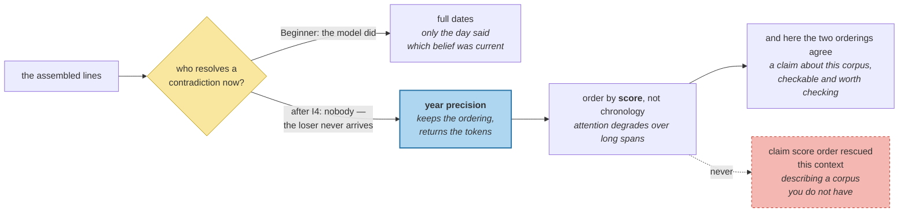

# Ordering and Formatting

> **In one line.** The date prefix costs six tokens across four facts — and dropping it entirely would be wrong, which makes precision the interesting question.

## Where this sits

<!-- graph:begin -->
**Stage:** `assemble` · **Level:** intermediate · **~35 min**

**You need first:** [The Packing Problem](../the-packing-problem/index.md)

**Concepts assumed:** [Token Reservation](../../../concepts/token-reservation.md) · [Context Assembly](../../../concepts/context-assembly.md) · [Relevance vs Truth](../../../concepts/relevance-vs-truth.md)

**This unlocks:** [What Must Never Be Dropped](../compaction-safety/index.md)
<!-- graph:end -->

## The problem

Packing ruled out its own layer. The next place tokens hide is the line itself.

```
- [2025-12-08] Priya works at Calico Systems     dated   11 tokens
- [2025] Priya works at Calico Systems           year    10
- Priya works at Calico Systems                  bare     9
```

Across the four facts the exam needs: **38, 32, or 25 tokens.** A third of the cost, decided by a formatting choice nobody revisits.

The tempting move is to drop the dates. `context-assembly-v0` added them for a reason that has since changed, which is exactly when a decision is worth re-examining and exactly when it is easy to get wrong.

## Why this isn't RAG

Formatting retrieved passages is presentation: cite the source, keep the passage intact, let the model quote it. The passage means the same thing however it is framed.

A memory's **timestamp is part of its meaning**. `Priya used to cycle to work` and `Priya commutes 40 minutes by train` are only orderable because one is dated later, and `relevance-vs-truth` established that a live fact can still be old. Stripping the date does not compress a memory; it removes a field.

## Mechanism

**Why the dates were added, and what changed.** Beginner's assembler dated every line because the model had to resolve contradictions itself — two live beliefs, and only the dates said which was current. I4 removed that job: the loser is retired and never reaches the context.

So full precision buys less than it did. **Not nothing** — a live fact can still be stale-ish, and recency is genuine evidence — but not a day.

**Year precision keeps the ordering and returns six tokens.** Every contradiction in this corpus resolves across months or years; none turns on a day. That is a claim about *this* data, checkable and worth checking, rather than a general rule.

**Order by score, not chronology** — and on this corpus you cannot tell. Attention degrades over long spans, so the most relevant memory belongs first; chronological order reads more naturally and can bury the best answer mid-context. The argument is sound and **the two orderings agree on all five positions here**, because the exam's facts happen to be scored in roughly the order they were said.

Worth stating rather than quietly asserting the principle. A lesson that claimed score order rescued this context would be describing a corpus it does not have.



## Design decisions

**Year precision, or drop dates entirely?** Year. Bare lines save nine more tokens and lose the ability to tell a 2025 belief from a 2026 one, which is the signal supersession does not cover. Dropping a field to save tokens is compression by deletion.

**Per-memory precision?** Tempting — dates matter more for episodes than standing beliefs — and rejected. A context with two date formats invites the model to read significance into the difference, and the saving is a token or two.

**Sections by type?** Not at this size. Grouping helps when a context has twenty memories across four types; with five, the headers would cost more than the structure returns. That is the same measurement `slot-value` formalises.

## Lab

**You'll implement:** `render` at three precisions, and `order`.

**Run:**
```
uv run python curriculum/intermediate/ordering-and-formatting/lab/lab.py
```

**Expected output:** the three formats priced against the four required facts — **38 / 32 / 25** — combined with each header. Then the two orderings side by side, agreeing on **5 of 5** positions: the principle is right and this data cannot demonstrate it.

**Stretch:** re-run the k-sweep from `retrieval-is-not-enough` with bare lines. The rankings are identical, because formatting is not a retrieval signal — it only changes how many survivors fit. Two levers that look similar and act on entirely different stages.

## What this adds to the capstone

`memlab.assemble.ordering` — `render` with `DATED` / `YEAR` / `BARE`, and `order`. The I8 assembler opts into year precision; the default stays `DATED`, so nothing earlier changes.

## Failure modes

| Symptom | Cause | How to detect | Mitigation |
|---|---|---|---|
| The best memory is ignored | Chronological ordering burying it mid-context | Put a known-critical memory last and query | Order by score |
| Recency cannot be judged | Dates dropped to save tokens | Ask which of two live beliefs is newer | Keep year precision |
| Formatting costs more than it returns | Sections and labels at small context sizes | Price the structure against the memories | Measure before structuring |
| Two date formats in one context | Per-memory precision | Read the assembled context | One format |
| A budget fix changes rankings | Formatting confused with retrieval | Re-run the k-sweep after a format change | They are different stages |

## Check yourself

??? question "Supersession retires the loser. Why keep dates at all?"
    Because retirement only covers beliefs something contradicted. A fact nobody has contradicted can still be old, and `relevance-vs-truth` is the distinction: supersession handles falsity, dates handle staleness. Removing them would leave the model unable to tell a 2025 belief from a 2026 one.

??? question "Bare lines save nine more tokens. Why not take them?"
    Because it is not compression, it is deleting a field. The four facts still say what they say; the context simply stops carrying when they were true. Nine tokens is a poor price for a signal the ranker itself uses.

??? question "Score and chronological order agree on every position. Does the ordering rule matter?"
    Not here, and the honest report is that it cannot be demonstrated on this corpus. It matters when relevance and recency come apart — a fact stated eighteen months ago that answers today's question exactly. The rule is defensible on the mechanism; this data simply does not exercise it, and saying so is better than borrowing a result from a corpus you do not have.

??? question "Why did Beginner use full dates if year precision is enough?"
    Because at the time it was not. Beginner had no supersession, so the model resolved contradictions from dates alone and precision mattered. The requirement changed when I4 landed and the format did not — which is the ordinary way a decision becomes stale: nothing goes wrong, the reason just quietly stops applying.

## Connections

<!-- graph:begin -->
**Stage:** `assemble` · **Level:** intermediate · **~35 min**

**You need first:** [The Packing Problem](../the-packing-problem/index.md)

**Concepts assumed:** [Token Reservation](../../../concepts/token-reservation.md) · [Context Assembly](../../../concepts/context-assembly.md) · [Relevance vs Truth](../../../concepts/relevance-vs-truth.md)

**This unlocks:** [What Must Never Be Dropped](../compaction-safety/index.md)
<!-- graph:end -->
