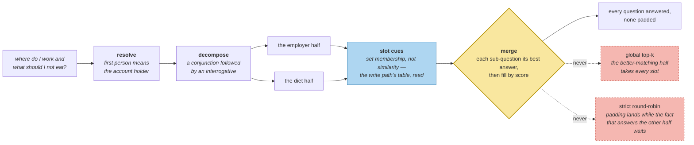

# The Query Is Not the Last Message

> **In one line.** Three rewrites — resolve the pronoun, split the compound, name the slot — and the last one finds a fact that shares no words with the question asking about it.

## Where this sits

<!-- graph:begin -->
**Stage:** `retrieve` · **Level:** intermediate · **~45 min**

**You need first:** [Hybrid Ranking](../hybrid-ranking/index.md)

**Concepts assumed:** [Hybrid Ranking](../../../concepts/hybrid-ranking.md) · [Slot](../../../concepts/slot.md) · [Coreference](../../../concepts/coreference.md)

**This unlocks:** [Should I Even Look?](../retrieval-triggers/index.md)
<!-- graph:end -->

## The problem

Hybrid ranking got the employer to rank 2. The remaining failure is in the *question*, not the ranker.

```
where do I work and what should I not eat?
```

Three things are wrong with using that string as a query.

**It names nobody.** *"I"* is Priya, and until something says so, no term in the query identifies her — so `Sam still works nights` competes on the strength of one shared word.

**It is two questions.** One embedding of both matches everything mediocrely. The employer ranks 2nd for the compound form and **1st** for its own half.

**It shares no vocabulary with part of its own answer.** `Priya has a gluten intolerance` contains not one word of *"what should I not eat"*. Coverage is near zero, similarity is weak, and the fact that directly answers half the question sits at rank 9.

## Why this isn't RAG

Query expansion over documents adds synonyms and related terms, because the corpus is large enough that *something* will contain them — you are widening a net over text you did not write.

Here the store is small, and the transformations are about **the conversation and the schema** rather than about vocabulary. Resolving *"I"* needs to know whose store this is. Splitting needs to know these are two questions. Finding the gluten fact needs the slot table the *write path* built. None of that is a synonym problem, and none of it is available to a system that only sees text.

## Mechanism

Three transformations, all rules. Extraction gets the one model call per turn; retrieval runs on every query and stays cheap.

**Resolve.** `where do I work?` → `where does Priya work?` First person means the account holder. Now the user's name is a term, and the subject signal has something to match on.

**Decompose.** Split on a conjunction followed by an interrogative. Two questions, two retrievals, two guaranteed answers — a compound query otherwise lets its better-matching half take every slot.

**Slots.** `SLOT_CUES` maps question vocabulary to the attributes from [contradiction detection](../contradiction-detection/index.md):

```
"what should Priya not eat?"  -> {diet}
    Priya eats fish · Priya does not eat meat · Priya is pescatarian
    · Priya has a gluten intolerance
```

Set membership, not similarity — which is why it reaches the gluten fact that shares no words with the question. The `SLOTS` table was written for the write path, to group beliefs that might conflict. **The same vocabulary that decides what conflicts decides what is relevant.** One table, two consumers, and neither knew about the other when it was written.

### Merging, which turns out to matter as much as scoring

Two sub-queries produce two ranked lists and the context has five slots. Two obvious strategies both fail:

- **Global top-k** lets the diet half take every slot; it outscores the employer half on every row.
- **Strict round-robin** hands the employer half a third and fifth slot for `Priya is a staff engineer` while the gluten fact waits.

What works: **guarantee each sub-question its best answer, then fill by score.** Every question gets an answer; no question gets padding. That single change is what put all four required facts into a five-slot context.



## Design decisions

**Rewrite with rules or a model?** Rules. This runs on every query, a model call doubles read latency, and all three transformations are mechanical. The judgement calls in this system belong on the write path where they happen once.

**Split on any conjunction?** No — only *and* followed by an interrogative. Splitting `Priya eats fish and does not eat meat` would turn one question into two bad ones. The lookahead is the whole rule.

**What if slot detection is wrong?** It degrades rather than breaks: a wrong slot adds candidates that then rank poorly, and a missing slot falls back to similarity. That is why slot is a *scoring* term and an *additive* candidate source rather than a filter.

## Lab

**You'll implement:** `resolve`, `decompose`, `slots_for`, and `in_slots`.

**Run:**
```
uv run python curriculum/intermediate/query-formulation/lab/lab.py
```

**Expected output:** the compound question becoming `['where do Priya work?', 'what should Priya not eat?']`, each mapping to its slot, and the diet slot returning **five** memories including both gluten records — none of which share a word with the question.

**Stretch:** skip decomposition and rank the compound question directly, with slots still on. The employer holds rank 2 and gluten sits at 5 — inside a five-slot context, but only just. Decomposition is what turns a narrow pass into a comfortable one, and it is the transformation that would matter most as the store grows.

## What this adds to the capstone

`memlab.retrieve.query` — `resolve`, `decompose`, `formulate`, `slots_for`, `in_slots`, `SLOT_CUES`. Wired into `scoped.search`, which now formulates before it ranks.

## Failure modes

| Symptom | Cause | How to detect | Mitigation |
|---|---|---|---|
| Another person's facts answer a first-person question | Pronoun never resolved | Ask "where do I work" in a store with two people | Resolve to the account holder |
| One half of a compound question is unanswered | Global top-k across sub-queries | Ask two things at once; check both are addressed | Guarantee one slot per sub-question |
| A fact that answers the question never surfaces | No slot mapping; no shared vocabulary | Ask something whose answer uses different words | Map query to slot |
| A single question gets split into nonsense | Conjunction rule too broad | Split a sentence containing a listing *and* | Require an interrogative after it |
| Read latency doubles | A model call in query rewriting | Count model calls per query | Rules on the read path |

## Check yourself

??? question "The slot table was written for conflict detection. Is reusing it on the read path a coincidence?"
    No — it is the same question asked twice. Conflict detection needs to know which beliefs claim the same attribute, and retrieval needs to know which beliefs fill the attribute being asked about. Both are *"what is this claim about?"*. That the write path's answer serves the read path is a sign the abstraction was the right one.

??? question "Why does merging matter as much as scoring?"
    Because scoring ranks within a question and merging allocates *between* questions, and a compound question makes that allocation the binding constraint. All four required facts were in the top five of *some* sub-query before the merge was fixed; the merge was what kept two of them out of the context.

??? question "Resolving 'I' to 'Priya' is trivially specific. Does it generalise?"
    The mechanism does: first person refers to the account holder, whose identity the scope already carries. What does not generalise is doing it with a regex — real conversations have third parties, reported speech, and quoted text. It is the same shape as [coreference](../../../concepts/coreference.md) on the write path, and it has the same failure modes.

## Connections

<!-- graph:begin -->
**Stage:** `retrieve` · **Level:** intermediate · **~45 min**

**You need first:** [Hybrid Ranking](../hybrid-ranking/index.md)

**Concepts assumed:** [Hybrid Ranking](../../../concepts/hybrid-ranking.md) · [Slot](../../../concepts/slot.md) · [Coreference](../../../concepts/coreference.md)

**This unlocks:** [Should I Even Look?](../retrieval-triggers/index.md)
<!-- graph:end -->
