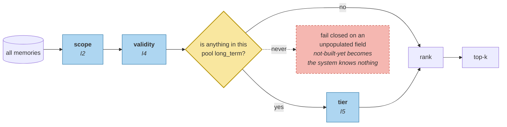

# Scope, Then Rank

> **In one line.** Five modules recorded scope, validity and tier; the retriever has consulted one of them — and switching on the other two lifts the correct answer from rank 20 to rank 12 before any ranking work at all.

## Where this sits

<!-- graph:begin -->
**Stage:** `retrieve` · **Level:** intermediate · **~35 min**

**You need first:** [Forgetting Under a Budget](../budgeted-forgetting/index.md)

**Concepts assumed:** [Retrieval Scoping](../../../concepts/retrieval-scoping.md) · [Namespace](../../../concepts/namespace.md) · [Eviction](../../../concepts/eviction.md) · [Supersession](../../../concepts/supersession.md)

**This unlocks:** [Hybrid Ranking](../hybrid-ranking/index.md)
<!-- graph:end -->

## The problem

Everything the write path built is sitting unused on the read path.

I2 gave memories a namespace. I4 gave them `invalid_at`. I5 gave them tiers, and the last lesson demoted twelve memories out of `long_term` — where they are still being retrieved, because nothing filters on tier.

```
live only (today)           pool=30  employer rank=20
live + LONG_TERM tier       pool=18  employer rank=12
```

Removing memories that forgetting already decided were not worth retrieving lifts the answer eight places and evicts `Priya mostly does pipeline work` from the top five. **No ranking changed.** The pool did.

## Why this isn't RAG

Access control over a document index is usually a post-filter, and it is safe there because a dropped result just means the next-best passage moves up.

Here the filters encode *state* the write path computed — is this belief still true, has it been demoted, whose is it — and applying them after ranking means dead and demoted memories consume top-k slots and are then discarded. Recall silently depends on how much retired material happens to be in the store, which grows over time. The ordering is not an optimisation; it is what makes the read path's behaviour a function of live state rather than of history's volume.

## Mechanism

**Filter, then rank. Never rank, then filter.**

```python
def eligible(memories, scope, retrievable_only=True):
    out = [m for m in memories if m.scope.matches(scope) and m.is_live]
    if retrievable_only and any(m.tier is Tier.LONG_TERM for m in out):
        out = [m for m in out if m.tier is Tier.LONG_TERM]
    return out
```

Three predicates, each from a different module: **scope** (I2), **validity** (I4), **tier** (I5).

The tier filter is guarded. If nothing in the pool is `long_term` — the beginner profile, where tiers were never assigned — the filter is skipped rather than returning an empty result. A read path that fails closed on an unpopulated field turns "we have not built forgetting yet" into "the system knows nothing", which is exactly what a plain `if` would have done here.



`search` is the composed read path this module introduces — filter, formulate, gather, rank, merge — and the next three lessons fill in its middle. Right now it is filter and rank, and that is already worth eight places.

## Design decisions

**Filter on tier, or weight it?** Filter. Tier is the decision forgetting already made, and re-litigating it with a weight means two mechanisms deciding the same thing, disagreeing quietly. Salience already contributes as a *score*; the tier is the *verdict*.

**Should `live_only` stay a flag?** It becomes the default and the flag stays, because audit and as-of queries genuinely need retired beliefs. What changes is which is the default: answering excludes them, inspecting includes them.

**Fail open or closed on an unpopulated tier?** Open, and it is a real judgement rather than a convenience. Failing closed is safer for access control and catastrophic for relevance — the difference between showing too much and showing nothing.

## Lab

**You'll implement:** `eligible`, and measure the pool before and after.

**Run:**
```
uv run python curriculum/intermediate/scope-then-rank/lab/lab.py
```

**Expected output:** pool **30 → 18**, employer rank **20 → 12**, and `Priya mostly does pipeline work` gone from the top five. Then the ordering test: filtering after ranking returns fewer than `k` results and leaks a demoted memory into the count.

**Stretch:** run `eligible` against the beginner profile, where no memory is `long_term`. The guard skips the tier filter and returns all 36 rather than none — remove the guard and watch the beginner profile's entire test suite fail on an empty store.

## What this adds to the capstone

`memlab.retrieve.scoped` — `eligible`, `search`, `_merge`. The `intermediate` profile switches on `rank`, which routes retrieval through this module.

## Failure modes

| Symptom | Cause | How to detect | Mitigation |
|---|---|---|---|
| Fewer than `k` results, inconsistently | Filtering after ranking | Compare result counts across stores of different ages | Filter first |
| Demoted memories keep surfacing | Tier recorded and never consulted | Check tiers of what is returned | Filter on tier |
| Recall degrades as retired beliefs accumulate | Dead memories consuming slots | Track ratio of live to retired in the store | Filter on validity |
| A store with no tiers returns nothing | Failing closed on an unpopulated field | Query under a profile that never tiers | Guard the filter |
| Historical queries impossible | Validity filter applied everywhere | Try to ask what was true last year | Keep the flag; change the default |

## Check yourself

??? question "The rank improved by eight places with no change to scoring. What does that say about ranker tuning?"
    That the candidate set is often the bigger lever, and it is the one nobody tunes. Twelve of the thirty candidates had already been judged not worth retrieving by a mechanism built one lesson earlier; the ranker was being asked to work around a decision that had already been made.

??? question "Why does filtering after ranking leak rather than just waste?"
    Because the leak is in the count as well as the content. Ranking to k and then dropping ineligible results gives fewer than k, so how much a user sees depends on how much retired material happens to sit near their query — which grows silently with account age.

??? question "The tier filter is skipped when nothing is `long_term`. Is that not a bug waiting to happen?"
    It is a deliberate fail-open, and the trade is asymmetric: failing closed on an unpopulated field means a system that has not built forgetting yet returns nothing at all. The guard is narrow — *no memory anywhere is long-term* — which only holds before tiering exists.

## Connections

<!-- graph:begin -->
**Stage:** `retrieve` · **Level:** intermediate · **~35 min**

**You need first:** [Forgetting Under a Budget](../budgeted-forgetting/index.md)

**Concepts assumed:** [Retrieval Scoping](../../../concepts/retrieval-scoping.md) · [Namespace](../../../concepts/namespace.md) · [Eviction](../../../concepts/eviction.md) · [Supersession](../../../concepts/supersession.md)

**This unlocks:** [Hybrid Ranking](../hybrid-ranking/index.md)
<!-- graph:end -->
