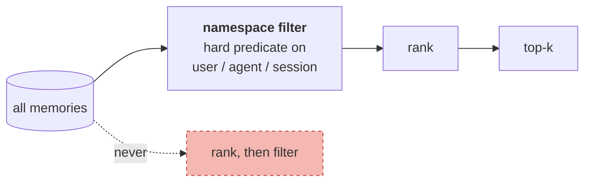

# Scopes and Namespaces

> **In one line.** Scope is a correctness boundary, its failure mode is silent, and the only defence that holds is filtering on structured keys before anything is scored.

## Where this sits

<!-- graph:begin -->
**Stage:** `store` · **Level:** intermediate · **~35 min**

**You need first:** [Entity Resolution](../entity-resolution/index.md)

**Concepts assumed:** [Retrieval Scoping](../../../concepts/retrieval-scoping.md) · [Canonical Entity](../../../concepts/canonical-entity.md)

**This unlocks:** [Deduplication](../deduplication/index.md)
<!-- graph:end -->

## The problem

Entity resolution just taught the system that several names mean one person. Now the opposite question: several *stores* worth of memories share one process. Which ones may a given reader see?

The intermediate store already has three namespaces, because I1 admitted the writes other agents made:

| namespace | memories |
|---|--:|
| `priya/*/*` | 35 |
| `priya/calendar-agent/*` | 2 |
| `priya/travel-agent/*` | 1 |

One of those travel-agent rows is a colleague's speculation that Priya is relocating to Berlin — hearsay, `authority: 0.3`, and not something Priya ever said. It is correctly *in* the store and must not be treated as her belief.

The dangerous version of this problem is not agents but users. Rank across tenants and the wrong person's memory simply scores well and lands in a prompt. **Nothing errors. Nothing logs.** The first signal is a user reading a fact about a stranger, and by then it has happened many times.

## Why this isn't RAG

Retrieval systems have access control too, and it is usually a filter applied to results or a separate index per tenant. Either works, because the corpus is static and a document either is or is not in your collection.

A memory layer's boundary moves. Memories are written continuously, by the user and by agents acting on their behalf, and a single store legitimately holds records that different readers must see differently — the calendar agent's writes are Priya's memories, but they are not first-party statements from Priya. The distinction between *whose store this is*, *who wrote this*, and *how much to believe it* needs three different fields, and collapsing them is how hearsay becomes fact.

## Mechanism

**Filter, then rank. Never rank, then filter.**



Ranking first means a foreign memory can win a slot and then be removed, leaving `k-1` results and a system whose recall silently depends on who else is in the database. Worse, any bug in the second step is a leak rather than a shortfall.

`Namespace` is the structured key, with `None` meaning *any*:

```python
Namespace(user="priya").key                        # "priya/*/*"
Namespace(user="priya", agent="calendar-agent").key  # "priya/calendar-agent/*"
```

The key is also the natural **shard key** — how a real store partitions — so the visibility rule and the physical layout are the same decision, made once.

### Three fields, three questions

| Field | Question | Lives on |
|---|---|---|
| `scope.user` | whose store is this? | `Scope` |
| `scope.agent` | which namespace within it? | `Scope` |
| `provenance.speaker` | who actually said this? | `Provenance` |
| `provenance.authority` | how much do we believe them? | `Provenance` |

The Berlin memory has `scope.agent = "travel-agent"`, `speaker = "travel-agent"`, `authority = 0.3`. Flatten any of those into the others and the system loses the ability to say *"a third party mentioned this and we do not believe it"* — which is precisely what [deterministic arbitration](../deterministic-freshness/index.md) will need.

### Two boundaries, only one of them a security boundary

This distinction is easy to blur and expensive to get wrong.

- **The user boundary must never be crossed.** A reader in Priya's scope seeing another user's memory is a disclosure.
- **The agent boundary is a relevance choice.** A reader scoped to `priya/calendar-agent` cannot see the travel agent's row, and that is not a leak — it is narrowing.

`leak_check` asserts only the first, and deliberately so:

```python
def leak_check(memories, scope):
    return [m for m in visible(memories, scope) if m.scope.user != scope.user]
```

Defining it as *"everything this reader cannot see"* would be both tautological and wrong — it would report correct narrowing as a violation, and the noise would train you to ignore it. This is the one check in the course worth running in production rather than only in tests, because a crossed user boundary has no other signal.

## Design decisions

**One store filtered, or a store per tenant?** One store with hard filters, at this scale. Physical separation is stronger and costs you every cross-tenant operation — evaluation, migration, admin — which then get written as scripts that bypass the boundary anyway. Partition when scale demands it, and keep the filter regardless.

**Should agent writes be in the user's namespace or their own?** Their own, under the same user. They are memories *about* Priya that Priya did not make, and only a separate namespace preserves that. Filing them as hers is a one-line change that silently converts every agent's guess into a first-party fact.

**Should `authority` gate visibility?** No — visibility and belief are different questions. The Berlin memory should be *visible* to a reader in Priya's scope and *not believed* by anything that answers questions. Conflating them means low-confidence memories become invisible and can never be re-evaluated when better evidence arrives.

## Lab

**You'll implement:** `Namespace.admits`, `visible`, and `leak_check`.

**Run:**
```
uv run python curriculum/intermediate/scopes-and-namespaces/lab/lab.py
```

**Expected output:** the three namespaces above; a reader scoped to `priya` sees **38**, one scoped to `priya/calendar-agent` sees **37** (the travel agent's row is narrowed away, not leaked), and a reader scoped to `sam` sees **0**. `leak_check` returns empty for all of them — including the narrowed reader, which is the case that tells you the check is measuring the right boundary.

**Stretch:** implement the wrong order — rank first, filter after — and query as `sam` against a store holding Priya's memories. You get zero results either way, which is the point: the correct and incorrect implementations are indistinguishable until a store holds two users with similar facts, and by then the bug is in production. Write the assertion instead of trusting the test.

## What this adds to the capstone

`memlab.store.scopes` — `Namespace`, `visible`, `partition`, `leak_check`. Agent writes now carry their own namespace, which the arbitration lesson in I4 depends on.

## Failure modes

| Symptom | Cause | How to detect | Mitigation |
|---|---|---|---|
| A user sees a stranger's memory | Ranked before filtering | Query with a scope holding no memories; assert empty | Hard filter first; `leak_check` |
| Fewer than k results, inconsistently | Foreign memories filtered out of the top-k | Compare result counts across tenants | Filter before ranking |
| An agent's guess becomes the user's belief | Agent writes filed in the user's namespace | Check `speaker` and `authority` on stored beliefs | Separate namespace; keep provenance |
| Low-confidence memories vanish | `authority` used as a visibility gate | Look for memories that exist but are never returned | Keep visibility and belief separate |
| Admin tooling bypasses the boundary | Cross-tenant work impossible through the normal API | Audit what queries skip the filter | One store, explicit filters |

## Check yourself

??? question "A reader scoped to `priya` sees all 38 memories including the travel agent's. Is that a leak?"
    No — it is the correct boundary. The memory is about Priya and belongs in her store; `Namespace(user="priya")` with no agent means *any agent within this user*. The protection against believing it is `authority: 0.3`, which is a different mechanism answering a different question.

??? question "The calendar-agent reader cannot see the travel agent's row. Why does `leak_check` not report that?"
    Because it is narrowing, not disclosure. If the check flagged every correctly-excluded memory it would fire constantly, and an assertion that always fires is one you stop reading. Reserve it for the boundary that must never be crossed, and it stays worth alerting on.

??? question "Why is ranking before filtering unsafe even when the filter is correct?"
    Because it makes recall depend on other tenants' data — foreign memories consume top-k slots and get dropped, so a user's results silently degrade as the database grows. And any bug in the second step is a disclosure rather than a missing row.

??? question "Why keep `speaker` when `scope.agent` already records who wrote it?"
    They diverge. An agent can relay something a person said, and a user turn can report a third party's claim — *"my colleague thinks she's moving to Berlin"*. Namespace answers where it is filed; speaker answers who asserted it; authority answers whether to believe them. I4 needs all three.

## Connections

<!-- graph:begin -->
**Stage:** `store` · **Level:** intermediate · **~35 min**

**You need first:** [Entity Resolution](../entity-resolution/index.md)

**Concepts assumed:** [Retrieval Scoping](../../../concepts/retrieval-scoping.md) · [Canonical Entity](../../../concepts/canonical-entity.md)

**This unlocks:** [Deduplication](../deduplication/index.md)
<!-- graph:end -->
