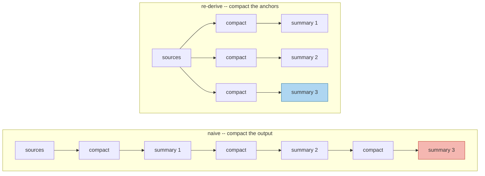

# Semantic Drift

> **In one line.** Summarising a summary leaves 19% of the original claims after four rounds; re-deriving from anchors holds at 69% forever — same compression ratio, same summariser, different input.

## Where this sits

<!-- graph:begin -->
**Stage:** `evolve` · **Level:** intermediate · **~35 min**

**You need first:** [Summarization and Compaction](../summarization-and-compaction/index.md)

**Concepts assumed:** [Summarization](../../../concepts/summarization.md) · [Derived Memory](../../../concepts/derived-memory.md)

**This unlocks:** [From Episode to Belief](../episodic-to-semantic/index.md)
<!-- graph:end -->

## The problem

Compaction is not something you do once. A memory layer that runs for years compacts, and then compacts the result.

The cheap implementation takes yesterday's summary as today's input. It is faster, it touches less data, and by then the sources may be archived. Run it four times at a 70% keep-ratio and measure what remains of the originals:

| round | claims | original claims still recoverable |
|--:|--:|--:|
| 0 | 26 | 100% |
| 1 | 18 | 69% |
| 2 | 12 | **46%** |
| 3 | 8 | **31%** |
| 4 | 5 | **19%** |

Each round keeps 70%, and the survival rate is not 70% — it is roughly 0.7ⁿ. Round two does not lose 30% of the original; it loses 30% of what round one left. The decay is geometric, and after four rounds four fifths of what Priya said is gone.

**And nothing recorded that it existed.** The only thing that knew about the dropped claims was the input you just replaced.

## Why this isn't RAG

An index is derived from documents that stay put, so it can always be rebuilt: corrupt it, delete it, change the chunker, and re-run. The source of truth is untouched.

Here compaction consumes its own output, and after round one the summary *is* the source of truth for everything it dropped. That makes the loop **irreversible** in a way no retrieval pipeline is. Drift is not a quality regression you can tune away; it is data destruction, one round at a time.

## Mechanism

The two loops differ by one word: what gets compacted.



Re-derivation always compacts the **originals**, reachable through `derived_from`. Same summariser, same ratio, and the result is stable at 69% no matter how many times it runs.

That stability has a name: **compaction becomes idempotent**. Compacting twice equals compacting once, which is what `is_idempotent` asserts. The naive loop fails that test by construction, and once a loop is not idempotent, "how many times has this run?" becomes a question your data depends on and nobody is tracking.

The measurement also exposes something the ratio hides: **which claims survive is a policy, not an accident**. `compact` drops the tail. Any real compactor drops *something*, and whatever it drops is what the next round cannot recover. Dropping the tail loses the most recent claims; dropping the head loses the baseline; dropping by length loses procedures. There is no neutral choice, only an explicit one.

## Design decisions

**Re-derive always, or only when sources exist?** Always, and keep the sources for exactly this reason. The moment you archive a source you have committed to the naive loop for everything derived from it — so archival is a decision about drift, not just about storage, and it belongs with the retention policy rather than with the cost budget.

**Cap the number of rounds instead?** It bounds the damage and does not fix it, and the cap is a number nobody can justify. Re-derivation removes the question: rounds stop mattering when the operation is idempotent.

**Store the compaction ratio with the summary?** Yes. Without it a summary cannot be reproduced, and reproducibility is what makes a derived memory auditable rather than merely present.

## Lab

**You'll implement:** `compact`, `drift_curve`, `rederive_curve`, and `is_idempotent`.

**Run:**
```
uv run python curriculum/intermediate/semantic-drift/lab/lab.py
```

**Expected output:** 26 source claims, and the two curves side by side — naive decaying 100 → 69 → 46 → 31 → 19%, re-derived flat at **69%** — with `is_idempotent` returning `True` for re-derivation and the naive loop shown failing it.

**Stretch:** change `compact` to drop the *head* instead of the tail and re-run both curves. The percentages are identical and a completely different set of facts survives: Priya's current employer instead of her diet baseline. The ratio told you nothing about which half you kept.

## What this adds to the capstone

`memlab.evolve.drift` — `compact`, `drift_curve`, `rederive_curve`, `is_idempotent`. Nothing is wired into the pipeline: this lesson exists to establish *how* compaction must be run when I5 puts it under real budget pressure.

## Failure modes

| Symptom | Cause | How to detect | Mitigation |
|---|---|---|---|
| Old facts quietly disappear | Compaction consuming its own output | Re-derive from sources; diff against the live summary | Always compact from anchors |
| Loss accelerates over time | Geometric decay against a shrinking base | Plot recoverable fraction per round | Idempotent compaction |
| Result depends on how often the job ran | Non-idempotent pipeline | Run it twice; compare | Re-derive |
| Archiving sources breaks summaries | `derived_from` points at gone records | Check anchors resolve before archiving | Retention policy covers derived data |
| Nobody knows what was dropped | Only the replaced input knew | Try to list what a summary omitted | Keep sources; record the ratio |

## Check yourself

??? question "Each round keeps 70%. Why is round four at 19% rather than 70%?"
    Because the ratio applies to the previous round, not the original: 0.7⁴ ≈ 0.24, and rounding down to whole claims at each step gives 19%. Every lossy step compounds against an already-reduced base, which is what makes "just compact again" so much more expensive than it sounds.

??? question "Re-derivation holds at 69% forever. Is that not also lossy?"
    Yes — 31% is dropped and stays dropped. The difference is that the loss is *bounded and reproducible*: the same sources and ratio always give the same summary, and the dropped 30% is still in the store. Lossy is fine; unbounded and unrecoverable is not.

??? question "Why does idempotency matter for a summariser?"
    Because without it, your data depends on how many times a background job happened to run — after a retry, a redeploy, a duplicated cron entry. That is a variable nobody tracks and no test covers. An idempotent compactor makes the question irrelevant.

## Connections

<!-- graph:begin -->
**Stage:** `evolve` · **Level:** intermediate · **~35 min**

**You need first:** [Summarization and Compaction](../summarization-and-compaction/index.md)

**Concepts assumed:** [Summarization](../../../concepts/summarization.md) · [Derived Memory](../../../concepts/derived-memory.md)

**This unlocks:** [From Episode to Belief](../episodic-to-semantic/index.md)
<!-- graph:end -->
