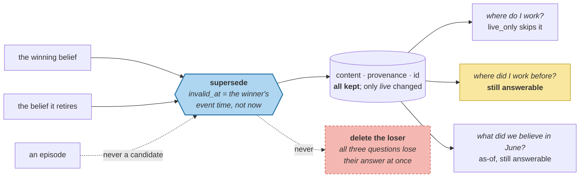

# Supersede, Never Destroy

> **In one line.** Forty lines set two fields, seven beliefs retire, and the question this course opened with is finally answered correctly — without losing a single thing Priya said.

## Where this sits

<!-- graph:begin -->
**Stage:** `evolve` · **Level:** intermediate · **~45 min**

**You need first:** [Deterministic Arbitration](../deterministic-freshness/index.md)

**Concepts assumed:** [Belief Updating](../../../concepts/belief-updating.md) · [Memory Operations](../../../concepts/memory-operations.md) · [Episodic Memory](../../../concepts/episodic-memory.md)

**This unlocks:** [Why Forgetting Is a Feature](../why-forgetting-is-a-feature/index.md)
<!-- graph:end -->

## The problem

Everything is decided. Eight decisions, each naming a loser and a rule. All that remains is to apply them, and the obvious way is to delete the losers.

That answers *"where do I work?"* and permanently destroys *"where did I work before Calico?"*, *"when did I change jobs?"*, and any account of why the system ever believed otherwise. It also makes the write path irreversible: a misclassified pair silently deletes a true belief, and nothing records that it existed.

## Why this isn't RAG

Deleting from an index is safe because the index is derived — the document is still there and it can be rebuilt.

Here the store *is* the source of truth, and the conversation that produced it is gone. A deleted belief cannot be recovered from anything. That asymmetry is why belief updating never deletes: retirement costs one nullable timestamp, and deletion costs the only copy.

## Mechanism

```python
def supersede(self, by: str, at: datetime) -> "Memory":
    return replace(self, invalid_at=at, superseded_by=by)
```

Two fields, both designed into the record back in Beginner and unused until now. The belief keeps its content, its provenance and its id; it stops being *live*.

**The date is the winner's event time, not now.** A belief is invalid from the moment its replacement became true. `Priya is a data engineer at Northwind Labs` gets `invalid_at = 2025-12-08` — the day she announced the change — not the day consolidation happened to run. This is what makes an as-of query meaningful: ask what the system believed in June 2025 and Northwind is correctly still live.

**Episodes are never touched.** `Priya is leaving Northwind Labs` and `Priya left Northwind last month` remain permanently true and permanently live. `typed-memory-model` made that structural: `can_contradict` is false for episodic, so they never become candidates, and no special case is needed here. That decision, made eleven lessons ago, is why applying supersession is safe rather than delicate.



### The result

Seven beliefs retired, none deleted. **37 memories, 30 live.**

| retired | invalid from | replaced by |
|---|---|---|
| `is a data engineer at Northwind Labs` | 2025-12-08 | `works at Calico Systems` |
| `is vegetarian` | 2025-10-30 | `eats fish` / `is pescatarian` |
| `prefers detailed explanations with reasoning` | 2026-02-27 | `prefers shorter answers` |
| `does not drink coffee` | 2026-02-27 | `drinks three coffees a day` |
| `partner Sam is a nurse at St. Aubyn's` | 2025-04-22 | `Samira is a charge nurse` |
| `colleague mentioned she is relocating to Berlin` | 2025-08-02 | `lives at 47 Halloway Road` |
| `She works nights most of the month` | 2026-04-08 | `Sam still works nights` |

The last row is a **MERGE**, not a contradiction — the same fact restated, so the earlier (pronoun-only) record retires and the survivor is corroborated. A merge that left both copies live would not be a merge, and the audit trail would inherit the misnomer.

And the retriever finally filters on it — `live_only=True` in the intermediate profile, the flag that has existed since Beginner and did nothing because nothing ever set `invalid_at`.

### The exam

```
where do I work and what should I not eat?
```

| profile | live | employer | avoid | fish |
|---|--:|---|---|---|
| beginner | 36 | Northwind Labs | meat, gluten | ✗ |
| @I1 | 38 | Northwind Labs | meat, gluten | ✗ |
| @I2 | 38 | Northwind Labs | meat, gluten | ✗ |
| @I3 | 37 | Northwind Labs | meat, gluten | ✗ |
| **@I4** | **30** | **Calico Systems** | **meat, gluten** | **✓** |

Four modules of machinery, and the answer changes on the last one. Everything before it was necessary and none of it was sufficient: extraction made the right answer *exist*, resolution made evidence *accumulate*, deduplication removed a competing copy — and the answer stayed wrong until something recorded that one belief had *retired* another.

**`where did I work before Calico?` is still answerable.** That is the difference between this and deleting.

### What it did not fix

Supersession **removed the wrong answer; it did not promote the right one.** Measured against the exam question:

| | live memories | `data engineer at Northwind` | `works at Calico Systems` |
|---|--:|---|---|
| beginner | 36 | **rank 9** | absent |
| @I4 | 30 | **gone from retrieval** | **rank 20 of 30** |

The stale fact no longer competes — `live_only` filters it out entirely. But Calico sits at 20th, still outranked by *"Priya mostly does pipeline work"* and *"Priya used to cycle to work"* on plain lexical overlap with the word *work*.

The exam passes because `exam_answer` reads the live semantic beliefs rather than the top-k, and the beliefs are now correct. Ask the CLI for the top 4 and you still get noise. **That is a ranking problem, not a belief problem** — it belongs to [hybrid ranking](../hybrid-ranking/index.md) in I6, which adds recency and salience terms to a score that currently has neither.

Worth being precise about what this milestone achieved: the system no longer *believes* the wrong thing. Getting it to *say* the right thing first is the next module's work.

## Design decisions

**Set `invalid_at` to the winner's event time or to now?** Event time. "Now" records when the system noticed, which makes every as-of query wrong by the length of the delay — and a batch job that runs weekly would put a week of false history into the store.

**Cascade to derived memories?** Not yet, and it is a real gap. A summary built from a retired belief still asserts it; `orphaned_summaries` can detect this and nothing calls it. Cascading correctly means walking `derived_from` transitively, which is [deletion that actually deletes](../../advanced/deletion-that-actually-deletes/index.md). Naming the gap is better than a partial cascade that looks complete.

**Should retired beliefs still be retrievable?** By default no, and the flag must be explicit. `live_only=True` for answering; `live_only=False` for audit, history, and as-of queries. A store with no way to see retired beliefs has thrown away the reason for keeping them.

## Lab

**You'll implement:** `reconcile` — apply the decisions, retire losers, corroborate merges.

**Run:**
```
uv run python curriculum/intermediate/supersession-not-deletion/lab/lab.py
```

**Expected output:** the retirement table above, then the exam across all five snapshots, flipping to correct at `@I4`. Then the check that matters most: `where did I work before Calico?` answered from retired beliefs, and both Northwind episodes confirmed still live.

**And run consolidation twice.** `consolidate(consolidate(x)) == consolidate(x)` — the same standard [semantic drift](../semantic-drift/index.md) demanded of compaction. Without the guard in `corroborate`, a re-run re-detects the merge and ratchets confidence 0.9 → 0.95 → 1.0, so the store's beliefs would depend on how often a background job happened to fire.

**Stretch:** replace `supersede` with a delete and re-run. The exam still passes — and the historical query returns nothing, the audit trail is gone, and a misclassification is now unrecoverable. **Both implementations pass the headline test.** Only one of them is right, which is why the lab asserts the history too.

## What this adds to the capstone

`memlab.evolve.supersede` — `reconcile`, `Reconciliation`. The intermediate profile becomes `resolve → dedupe → reconcile` with `live_only=True`.

**memlab v0.2-alpha ships here.** Five predicates in the regression suite flip — staleness, accumulating contradictions, refinement-read-as-noise, entity fragmentation, and hearsay demotion (testable only once I1 admitted the shared-scope writes). Four of the seven *original* failures are among them. Three remain and are correctly still broken: over-extraction and forgetting are I5's, the deletion cascade is Advanced's.

## Failure modes

| Symptom | Cause | How to detect | Mitigation |
|---|---|---|---|
| History is unanswerable | Deleting instead of retiring | Ask what was true last year | `invalid_at` + `superseded_by` |
| As-of queries off by the batch interval | `invalid_at` set to now | Compare against the winner's event time | Use the winner's `happened_at` |
| A true episode disappears | Supersession applied across types | Check no episodic memory has `invalid_at` | Gate on `can_contradict` |
| Retired beliefs still surface | Retriever not filtering on validity | Query a superseded fact | `live_only=True` |
| A summary asserts a retired belief | No cascade through `derived_from` | Run `orphaned_summaries` after reconciling | Advanced |

## Check yourself

??? question "Deleting the losers also makes the exam pass. Why is that not good enough?"
    Because the exam is one question and the store has to answer others. Deletion loses *when* the change happened, *what* was believed before, and any explanation of why — and it makes every misclassification permanent. Passing the headline test is necessary; the lab asserts the historical query precisely because both implementations pass that one.

??? question "Why is `invalid_at` the winner's event time rather than the moment of reconciliation?"
    Because the belief stopped being true when Priya changed jobs, not when the job ran. Using "now" injects however long the pipeline was delayed into the historical record as a period of false belief — invisible, and wrong on every as-of query in that window.

??? question "Three of the seven failures are still broken. Is v0.2 finished?"
    For this milestone, yes, and the remainder are correctly out of scope. Over-extraction and forgetting need salience signals that arrive in I5; the deletion cascade needs transitive `derived_from` walking and belongs with the privacy machinery in Advanced. A level that claimed all seven would be claiming mechanisms it does not have.

## Connections

<!-- graph:begin -->
**Stage:** `evolve` · **Level:** intermediate · **~45 min**

**You need first:** [Deterministic Arbitration](../deterministic-freshness/index.md)

**Concepts assumed:** [Belief Updating](../../../concepts/belief-updating.md) · [Memory Operations](../../../concepts/memory-operations.md) · [Episodic Memory](../../../concepts/episodic-memory.md)

**This unlocks:** [Why Forgetting Is a Feature](../why-forgetting-is-a-feature/index.md)
<!-- graph:end -->
