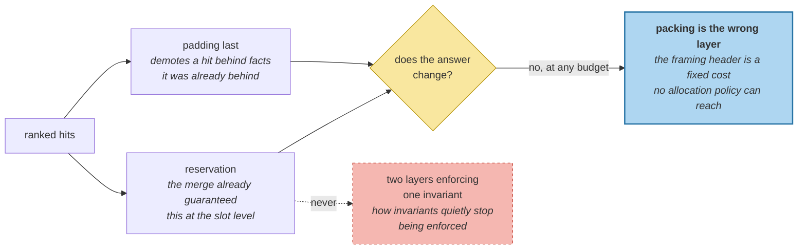

# The Packing Problem

> **In one line.** Two plausible packing policies, both measured, both no-ops — and the reason is that a third of the context is not memories at all.

## Where this sits

<!-- graph:begin -->
**Stage:** `assemble` · **Level:** intermediate · **~40 min**

**You need first:** [Hybrid Architecture](../hybrid-architecture/index.md)

**Concepts assumed:** [Context Assembly](../../../concepts/context-assembly.md) · [Token Budget](../../../concepts/token-budget.md) · [Score Fusion](../../../concepts/score-fusion.md)

**This unlocks:** [Ordering and Formatting](../ordering-and-formatting/index.md)
<!-- graph:end -->

## The problem

`context-assembly-v0` established the rule that keeps a context safe: pack highest-score-first, drop whole memories, never truncate one. Half a fact is a hazard.

Correct, and not enough — for the same reason global top-k was not enough in `query-formulation`. A compound question has two halves and score order lets the better-matching half spend the budget. Priya's exam is exactly that shape:

```
2.562  [where do Priya work?]        Priya works at Calico Systems
2.899  [what should Priya not eat?]  Priya does not eat meat
2.605  [what should Priya not eat?]  Priya eats fish
2.415  [where do Priya work?]        Priya is a staff engineer      <- padding
2.383  [what should Priya not eat?]  Priya has a gluten intolerance
```

`Priya is a staff engineer` is true, on-topic, and completely redundant once the employer itself is in — and at a tight budget it takes the tokens the gluten fact needs.

## Why this isn't RAG

A RAG context is a list of passages answering one query, packed by score until it is full. Dropping the marginal passage costs a little supporting evidence.

Here the context answers **several questions at once**, and dropping the marginal memory can leave one of them entirely unanswered while the other has three supporting facts. Allocation between questions is a problem retrieval does not have, because retrieval was never asked two things.

## Mechanism

The obvious fix is reservation: guarantee each sub-question a share of the budget before filling by score.

**Implement it and it changes nothing.** `scoped.search` already guarantees each sub-question its best answer at the *slot* level — the merge from `query-formulation`. By the time hits reach the packer, coverage has been made upstream, and reserving it again is a no-op.

That is worth building anyway, because knowing which layer owns a guarantee is worth more than the guarantee. Two mechanisms enforcing the same invariant is how invariants quietly stop being enforced.

The second candidate is **padding suppression** — a question's second and later hits go last, because a follow-up to an answered question is worth less than a first answer to an unanswered one:

```python
for hit in hits:            # pass 1 -- one answer per question
    ...
for hit in padding:         # pass 2 -- everything else
    ...
```

### Measured, both are no-ops

| budget | score order | padding last |
|--:|---|---|
| 80 | PASS | PASS |
| **77** | **PASS** | **PASS** |
| 70 | fail | fail |
| 60 | fail | fail |

A complete answer costs **77 tokens either way**. Padding suppression changes nothing because the padding scores *between* the two facts that matter — `Priya is a staff engineer` at 2.415 sits between `eats fish` at 2.605 and `has a gluten intolerance` at 2.383. Demoting it to the second pass moves it behind facts it was already behind.

That is not a bug in the policy. It is the measurement telling you the problem is somewhere else: **29 of those 77 tokens are the framing header**, and no packing policy can reach them.

**Packing is the wrong layer.** The next three lessons are the right ones — the line format, the coverage policy, and the header itself.



## Design decisions

**Reserve, even though it is a no-op here?** Yes — as an explicit no-op with the reason recorded. Silently relying on an upstream guarantee is how a refactor to the merge breaks the packer with no test in between.

**Suppress padding, or cap hits per question?** Suppress by ordering, not by a cap. A cap needs a number nobody can justify, and a question with three genuinely relevant facts should be able to use three slots when the budget allows.

**Score order or question order in pass 2?** Score. Once every question has an answer, the remaining tokens should go to the best remaining content regardless of which question produced it.

## Lab

**You'll implement:** `pack` with both passes, and the budget comparison.

**Run:**
```
uv run python curriculum/intermediate/the-packing-problem/lab/lab.py
```

**Expected output:** the hits tagged with the sub-question that surfaced them, then the table above — **77 tokens for a complete answer under both policies**, identical at every budget.

**Stretch:** remove the interleave from `scoped._merge` and re-run with reservation on and off. Now it matters — without the upstream guarantee the diet question takes every slot, and reservation is the only thing putting an employer fact in the context. **A no-op mechanism is one whose invariant someone else is currently maintaining.**

## What this adds to the capstone

`memlab.assemble.budget` — `pack`, `Packed`, and `Hit.query`, which records the sub-question that surfaced each hit. Attribution is what makes allocation possible.

## Failure modes

| Symptom | Cause | How to detect | Mitigation |
|---|---|---|---|
| One half of a compound question unanswered | Score order across sub-questions | Ask two things; check both are addressed | Guarantee one answer each |
| A needed fact displaced by a redundant one | Padding packed before first answers | Look at which question each context line came from | Two-pass packing |
| Half a fact in the context | Truncating to fit | Assemble at a tiny budget; look for cut lines | Drop whole memories |
| A guarantee silently stops holding | Two layers enforcing the same invariant | Remove one and see if anything fails | Own it in one place; test the other is a no-op |
| Budget work does not fix the budget | Wrong layer — the cost is elsewhere | Price every element, not just memories | `slot-value` |

## Check yourself

??? question "Reservation changes nothing. Was implementing it a mistake?"
    No — finding out was the result. The guarantee exists; it is made by the retrieval merge, one layer up. Knowing *which* layer owns an invariant is what stops a later refactor from removing it silently, and the lab's stretch shows exactly that: break the merge and reservation becomes load-bearing immediately.

??? question "Why is `Priya is a staff engineer` padding rather than a useful second fact?"
    Because the question it answers already has an answer. It is not wrong or off-topic — at a generous budget it belongs. At a tight one it is competing against the *first* answer to a different question, and first answers win.

??? question "Both policies cost 77 tokens. So what did this lesson achieve?"
    It ruled out a layer. Two plausible mechanisms, measured, and neither moves the number — which is how you learn that the problem is not allocation. Packing can reorder and drop memories; it cannot touch the framing, and the framing is more than a third of the context.

??? question "Why does padding suppression fail when the padding is genuinely redundant?"
    Because it demotes the padding behind facts it was already behind. `Priya is a staff engineer` scores 2.415 — between `eats fish` at 2.605 and `has a gluten intolerance` at 2.383 — so moving it to the second pass changes nothing about who it beats. A reordering policy only helps when the thing you want to demote was winning.

## Connections

<!-- graph:begin -->
**Stage:** `assemble` · **Level:** intermediate · **~40 min**

**You need first:** [Hybrid Architecture](../hybrid-architecture/index.md)

**Concepts assumed:** [Context Assembly](../../../concepts/context-assembly.md) · [Token Budget](../../../concepts/token-budget.md) · [Score Fusion](../../../concepts/score-fusion.md)

**This unlocks:** [Ordering and Formatting](../ordering-and-formatting/index.md)
<!-- graph:end -->
