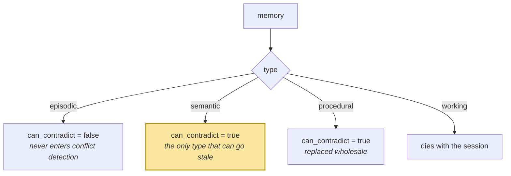

# The Typed Memory Model

> **In one line.** Beginner used the type as a label; here it becomes the thing that decides whether a memory can go stale, what happens when two disagree, and what a correct update looks like.

## Where this sits

<!-- graph:begin -->
**Stage:** `store` · **Level:** intermediate · **~40 min**

**You need first:** [Watching It Fail](../../beginner/watching-it-fail/index.md)

**Concepts assumed:** [Semantic Memory](../../../concepts/semantic-memory.md) · [Episodic Memory](../../../concepts/episodic-memory.md) · [Procedural Memory](../../../concepts/procedural-memory.md) · [The Memory Record](../../../concepts/memory-record.md)

**This unlocks:** [Extraction Pipelines](../extraction-pipelines/index.md)
<!-- graph:end -->

## The problem

You are about to build conflict detection, and the first question is *which memories can even conflict*.

Naively, any two. In practice, almost none. Priya's store holds 36 memories and two of them are:

```
episodic   Priya is leaving Northwind Labs          (2025-12-08)
episodic   Priya left Northwind Labs last month     (2026-01-19)
```

Those do not contradict. They are two things that happened, both permanently true, and a system that "resolves" them by retiring one has destroyed a fact for no reason. Meanwhile these two do contradict, and nothing currently notices:

```
semantic   Priya does not drink coffee              (2025-06-11)
semantic   Priya drinks three coffees a day         (2026-02-27)
```

The difference is not in the content, the wording, or the similarity score — `embedding-recall` already proved similarity cannot tell these cases apart. It is entirely in the **type**, which Beginner recorded and then never consulted.

## Why this isn't RAG

A corpus has one type. Every chunk is treated identically because, for documents, that is roughly correct — a passage does not claim to describe the present, so it cannot be falsified by a later passage.

The moment memories make claims about *now*, they acquire different lifecycles, and the type becomes an executable rule rather than metadata. There is no chunking strategy that expresses "this one may go stale and that one may not", because no document ever needed it.

## Mechanism

Four types, four rules. The column that matters is the first.

| Type | Can contradict? | Expires? | On conflict | Retrieved by |
|---|:--:|:--:|---|---|
| **episodic** | **no** | no | keep both — two things happened | time, participants |
| **semantic** | **yes** | yes | one must retire | topic |
| **procedural** | **yes** | yes | replace wholesale | task, not topic |
| **working** | **no** | yes | irrelevant — dies with the session | position |

`RULES` in `memlab.extract.router` is that table, and `can_contradict()` is the predicate every later mechanism gates on. Of Priya's 36 memories, **24 can contradict** — 22 semantic plus 2 procedural — and **12 cannot**, all of them episodic. Those 12 are structurally incapable of the failure the next four lessons are about, and conflict detection never has to look at them.

Procedural is the interesting middle case. Two versions of a workflow do conflict, but the correct resolution is not "retire one fact" — it is **replace the whole procedure**, because the steps are not independently updatable. The type says so, and the code reads it rather than special-casing.



There is a second rule here, needed by the very next lesson: **`describes_a_change()`**. A turn built around a transition verb — *leaving*, *started*, *moved*, *was diagnosed* — reports an event, and the state it produced has to be derived rather than hoped for. Type routing and change detection are the same judgement seen from two directions.

## Design decisions

**Rules in a table, or behaviour on the type?** A table. `TypeRule` is data, so the whole policy is visible in one place, diffable, and testable without constructing memories. Methods on an enum scatter the policy across the codebase and make "what does semantic actually do differently" unanswerable without reading everything.

**Should procedural be its own type at all?** Yes, and it is the type most often collapsed into semantic. Its `on_conflict` differs from every other type — wholesale replacement rather than per-fact retirement — and that difference is exactly what a taught workflow needs. Collapse it and updating one step silently reshuffles the rest.

**Add a fifth type for preferences?** No. Preferences are semantic memories with a longer half-life; that is a `salience` question, not a type question. Every additional type multiplies the cross-type conflict matrix, and this one buys nothing.

## Lab

**You'll implement:** `can_contradict` reading the rule table, and `partition_by_conflict_risk` — split a store into the memories conflict detection must examine and the ones it can ignore.

**Run:**
```
uv run python curriculum/intermediate/typed-memory-model/lab/lab.py
```

**Expected output:** of 36 memories, **24 can contradict and 12 cannot** — by type alone, before a single comparison is made — which cuts the pairwise comparison space from **630 to 276**. Then the two Northwind episodes are shown beside the two coffee facts, and the rule table explains why only one pair is a problem.

**Stretch:** feed the two Northwind episodes to `can_contradict` and confirm both return `False`, then read `RULES[EPISODIC].on_conflict`. A system that lacks this table has no principled way to avoid "fixing" them, and retiring a true episode is a data-loss bug you will never see reported.

## What this adds to the capstone

`memlab.extract.router` — `TypeRule`, `RULES`, `can_contradict`, `describes_a_change`. Nothing calls it yet; the next lesson does.

## Failure modes

| Symptom | Cause | How to detect | Mitigation |
|---|---|---|---|
| A true episode gets retired | Conflict detection run over all types | Check whether any episodic memory has `invalid_at` set | Gate on `can_contradict` |
| Old preferences never die | Preferences typed episodic, which never expires | Look for two live semantic-shaped facts that disagree | Route claims about *now* to semantic |
| Updating a workflow shuffles its steps | Procedure typed semantic, updated per-fact | Ask the system to perform a taught procedure after an update | `on_conflict` = replace wholesale |
| Conflict detection is slow and mostly useless | Comparing every pair regardless of type | Count comparisons vs. eligible pairs | Partition by type first |

## Check yourself

??? question "'Priya is leaving Northwind' and 'Priya left Northwind last month' describe one event. Are they duplicates?"
    Near-duplicates worth merging in [deduplication](../deduplication/index.md), but not a *conflict* — merging and retiring are different operations with different consequences. The type tells you they cannot contradict; whether they are redundant is a separate question, answered by similarity.

??? question "24 of 36 memories can contradict. What does that buy?"
    Correctness before performance. Conflict detection is now structurally unable to touch the 12 episodic records where retiring something would be data loss. The comparison count falling from 630 pairs to 276 is a side benefit, not the point.

??? question "Procedural memories can contradict. Why are they not just semantic, then?"
    Because `on_conflict` differs. Two versions of a workflow do conflict, and the correct resolution is to replace the procedure wholesale rather than retire one step — steps are not independently updatable. Same answer to "can this be wrong", different answer to "what do I do about it", which is exactly why the rule is a table rather than a boolean.

??? question "Why is `describes_a_change` in the router rather than the extractor?"
    Because it is a claim about type. "Does this turn report a transition" and "what type is the resulting memory" are the same judgement, and keeping them together stops the two from drifting apart.

## Connections

<!-- graph:begin -->
**Stage:** `store` · **Level:** intermediate · **~40 min**

**You need first:** [Watching It Fail](../../beginner/watching-it-fail/index.md)

**Concepts assumed:** [Semantic Memory](../../../concepts/semantic-memory.md) · [Episodic Memory](../../../concepts/episodic-memory.md) · [Procedural Memory](../../../concepts/procedural-memory.md) · [The Memory Record](../../../concepts/memory-record.md)

**This unlocks:** [Extraction Pipelines](../extraction-pipelines/index.md)
<!-- graph:end -->
