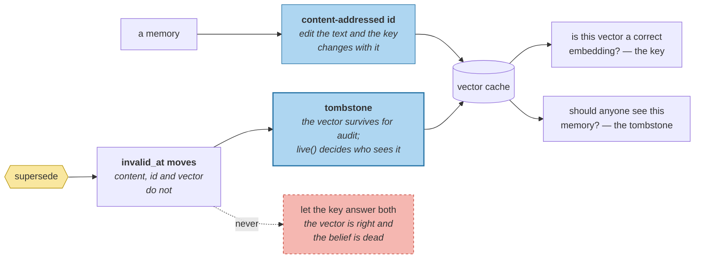

# Vector Stores for Data That Changes

> **In one line.** Caching the embeddings takes a query from 38 model calls to 2 — and the cached vector for a superseded belief stays perfectly valid for something nobody should retrieve.

## Where this sits

<!-- graph:begin -->
**Stage:** `store` · **Level:** intermediate · **~45 min**

**You need first:** [Should I Even Look?](../retrieval-triggers/index.md)

**Concepts assumed:** [Vector Search](../../../concepts/vector-search.md) · [Supersession](../../../concepts/supersession.md) · [Idempotent Writes](../../../concepts/idempotency.md)

**This unlocks:** [The Underrated Default](../relational-stores/index.md)
<!-- graph:end -->

## The problem

Every retrieval so far has embedded the entire store. Count the calls:

```
@I6:  38 embed calls per query   (store of 37)
```

Once for the query, once for every memory — **on every query**, for content that has not changed since it was written. Replicate the corpus and the shape is unmissable:

| store size | embed calls per query |
|--:|--:|
| 37 | 74 |
| 740 | 1480 |
| 1850 | 3700 |

*(Replicated corpus, illustrative — twenty identical Priyas would break entity resolution and deduplication, so read the property rather than the numbers: the cost is 2N, and N is everything ever written.)*

Caching is obvious and takes about ten lines. What makes this a lesson is what happens next.

## Why this isn't RAG

A document index is derived: delete it, rebuild it from the corpus, nothing is lost. Staleness is a *freshness* problem — re-index when the document changes, and until then you serve a slightly old answer.

A memory store's vectors describe records that **change meaning without changing text**. `Priya is a data engineer at Northwind Labs` is byte-identical before and after supersession; only `invalid_at` moved. A cache keyed on content is therefore correct about the text and silent about the truth — and a re-index will not fix it, because there is nothing to re-index. The record did not change; the *world* did.

## Mechanism

**Key on `Memory.id`, which is content-addressed.** That is what makes the cache safe: editing a memory produces a different id and therefore a different entry, so a cached vector can never describe text it does not match. Idempotency, designed in Beginner for a different reason, turns out to be the property that makes this cache correct.

**Supersession does not change the id.** This is the hole:

```
Priya is a data engineer at Northwind Labs
  content   unchanged
  id        unchanged
  vector    still an accurate embedding of that sentence
  invalid_at 2025-12-08          <- the only thing that moved
```

The vector is *right*. The belief is *dead*. A content-addressed cache cannot tell those apart, because it was never told about truth.

**So the index carries tombstones.** `index()` embeds anything new and tombstones anything retired; the vector survives — audit and as-of queries need it — and `live()` decides what a default search may see. Two different questions, kept separate:

| question | answered by |
|---|---|
| is this vector a correct embedding? | content-addressed key |
| should anyone see this memory? | tombstone |



On Priya's store that is **37 vectors, 7 tombstoned** — exactly the seven beliefs I4 retired.

### What it buys

```
@I6:  38 embed calls per query
@I7:   2 embed calls per query
```

Two, not one, because `query-formulation` splits the compound question in half and each half is embedded once. Everything else is served from cache.

## Design decisions

**Cache in memory or persist to disk?** In memory here, and the interface is the decision that matters — `index()`, `vector_for()`, `live()`. Persisting is a serialisation detail; what would be hard to change later is a cache that could not express a tombstone.

**Tombstone, or drop the vector on supersession?** Tombstone. Dropping it makes as-of queries and audit impossible, and the course's spine is supersede-never-destroy. It also makes un-retiring free, which matters because arbitration can be wrong.

**Re-embed on every ingest, or only new ids?** Only new. Re-embedding everything on ingest would make the write path linear in store size, trading a per-query cost for a per-write one — worse, because writes are more frequent than the compound queries this store sees.

## Lab

**You'll implement:** `index`, `vector_for`, `live`, and `search`.

**Run:**
```
uv run python curriculum/intermediate/vector-stores-for-mutable-data/lab/lab.py
```

**Expected output:** 37 vectors computed, **7 tombstoned**, and after three queries `computed=40, served_from_cache=90` — against 222 embed calls for the same three queries uncached.

**Stretch:** delete the tombstone logic and re-run the exam. It still passes — the retired employer is filtered by `is_live` before ranking, so nothing visibly breaks. Then query with `live_only=False` for an audit and watch the retired belief come back *ranked*, as though it were current. **The tombstone is not what makes today's query correct; it is what stops tomorrow's audit path from being wrong.**

## What this adds to the capstone

`memlab.store.vector` — `VectorIndex`, `index`, `vector_for`, `live`, `search`, `stats`. The `intermediate` profile switches on `vectors`, threaded through `scoped.search` into `hybrid.rank`.

## Failure modes

| Symptom | Cause | How to detect | Mitigation |
|---|---|---|---|
| Query cost grows with the store | Embedding every memory per query | Count embed calls per query | A vector index |
| A retired belief is served from cache | No tombstone; content unchanged | Retire a memory, search with cache warm | Tombstone on `invalid_at` |
| Vector describes text the memory no longer has | Cache keyed on something mutable | Edit content; check the served vector | Key on the content-addressed id |
| Audit queries lose history | Vector dropped on supersession | Ask what was true last year | Keep the vector; gate the read |
| Writes slow as the store grows | Re-embedding everything on ingest | Time ingest at two store sizes | Embed only new ids |

## Check yourself

??? question "The cache is keyed on content. Why can a superseded belief still be a problem?"
    Because supersession changes `invalid_at`, not content — the id, the text and the vector are all unchanged and all still correct. The cache is answering *"is this a good embedding of this sentence?"* and the question that matters is *"should anyone see this sentence?"*. Nothing about content addressing can answer the second.

??? question "Why not just drop the vector when a belief is retired?"
    Because the record is not gone. As-of queries, audit, and any un-retirement all need it, and this course has spent two modules establishing that retirement is not deletion. Dropping the vector would make the index the one place where that principle did not hold.

??? question "Two embed calls per query, not one. Where does the second come from?"
    `query-formulation` splits the compound question into two sub-questions and each is embedded once. It is the honest number: the floor is one call per *query actually issued*, not one per user turn.

## Connections

<!-- graph:begin -->
**Stage:** `store` · **Level:** intermediate · **~45 min**

**You need first:** [Should I Even Look?](../retrieval-triggers/index.md)

**Concepts assumed:** [Vector Search](../../../concepts/vector-search.md) · [Supersession](../../../concepts/supersession.md) · [Idempotent Writes](../../../concepts/idempotency.md)

**This unlocks:** [The Underrated Default](../relational-stores/index.md)
<!-- graph:end -->
